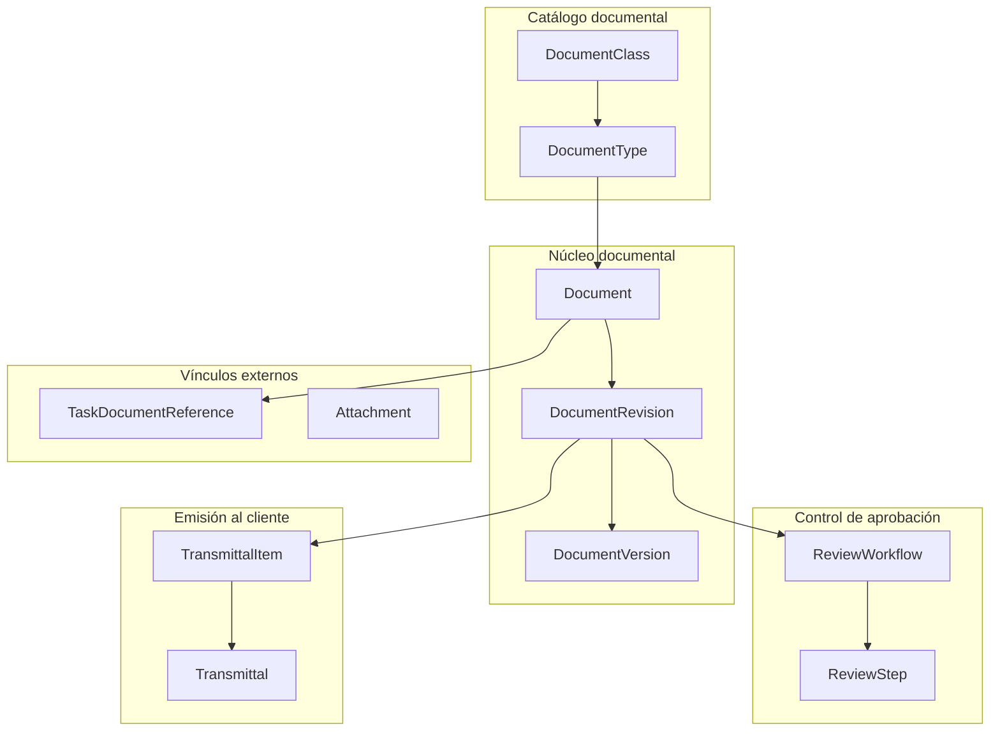

# Plan de evolución funcional — OperMask Documents

**Estado:** Relevamiento para revisión
**Versión:** 0.1
**Alcance:** subsistema de Gestión Documental (`Document`, `DocumentRevision`, `DocumentVersion`, `ReviewWorkflow`, `ReviewStep`, `Transmittal`, `TransmittalItem`, catálogos, adjuntos y vínculo con tareas de proyecto).

## Objetivo

Relevar el comportamiento implementado del subsistema de Gestión Documental, exponer sus brechas y dejar planteadas las decisiones funcionales que deben confirmarse **antes** de documentar cualquier regla en la SFS.

Este documento no aprueba comportamiento. Las enumeraciones que siguen son observaciones verificadas contra el código; ninguna constituye todavía una regla de negocio.

## Estado de partida verificado

Relevado sobre `prisma/schema.prisma`, `schema.graphql` y `src/resolvers/` a la fecha de este documento.

- El subsistema está completo en el backend: 8 modelos, 10 enumeraciones y las operaciones GraphQL correspondientes.
- El circuito implementado es: `createDocument` crea documento, primera revisión y primera versión en una sola operación; `createRevision` abre revisiones sucesivas; `registerVersion` agrega versiones dentro de una revisión en `DRAFT`; `initiateReview` abre el circuito de aprobación; `approveStep` / `rejectStep` lo resuelven; los transmittals se crean, emiten, responden y cierran.
- La única vía por la que una revisión llega a `APPROVED` es la aprobación del último paso no `ACKNOWLEDGE` de un `ReviewWorkflow`.
- Al aprobarse una revisión, las revisiones anteriores en `APPROVED` del mismo documento pasan a `SUPERSEDED`.
- Toda la trazabilidad se escribe hoy en `DocumentSysLog`, mezclada con los errores técnicos del servicio.
- **No existe ninguna pantalla que consuma este subsistema.** Los directorios `documents/` y `transmittals/` bajo `201-mi-webapp/app/(withSidebar)/projects/documents/[projectId]/` están vacíos y el hub ya los enlaza.
- **No existen pruebas automatizadas** en el módulo.

## Línea base de uso productivo

Confirmado funcionalmente:

- **Ningún cliente utiliza hoy el subsistema de Gestión Documental.** No hay documentos, revisiones, versiones, workflows ni transmittals en uso productivo.
- **Un único cliente utiliza `ScannedFile` y `Area`**, con la funcionalidad implementada en la webapp.

Esta línea base tiene una consecuencia central sobre la estrategia: el subsistema de Gestión Documental **no arrastra datos productivos**. Sus cambios de modelo no requieren compatibilidad hacia atrás, backfill, ni migración por etapas. La estructura puede corregirse de forma directa antes de que exista el primer uso real.

Por el contrario, la salida de `ScannedFile` y `Area` hacia `212-mi-digitalization` **sí opera sobre datos y sobre una interfaz en producción**, y exige preservar la continuidad operativa de ese cliente.

Antes de aplicar las migraciones se verificará el supuesto contra las bases de cada cliente, para confirmar que las tablas del subsistema documental están efectivamente vacías.

## Organización funcional propuesta

Hipótesis inicial para ordenar el relevamiento. No es todavía una arquitectura conceptual aprobada.

## Hallazgos de implementación

Los siguientes puntos requieren revisión antes de convertirse en reglas aprobadas.

### Ciclo de revisión

| # | Tema | Situación actual observada | Estado |
| - | ---- | -------------------------- | ------ |
| H-01 | Revisión bloqueada tras un rechazo | `rejectStep` devuelve la revisión a `DRAFT` y marca el workflow como `REJECTED`. Como `ReviewWorkflow.revisionId` es único, esa revisión ya no admite un segundo workflow; y como `createRevision` rechaza abrir una nueva mientras exista una en `DRAFT` o `IN_REVIEW`, el documento queda sin salida funcional. Resuelto por D-10: el rechazo interno produce una nueva versión dentro de la misma revisión, y la restricción de unicidad del workflow debe caer. | `APROBADO_PENDIENTE` |
| H-02 | Sin circuito para documentos que no requieren aprobación | `DocumentType.requiresWorkflow` se persiste pero no se consulta en ninguna validación. No existe operación que apruebe una revisión sin workflow, de modo que un documento de tipo informativo permanece en `DRAFT` indefinidamente. Resuelto por D-03. | `APROBADO_PENDIENTE` |
| H-03 | Ausencia de control sobre el firmante | `approveStep` y `rejectStep` no verifican que el usuario autenticado sea el `assignedToId` del paso. Cualquier usuario con `DOCUMENTS_WORKFLOW_UPDATE` puede resolver el paso asignado a otro, y no queda registro de quién lo resolvió realmente. Resuelto por D-04. | `APROBADO_PENDIENTE` |
| H-04 | Pasos de toma de conocimiento sin cierre | `approveStep` excluye los pasos `ACKNOWLEDGE` del cálculo de completitud. Al completarse el workflow, esos pasos quedan `PENDING` de forma permanente. | `IMPLEMENTADO_CON_BRECHA` |
| H-05 | Cancelación sin identidad propia | `cancelWorkflow` deja el workflow en `REJECTED`; el motivo de la cancelación solo se escribe en el registro técnico y no queda en el modelo. Una cancelación es indistinguible de un rechazo. Resuelto por D-17. | `APROBADO_PENDIENTE` |
| H-06 | Alcance de la firma | `signatureHash` se calcula como SHA-256 de `stepId`, `userId`, marca temporal y acción. No incorpora la versión ni el `checksum` del archivo, por lo que no acredita **qué** se aprobó. Tampoco se persisten los datos firmados, de modo que el hash no es verificable a posteriori. Resuelto por D-05. | `APROBADO_PENDIENTE` |
| H-07 | Consulta de pendientes ajenos | `pendingReviewSteps` recibe el `userId` como argumento y no lo contrasta con el usuario autenticado. Debe alinearse con el criterio de D-04. | `PROPUESTO` |
| H-08 | Estados inalcanzables | `WorkflowStatus.PENDING` nunca se asigna: `initiateReview` crea el workflow directamente en `IN_PROGRESS`. `RevisionStatus.OBSOLETE` no lo asigna ninguna operación. | `PROPUESTO` |
| H-09 | Códigos de revisión arbitrarios | `createRevision` acepta un `revisionCode` explícito sin validar formato ni progresión, lo que permite salir de la secuencia del esquema. Resuelto por D-13: se admite solo bajo `FREE_TEXT`. | `APROBADO_PENDIENTE` |
| H-10 | Orden de revisiones por código | `switchRevisionScheme` sobre un documento con revisiones `A`, `B`, `C` que pasa a `NUMERIC` genera `0` como siguiente código. El comportamiento es el buscado (D-13), pero deja secuencias como `A, B, C, 0, 1`: ordenar o comparar revisiones por su código pierde sentido y el orden debe darse por secuencia de creación. | `APROBADO_PENDIENTE` |
| H-34 | Versiones bloqueadas durante la revisión | `registerVersion` exige que la revisión esté en `DRAFT` y rechaza cualquier versión mientras está en `IN_REVIEW`. Contradice el ciclo de D-10: el revisor que marca el plano genera una versión **durante** el circuito. Hoy esa intervención es imposible de registrar. | `APROBADO_PENDIENTE` |
| H-35 | Versión sin origen ni naturaleza | `DocumentVersion` no registra qué representa cada versión: original del autor, comentada por el revisor o corregida tras un rechazo. Se resuelve no incorporando esa clasificación: rige la secuencia y la última versión es la vigente (D-10). El hallazgo se cierra sin cambio de modelo. | `DESCARTADO` |

### Emisión al cliente

| # | Tema | Situación actual observada | Estado |
| - | ---- | -------------------------- | ------ |
| H-11 | Emisión de revisiones no aprobadas | `createTransmittal` no valida el estado de las revisiones incluidas. Es posible emitir al cliente una revisión en `DRAFT` o en `IN_REVIEW`. Resuelto por D-18: puerta dura, sin excepción por código de propósito. | `APROBADO_PENDIENTE` |
| H-12 | Acuse de recibo sin operación | `TransmittalStatus.ACKNOWLEDGED` se acepta como estado de origen para responder, pero ninguna operación lo asigna. | `IMPLEMENTADO_CON_BRECHA` |
| H-13 | Items inmutables tras la creación | No existe operación para agregar ni quitar `TransmittalItem` después de crear el transmittal, ni siquiera en estado `DRAFT`. | `PROPUESTO` |
| H-14 | Respuesta sin verificación de pertenencia | `respondTransmittal` actualiza cada item por su identificador sin comprobar que pertenezca al transmittal indicado. | `IMPLEMENTADO_CON_BRECHA` |
| H-15 | Cierre sin respuesta completa | `closeTransmittal` no exige que todos los items tengan `clientStatus` registrado. Deja de ser una brecha: las respuestas parciales son la práctica normal y el cierre no condiciona el avance de ningún documento (D-18). Resta definir si el cierre se deriva de los ítems o admite cierre explícito con motivo. | `PROPUESTO` |
| H-16 | Numeración global y no transaccional | `generateTransmittalCode` deriva `TR-NNN` del último registro por identificador, sin secuencia ni transacción, y la numeración es global en lugar de por proyecto. | `PROPUESTO` |
| H-29 | Transmittal sin sentido de circulación | El modelo asume una única dirección: se emite y el cliente responde sobre el mismo registro. No existe el concepto de transmittal **entrante** ni el vínculo entre uno de respuesta y el que responde. Según D-18: en modo Emisor el transmittal es saliente y la respuesta llega como transmittal de retorno o documento a documento; en modo Receptor es entrante y **no hay transmittal de salida**. | `APROBADO_PENDIENTE` |
| H-30 | Sin archivos de respuesta del cliente | La respuesta solo admite `clientStatus` y comentarios de texto. No hay forma de incorporar los archivos marcados que devuelve la contraparte, que son la evidencia de la observación. | `APROBADO_PENDIENTE` |
| H-31 | Sin listado de documentos esperados | En modo Receptor la planta debe definir los documentos obligatorios por contrato, sobre los que el proveedor emite, pudiendo agregar adicionales. No existe ningún concepto equivalente en el modelo. | `APROBADO_PENDIENTE` |
| H-32 | Sin alcance para usuarios externos | Ambos modos pueden incorporar usuarios ajenos a la organización que hospeda el sistema: el contratista en modo Receptor, y el cliente que responde directamente en modo Emisor (D-12). Cada uno debe ver únicamente lo que le corresponde. No existe hoy ningún mecanismo de alcance: la autorización es puramente global por permiso. Resuelto por D-15. | `APROBADO_PENDIENTE` |
| H-36 | Sin matriz de responsabilidad | En modo Receptor los documentos recibidos se distribuyen entre revisores según disciplina, tipo o área. No existe ningún concepto que proponga esa asignación: hoy cada paso del workflow se asigna a mano, documento por documento (D-18). | `APROBADO_PENDIENTE` |
| H-33 | Respuesta sin autoría diferenciada | El modelo no distingue quién respondió de quién registró la respuesta. En el caso habitual del modo Emisor la ingresa el control documental de la ingeniería, y esa diferencia debe quedar explícita (D-12). Tampoco se conserva la fecha real de la respuesta frente a la de registro. | `APROBADO_PENDIENTE` |

### Modelo y alcance

| # | Tema | Situación actual observada | Estado |
| - | ---- | -------------------------- | ------ |
| H-17 | Documento sin proyecto | `Document` no tiene `projectId`. Su contexto se expresa con `module` más `entityType`/`entityId` genéricos, mientras que `Transmittal`, `Area` y `ScannedFile` sí tienen `projectId`. No hay forma directa de listar los documentos de un proyecto. Resuelto por D-06. | `APROBADO_PENDIENTE` |
| H-18 | Doble vínculo documento–tarea | Coexisten `Document.projectTaskId` (entregable principal) y `TaskDocumentReference` con rol `OUTPUT`. Ambos expresan producción documental de una tarea y pueden contradecirse. Diferido por D-07. | `PROPUESTO` |
| H-28 | Módulos sin uso real | `Document.module` admite seis módulos, pero no existe ningún consumidor fuera de proyectos: `mi-quality` solo invoca `checkDocumentDependencies` para proteger borrados y nunca crea documentos; la webapp solo consume los catálogos. `entityType`/`entityId` no tienen usos productivos. | `APROBADO_PENDIENTE` |
| H-19 | Unicidad de catálogos con módulo nulo | `DocumentClass` y `DocumentType` declaran unicidad sobre tuplas que incluyen columnas anulables. Cuando `module` o `classId` son nulos, la restricción no impide duplicados. | `IMPLEMENTADO_CON_BRECHA` |
| H-20 | Documento sin archivo imposible | `createDocument` exige `fileKey`, `fileName`, `fileSize` y `mimeType`. No es posible registrar un documento previsto antes de contar con su archivo. | `PROPUESTO` |
| H-21 | Adjuntos sin ciclo de vida ni consumidores | `Attachment` carece de `terminatedAt` y `updatedAt`, y no se relaciona con `Document`. Sus operaciones están expuestas en GraphQL, pero no las consume ni la webapp ni `mi-quality`. Diferido por D-08. | `PROPUESTO` |
| H-22 | Permisos poco específicos | `createRevision` y `registerVersion` exigen `DOCUMENTS_DOCUMENT_CREATE` en lugar de un permiso propio de revisión; `cancelWorkflow` exige `DOCUMENTS_WORKFLOW_CREATE`. | `PROPUESTO` |
| H-27 | Integridad del archivo opcional | `DocumentVersion.checksum` es anulable y ninguna operación lo exige. Si la firma debe acreditar el contenido aprobado (D-05), una versión sometida a aprobación sin checksum no es verificable. | `APROBADO_PENDIENTE` |

### Trazabilidad

| # | Tema | Situación actual observada | Estado |
| - | ---- | -------------------------- | ------ |
| H-23 | Auditoría funcional mezclada con log técnico | Toda la traza se escribía en `DocumentSysLog`, junto con los errores del servicio, en registros de texto sin tipo de objeto ni estado. Resuelto por D-01 e implementado en `BLOCK_01`: las 25 escrituras funcionales del subsistema documental se sustituyeron por `DocWorkflowEvent` y `DocAuditEvent`. `DocumentSysLog` conserva la operación del servicio y el subsistema legado. | `PROMOVIDO_A_SFS` |
| H-24 | Módulo del registro inconsistente | Los transmittals registran siempre `SysLogModule.PROJECTS`, mientras que el resto deriva el módulo del documento afectado. | `PROPUESTO` |

### Cobertura y validación

| # | Tema | Situación actual observada | Estado |
| - | ---- | -------------------------- | ------ |
| H-25 | Subsistema sin interfaz | Ninguna pantalla consume documentos, revisiones, versiones, workflows ni transmittals. El hub de documentos de proyecto enlaza a rutas cuyos directorios están vacíos. | `IMPLEMENTADO_CON_BRECHA` |
| H-26 | Sin pruebas automatizadas | El módulo no tenía marco de pruebas ni script `test`. `BLOCK_01` incorporó la base con `node:test`, sin dependencias nuevas: 28 pruebas en tres suites, incluida la verificación de la garantía transaccional contra la base. Resta la cobertura de integración de los resolvers, diferida al end-to-end con la webapp (`BLOCK_05`). | `IMPLEMENTADO_CON_BRECHA` |

## Decisiones del plan

### D-01 — Trazabilidad funcional como objeto del dominio

**Estado:** Aprobada.

La trazabilidad del subsistema de Gestión Documental se modela con eventos funcionales de dominio, siguiendo el tratamiento de `DigiWorkflowEvent` y `DigiAuditEvent` en OperMask Digitalization:

- un evento de **workflow** registra transiciones de estado: qué objeto cambió, desde qué estado, hacia cuál y cuándo;
- un evento de **auditoría** registra acciones ejecutadas: quién hizo qué, sobre qué objeto, cuándo y con qué datos de contexto;
- ambos son inmutables: no se modifican ni se eliminan.

`DocumentSysLog` conserva su función actual de registro técnico del servicio y de trazabilidad del subsistema legado de `ScannedFile`. Deja de ser la fuente de trazabilidad funcional del subsistema documental.

Alternativa descartada: enriquecer `DocumentSysLog` con tipo de objeto y estados. Se descarta porque mantiene la auditoría funcional mezclada con los errores técnicos y no permite consultarla como parte del dominio.

Pendiente de definición al abrir el bloque correspondiente: nomenclatura de los objetos y de las acciones, y si el evento de workflow reemplaza o complementa a los campos de fecha ya presentes en las entidades (`approvedAt`, `issuedAt`, `completedAt`).

### D-02 — El rechazo es terminal para la revisión

**Estado:** Reemplazada por D-10.

Se había acordado que una revisión rechazada quedaba en `REJECTED` de forma definitiva y que la corrección exigía crear una revisión sucesora.

Esa decisión partía de una lectura equivocada del modelo: trataba el rechazo del circuito **interno** como si cerrara la unidad **externa**. Al precisarse el ciclo real de emisión (D-09), quedó claro que el rechazo interno no debe consumir un código de revisión. Se reemplaza por D-10.

### D-03 — Toda revisión se aprueba por workflow

**Estado:** Aprobada.

Se elimina la distinción entre documentos con y sin circuito de aprobación. Toda revisión atraviesa un `ReviewWorkflow`; el camino a `APPROVED` es siempre la resolución de sus pasos.

Los documentos que no requieren revisión formal utilizan un **workflow mínimo**: un único paso de tipo `APPROVE`. El comportamiento resultante es el ciclo `DRAFT` → `APPROVED`: mientras la revisión está en borrador solo la ve quien la trabaja; una vez aprobada, queda disponible para el resto.

Alternativa descartada: una operación de aprobación directa que omita el workflow cuando `requiresWorkflow` es falso. Se descarta porque abriría un segundo camino a `APPROVED` sin firma ni trazabilidad, y duplicaría las reglas de transición.

Pendientes de definición al abrir el bloque:

- si el workflow mínimo se crea automáticamente junto con la revisión o requiere `initiateReview` explícito;
- a quién se asigna su único paso: al autor de la revisión o a un aprobador derivado del `DocumentType`;
- qué significa `DocumentType.requiresWorkflow` bajo esta regla. Deja de indicar si hay workflow y pasa a distinguir el circuito formal del mínimo, por lo que su nombre y semántica deben revisarse.

### D-04 — La aprobación admite delegación, pero queda registrada

**Estado:** Aprobada.

No se restringe la resolución de un paso al usuario asignado. Un administrador puede aprobar o rechazar el paso asignado a otra persona, situación legítima ante ausencias o urgencias.

A cambio, el modelo registra **quién resolvió efectivamente** el paso, además de quién estaba asignado. Cuando ambos no coinciden, la divergencia queda marcada de forma explícita y visible en la traza y en la interfaz: el paso muestra que fue resuelto por delegación.

Alternativa descartada: exigir coincidencia entre asignado y actor. Se descarta porque bloquea la operación real ante ausencias sin aportar garantía adicional, dado que la trazabilidad se obtiene registrando la diferencia.

Pendientes de definición al abrir el bloque:

- si la resolución delegada exige un permiso distinto del ordinario. El módulo ya tiene precedente de esta distinción en `DOCUMENTS_SCANNED_FILE_ADMIN_UPDATE`, y aplicar el mismo criterio a los workflows permitiría auditar quién puede firmar por otro;
- si la delegación requiere justificación obligatoria;
- alcance de `pendingReviewSteps` sobre pasos ajenos (H-07), que debe seguir el mismo criterio.

### D-05 — La firma acredita quién aprobó y qué aprobó

**Estado:** Aprobada.

La firma de un paso debe permitir demostrar, a posteriori, **qué contenido exacto** se aprobó y **quién** lo aprobó. Para ello incorpora:

- el paso, el workflow y la revisión;
- la `DocumentVersion` vigente al momento de la firma, con su número, `fileKey` y `checksum`;
- el usuario asignado y el usuario que resolvió efectivamente el paso (D-04);
- la acción y el momento en que se produjo.

Los datos firmados se **persisten junto al hash**. Un hash cuyos insumos no se conservan no es verificable y no constituye evidencia.

Consecuencia sobre el modelo (H-27): el `checksum` de la versión deja de ser opcional para toda versión sometida a aprobación. Debe definirse al abrir el bloque si se exige en el momento de registrar la versión o al iniciar el workflow, y cómo se tratan las versiones ya existentes sin checksum.

### D-06 — El documento pertenece a un proyecto

**Estado:** Aprobada.

`Document` incorpora `projectId`, del mismo modo que ya lo tiene `Transmittal`. El proyecto pasa a ser la unidad de agrupación y de alcance de la gestión documental, y habilita listar, filtrar y numerar documentos por proyecto sin recurrir a la combinación genérica `entityType`/`entityId`.

`module` se conserva. El módulo de documentos está concebido para dar servicio documental a varios módulos del ecosistema, y ese discriminador es lo que lo hace posible. `Transmittal` no lo tiene porque nació como capacidad exclusiva de proyectos; si en el futuro se extiende a otros módulos, deberá incorporarlo.

**El foco funcional actual es la gestión documental de proyectos.** La extensión a calidad u otros módulos se evaluará después, una vez consolidado el circuito sobre proyectos.

El relevamiento respalda esa concentración: no existe hoy ningún consumidor de documentos fuera de proyectos (H-28). `mi-quality` únicamente invoca `checkDocumentDependencies` como protección de borrado entre servicios y nunca crea documentos; la webapp solo consume `DocumentClass` y `DocumentType`.

Alternativa descartada: derivar el proyecto de `entityType = "project"` más `entityId`. Se descarta porque deja el vínculo sin integridad referencial ni índice propio, y obliga a cada consumidor a conocer una convención implícita.

Pendientes de definición al abrir el bloque:

- si `projectId` es obligatorio siempre o solo cuando `module = PROJECTS`. La recomendación es admitir nulo en el modelo y exigirlo por invariante para documentos de proyecto, de modo que un futuro documento de calidad asociado a un hallazgo no quede forzado a un proyecto artificial;
- qué ocurre con `entityType` y `entityId` una vez que existe `projectId`: si se retiran, se conservan para los módulos no basados en proyecto, o se reinterpretan;
- cómo cambia la unicidad del código. Hoy es `[code, module, entityType, entityId]`, lo que en la práctica hace el código único por módulo. Con proyecto explícito, lo natural es que sea único por proyecto.

Al no existir documentos productivos, estos cambios se aplican de forma directa sobre el modelo, sin etapas de compatibilidad.

### D-07 — La interfaz entre tareas y documentos se posterga

**Estado:** Aprobada — diferida.

El vínculo entre documentos y tareas de proyecto queda fuera del alcance inmediato. El trabajo se concentra primero en el núcleo de la gestión documental de proyectos; la interfaz con tareas se retoma después, con su propio análisis.

Se preserva la intención original que motivó el vínculo, para no perderla: registrar el **avance de una tarea a partir de la revisión aprobada** de su documento entregable, de modo que la aprobación documental alimente el progreso del proyecto. Es una capacidad deseada, no descartada.

En consecuencia, `Document.projectTaskId` y `TaskDocumentReference` se mantienen como están, sin ampliarse ni consolidarse, hasta abrir el bloque correspondiente. La unificación de ambos niveles (H-18) se decide entonces, junto con el mecanismo de avance por aprobación.

### D-09 — El proyecto declara el rol documental del sistema

**Estado:** Aprobada.

El módulo opera en dos modos según quién hospeda el sistema. El modo es un atributo **del proyecto**, no del despliegue: un mismo cliente puede tener proyectos en uno u otro rol.

**Modo Emisor** — el sistema lo usa la empresa de ingeniería; el cliente es la planta.

1. El documento se elabora y atraviesa el circuito de revisión **interno** de la ingeniería.
2. Aprobado internamente, se emite al cliente mediante un `Transmittal` saliente.
3. El cliente responde: aprueba, aprueba con comentarios o rechaza, con sus archivos marcados.
4. La respuesta cierra la revisión emitida y habilita el ciclo siguiente.

**Modo Receptor** — el sistema lo hospeda la planta; sus proveedores de ingeniería emiten dentro de él.

1. El proveedor da de alta o toma un documento esperado, y crea un `Transmittal` con sus archivos.
2. **El proveedor no realiza circuito interno dentro del sistema**: sube documentación ya aprobada por sus propios medios.
3. El personal de la planta califica la emisión recibida: aprueba, aprueba con comentarios o rechaza.
4. La calificación habilita al proveedor a emitir una nueva revisión en un nuevo transmittal.

La diferencia estructural entre ambos es el **orden**: en modo Emisor el circuito de revisión precede al transmittal; en modo Receptor el transmittal precede a la revisión, porque lo que se califica es la emisión ya recibida.

Lo que **no** cambia entre modos: la revisión sigue siendo la unidad externa y la versión la iteración interna (D-10); toda aprobación pasa por un workflow con firma (D-03, D-05); la respuesta de la contraparte cierra la revisión.

Esto reconcilia D-03: la regla "toda revisión se aprueba por workflow" se mantiene en ambos modos. Lo que cambia es quién ejecuta ese workflow y en qué momento — la ingeniería antes de emitir, o la planta después de recibir.

Pendientes de definición al abrir el bloque:

- nomenclatura del rol y dónde se declara;
- en modo Receptor, el alcance de acceso del proveedor: un contratista debe ver únicamente sus propios documentos y transmittals. Es la primera vez que el módulo admite usuarios externos a la organización que lo hospeda, y requiere un modelo de alcance que hoy no existe;
- en modo Receptor, el listado de documentos esperados: la planta define los obligatorios por contrato y el proveedor puede agregar adicionales. Es un concepto nuevo, sin correlato en el modelo actual;
- si un mismo proyecto puede cambiar de rol una vez iniciado.

### D-10 — La revisión es externa; la versión es interna

**Estado:** Aprobada. Reemplaza a D-02.

El modelo distingue dos niveles de iteración, y esa distinción gobierna todo el ciclo:

- la **revisión** es la unidad **externa**: lo que se emite a la contraparte y lo que la contraparte responde;
- la **versión** es la iteración **interna**: cada estado sucesivo del archivo dentro del circuito de revisión.

Las versiones se generan **a lo largo de todo el circuito**, no solo ante un rechazo. Cada intervención que altera el archivo produce una versión:

- el proyectista somete el documento a revisión — versión original, sin comentarios;
- el jefe de especialidad revisa y marca el plano — versión comentada, generada por el revisor;
- si hay rechazo, el proyectista corrige — versión corregida;
- el ciclo continúa hasta la aprobación, con tantas versiones como haya requerido.

El mismo mecanismo aplica en modo Receptor: cuando el personal de la planta incorpora marcas sobre el documento recibido, esa intervención genera una versión.

**Las versiones son secuenciales dentro de la revisión y la última es la vigente.** Esa es toda la regla: no se clasifica el origen ni la naturaleza de cada versión. La disciplina del propio ciclo lo resuelve — las versiones con marcas son las que acompañan un rechazo y devuelven el documento a borrador; la versión que se aprueba es una versión limpia. Lo único que el modelo debe garantizar es que la secuencia sea inequívoca, cosa que la unicidad de `[revisionId, versionNumber]` ya sostiene.

En consecuencia:

- **el rechazo interno no cambia la revisión.** Devuelve el trabajo a borrador dentro de la misma revisión, y la corrección se registra como una **nueva versión**. La revisión emitida conserva su código;
- **lo que hace avanzar la revisión es la respuesta de la contraparte.** Toda respuesta cierra la revisión emitida; la emisión siguiente lleva revisión nueva, aunque no se haya objetado nada;
- el estado terminal de la revisión deriva de la respuesta recibida. El modelo ya tiene el vocabulario en `ClientStatus`: aprobado, aprobado con comentarios, rechazado, revisado sin objeción.

Alternativa descartada: hacer que el rechazo interno consuma un código de revisión (D-02). Se descarta porque expone la iteración interna al cliente, agota la secuencia de códigos con trabajo que nunca salió, y contradice la práctica de control documental de ingeniería.

Consecuencia estructural: `ReviewWorkflow.revisionId` es único, de modo que hoy una revisión admite un solo circuito. Esa restricción debe caer, según lo definido en D-11.

Pendientes de definición al abrir el bloque:

- estados de `DocumentRevision` que expresan el cierre por respuesta de la contraparte.

El tratamiento del esquema de revisión se resuelve en D-13.

### D-11 — La revisión admite varios circuitos sucesivos

**Estado:** Aprobada.

El `ReviewWorkflow` permanece asociado a la **revisión**, no a la versión.

Ante un rechazo interno, el documento vuelve a borrador y se instancia un **nuevo workflow** sobre la misma revisión. Una revisión admite varios circuitos sucesivos, y su acumulación conserva la **historia completa de los rechazos** que la revisión atravesó antes de ser emitida.

En consecuencia:

- `ReviewWorkflow.revisionId` deja de ser único;
- `initiateReview` deja de rechazar la existencia de un workflow previo: solo impide abrir uno nuevo mientras haya otro sin resolver;
- la revisión distingue su circuito vigente de los ya cerrados.

Alternativa descartada: asociar el workflow a la versión. Se descarta porque fragmenta la historia del circuito entre versiones y dificulta leer cuántas vueltas necesitó una revisión antes de emitirse, que es justamente lo que interesa conservar.

Esto no altera D-05: la firma sigue referenciando la `DocumentVersion` vigente al momento de firmar. El workflow pertenece a la revisión; cada firma acredita la versión concreta que se aprobó.

El workflow **no registra explícitamente la versión con la que cerró**. Rige la misma regla de D-10: dentro de la revisión las versiones son secuenciales y la última es la vigente, de modo que el circuito cierra sobre ella. La correlación entre un workflow cerrado y la versión de ese momento queda igualmente recuperable por cronología, dado que tanto las versiones como el cierre del workflow están fechados.

Un circuito cierra aprobando una versión limpia. Las versiones con marcas son las que acompañan un rechazo, y ese rechazo devuelve el documento a borrador. En modo Receptor la calificación de la planta cierra la revisión del mismo modo, con o sin comentarios.

### D-15 — El acceso se acota por membresía de proyecto

**Estado:** Aprobada.

Ambos modos de D-09 incorporan usuarios ajenos a la organización que hospeda el sistema, y en ambos la relación es por proyecto: la planta contrata proveedores de ingeniería distintos según el proyecto, y la empresa de ingeniería trabaja con clientes distintos según el proyecto. El alcance de acceso, por lo tanto, se define **por proyecto**.

Se adopta el patrón de `ProjectMember` (DOM-020) de OperMask Digitalization:

- la membresía vincula un usuario con un proyecto y **habilita su acceso a ese proyecto**;
- la membresía **no define rol ni permisos**: provienen del servicio de administración global. La autorización efectiva resulta de combinar el permiso global **y** la membresía vigente;
- registra alta, baja y actor, preservando la trazabilidad;
- es única por par usuario–proyecto.

El precedente cubre exactamente este caso: en digitalización el `Cliente` que realiza revisiones por muestreo también se modela como miembro del proyecto, de modo que su acceso queda acotado.

Pendientes de definición al abrir el bloque:

**La membresía documental reside en `mi-document`.** La membresía de `mi-project` es interna: registra qué personal propio está asignado al proyecto, tanto para la empresa de ingeniería como para la planta, y no contempla personal externo. La membresía documental es otra población —incorpora cliente o proveedor según el modo— y otra finalidad. Son dos listas distintas, no dos versiones de la misma.

Pendiente de definición al abrir el bloque: si la membresía admite distinguir participación de solo lectura, o si eso queda enteramente en los permisos globales.

**La membresía determina qué puede alcanzar el usuario, no qué puede hacer.** Habilita los proyectos y las páginas a las que llega. Lo que puede ejecutar sobre lo que alcanza se resuelve en otras dos capas, que conviene mantener separadas:

- **la membresía**: a qué proyectos accede el usuario y de qué lado está;
- **el permiso global**, provisto por `mi-admin`: si puede ver, editar o eliminar;
- **la asignación del workflow**: qué documento concreto le toca revisar o aprobar.

Incorporar además un rol funcional a la membresía duplicaría las otras dos definiciones y obligaría a resolver cuál prevalece ante una contradicción.

**El lado se denomina según el rol documental del proyecto.** El modelo mantiene dos lados, pero la terminología genérica de anfitrión y contraparte no se expone: cada modo de D-09 aporta el nombre específico.

| Rol del proyecto | Organización que hospeda | Contraparte |
| ---------------- | ------------------------ | ----------- |
| Emisor — el sistema es de la empresa de ingeniería | Ingeniería | **Cliente** |
| Receptor — el sistema es de la planta | Planta | **Contratista** |

La estructura sigue siendo binaria; el rótulo se deriva del rol declarado por el proyecto.

#### Análisis — pendiente de confirmación

Recomendación sobre cuántas contrapartes admite un proyecto: **una sola**.

La práctica relevada es que cada proyecto **es** un contrato con un proveedor. La ingeniería civil constituye un proyecto; la mecánica y de piping, otro; la construcción, otro más. Cuando cambia el proveedor, se da de alta un proyecto nuevo. Eso no es un rodeo para sortear una limitación: es la unidad contractual del negocio. Admitir varias contrapartes por proyecto permitiría representar situaciones que la propia operación considera inválidas.

Forma recomendada:

- **el proyecto declara su contraparte**: el proveedor en modo Receptor, el cliente en modo Emisor;
- **la membresía declara de qué lado está el usuario**: anfitrión o contraparte.

Aun con una sola contraparte, todo proyecto tiene **dos partes**, y no ven lo mismo: las observaciones internas del anfitrión, antes de devolverse formalmente, no deben ser visibles para la contraparte. Esa distinción es necesaria siempre y es binaria, por lo que resulta mucho más barata que una lógica multi-parte, que se filtra a cada regla de visibilidad y a cada pantalla.

Sobre la etapa de construcción, donde el escenario multi-proveedor es más plausible por la aparición de subcontratistas: la práctica documental habitual es que el contratista principal consolide y emita, y que los documentos del subcontratista ingresen a través suyo.

Señal que obligaría a revisar esta recomendación: que dos proveedores emitan **en paralelo** sobre un mismo proyecto y requieran no verse entre sí. En ese caso, trasladar la contraparte del proyecto a la membresía es una migración contenida, y para entonces existiría evidencia concreta en lugar de una hipótesis.

### D-18 — La circulación es asimétrica entre modos

**Estado:** Aprobada.

Origen de la práctica: el transmittal nació como el remito en papel que acompañaba una carpeta de documentos, con una carátula que declaraba su contenido. El cliente respondía ese remito con otro remito, uno a uno, que consolidaba la calificación de todos los documentos enviados.

Hoy la emisión sigue siendo un transmittal —una carátula que viaja por correo, con los archivos en un repositorio compartido, o cargada en el sistema del cliente—, pero la respuesta cambió: los sistemas de los clientes distribuyen los documentos por una matriz de responsabilidad y **cada revisor califica y devuelve documento a documento**, a medida que trata cada uno.

**Modo Emisor — la empresa de ingeniería hospeda el sistema.**

- La emisión se agrupa en un transmittal saliente.
- **Puerta dura de emisión**: todo documento incluido debe tener su revisión aprobada internamente. El sistema lo impide sin excepción, cualquiera sea el código de propósito. La función del módulo es garantizar la calidad de lo que sale.
- La respuesta ingresa de dos formas, ambas contempladas: **transmittal de respuesta** que contesta al emitido —la práctica histórica— o **documento a documento** —la práctica actual—.
- **Toda respuesta se vincula al ítem del transmittal por el que ese documento salió.** No se admiten respuestas sobre documentos que no fueron emitidos; si falta la emisión, se registra primero.
- **Las respuestas son parciales y no bloquean.** Cada documento respondido reinicia su propio ciclo interno con independencia de los demás: la ingeniería produce la revisión siguiente sin esperar a que se conteste el resto del transmittal.
- Quién ingresa la respuesta se rige por D-12: excepcionalmente el cliente en el propio sistema, habitualmente el control documental que la obtiene del sistema del cliente y la transcribe.

**Modo Receptor — la planta hospeda el sistema.**

- El contratista ingresa transmittals entrantes con sus documentos, ya aprobados internamente por su organización. **La planta no modela el ciclo interno del contratista**: solo espera documentación aprobada por quien la emite.
- La calificación del personal de la planta se responde **documento a documento**, a medida que cada uno se revisa.
- **No existe transmittal de respuesta.** La planta no consolida su calificación en un remito: la única vía de respuesta es por documento.
- Sí existe, en cambio, un transmittal **saliente de información de partida**: la planta entrega al contratista la documentación de referencia que constituye el insumo para desarrollar el proyecto.
- La calificación habilita al contratista a emitir la revisión siguiente en un nuevo transmittal.

**Naturaleza del transmittal.** La clasificación relevante no es la dirección sino el propósito, que determina qué reglas lo gobiernan:

| Naturaleza | Modo Emisor | Modo Receptor | Responde a otro transmittal |
| ---------- | ----------- | ------------- | --------------------------- |
| **Información de partida** — entrega de documentación de referencia que es insumo del proyecto | Entrante, del cliente. Puede ser uno o varios | Saliente, de la planta al contratista | No |
| **Emisión** — entrega de documentación producida | Saliente, con puerta dura de aprobación interna | Entrante, del contratista | No |
| **Respuesta** — calificación consolidada de una emisión | Entrante, práctica histórica | No existe | Sí, al de emisión que contesta |

La distinción entre información de partida y respuesta es la que evita confundirlos: ambos ingresan al sistema del anfitrión en modo Emisor, pero el de referencia no contesta nada, mientras que el de respuesta necesariamente referencia la emisión que califica.

Los transmittals de información de partida son la recepción descrita en D-16, y su contenido es material recibido, no documentación controlada.

**Contenido del transmittal de información de partida: archivos sin catalogar.** En ambos modos el punto de partida se arma como hoy se arma sin sistema: alguien reúne archivos de los directorios que tiene, los empaqueta y los envía. No hay catalogación previa ni documentación controlada involucrada. Su contenido es material recibido (D-16), y nada más.

A futuro, cuando un cliente planta incorpore el módulo de activos, podría armarse la información de partida a partir de documentos ya catalogados allí, conservando el linaje hacia ellos. **No se diseña para eso ahora**: sería incorporar una segunda clase de ítem al transmittal, lo que resulta aditivo y no exige anticiparlo.

**Asignación de revisores en modo Receptor.** La matriz de responsabilidad —por disciplina, tipo de documento o área— **propone** los revisores de cada documento recibido, y quien recibe el transmittal puede ajustarlos antes de confirmar. Es una sugerencia, no una asignación automática: evita asignar a mano cada emisión sin quitar el control sobre el resultado.

**Consecuencia sobre el transmittal.** Agrupa la emisión, pero no gobierna el ciclo. Su estado se desprende de sus ítems y su cierre es un acto documental, no una precondición para que un documento avance.

Pendiente de definición al abrir el bloque: el traslado de la emisión al sistema del cliente en modo Emisor —hoy manual, eventualmente automático— queda fuera del alcance actual, pero el modelo no debe impedirlo.

### D-17 — Cancelar un circuito lo aborta, pero no borra historia

**Estado:** Propuesta — pendiente de confirmación.

Cancelar un `ReviewWorkflow` significa abortar el proceso de revisión: la revisión vuelve al estado que tenía antes de iniciarse el circuito. Eso ya ocurre y es correcto.

**Las versiones generadas durante el circuito no se eliminan.** Se evaluó eliminarlas para restituir el estado previo de forma completa, y se descarta por cuatro motivos:

1. **Consistencia con D-11.** Se sostuvieron varios workflows por revisión precisamente para conservar la historia de los rechazos. Una cancelación que borra crea un incentivo contrario: ante un rechazo inconveniente, cancelar en lugar de rechazar. La historia deja de ser confiable porque existe una salida que la depura.
2. **Integridad de la firma.** Si algún paso fue aprobado y firmado (D-05), eliminar la versión que esa firma acredita deja una firma sin objeto verificable.
3. **Las versiones intermedias son trabajo, no descarte.** La versión marcada por el revisor constituye la observación misma; eliminarla suprime el registro de qué se objetó.
4. **Pertenencia.** Las versiones pertenecen a la revisión, no al workflow. Que la cancelación de un circuito elimine historia de otro objeto invierte la relación. Además, la numeración es secuencial y única por revisión: eliminar deja huecos o fuerza renumerar.

**Cancelar y rechazar son salidas distintas:**

- **cancelar**: el circuito no debió iniciarse —pasos mal armados, asignación equivocada, envío prematuro—;
- **rechazar**: el circuito se ejecutó y concluyó negativamente.

De ahí la regla propuesta: **la cancelación se admite únicamente mientras ningún paso haya sido resuelto**. Cuando ya hay una firma, el circuito corrió y la salida es el rechazo. Así la cancelación nunca destruye evidencia, porque solo se permite mientras no existe evidencia que destruir.

El caso del circuito trabado —un revisor ausente con pasos previos ya aprobados— no requiere cancelación: lo resuelve la delegación registrada de D-04.

Si se necesita retomar el archivo previo a la revisión, no hace falta eliminar: siendo la última versión la vigente (D-10), se registra nuevamente ese archivo como versión siguiente. La historia avanza, no retrocede.

Esto resuelve H-05: la cancelación deja de expresarse como `REJECTED`, adopta identidad propia y su motivo pasa a residir en el modelo en lugar del registro técnico.

### D-16 — Material recibido y documento controlado son cosas distintas

**Estado:** Propuesta — pendiente de confirmación.

Al iniciar un proyecto la contraparte entrega documentación de partida. Parte de ella integra el alcance y será modificada para producir nuevas revisiones; el resto es solo referencia y llega en volumen, habitualmente comprimida, sin que se sepa de antemano qué resultará útil.

Exigir que todo eso se dé de alta como documento controlado impone al control documental un trabajo de catalogación desproporcionado. La consecuencia práctica es la que se observa hoy: el material termina en un directorio de red compartido y se pierde toda trazabilidad de qué se recibió, de quién y cuándo.

La distinción a sostener es entre **material recibido** y **documento controlado**. El primero no necesita identidad documental; el segundo sí. Forzar la identidad sobre todo lo que ingresa es lo que vuelve inviable el registro.

Existe precedente estructural en OperMask Digitalization: una masa de archivos sin identidad —la evidencia digital— de la que selectivamente se derivan documentos catalogados, conservando el linaje de qué originó qué. El problema es el mismo con otro disparador.

Forma propuesta:

1. **La recepción es un transmittal de información de partida.** Una vez que el transmittal tenga naturaleza y sentido de circulación (D-18, H-29), la documentación de referencia circula como una de las tres naturalezas previstas. Aporta lo que hoy se pierde: quién la envió, cuándo, con qué referencia y qué contenía. Es entrante en modo Emisor —del cliente a la ingeniería— y **saliente** en modo Receptor —de la planta al contratista—, de modo que el mecanismo no es exclusivo de la recepción.
2. **Los archivos recibidos no son documentos.** Cuelgan de la recepción con lo mínimo —nombre, tamaño, tipo, ubicación en el repositorio— sin código, sin revisión, sin workflow y sin catalogación obligatoria. Un paquete comprimido con doscientos archivos ingresa como doscientos archivos recibidos, sin clasificarlos.
3. **Deben ser navegables desde el sistema.** Listado por proyecto y por recepción, búsqueda y previsualización con el visor existente. Es lo que distingue esta solución del directorio compartido.
4. **La promoción es el puente.** Cuando un archivo recibido resulta estar en alcance, se promueve a documento controlado: se crea el documento con su primera revisión y su primera versión a partir de ese archivo, registrando el linaje. La decisión se toma cuando el equipo lo descubre, no por adelantado.

Este mecanismo es simétrico: aplica también en modo Receptor, donde la planta entrega material de referencia al contratista.

No se modela con `Attachment`, cuyo destino está diferido en D-08 y responde a otro propósito.

**La revisión no se hereda del material de origen.** Al darse de alta en el proyecto, el documento se inicia con la revisión que corresponda al esquema vigente —numérica, alfabética o de texto libre (D-13)— con independencia del código que trajera el archivo recibido. No puede suponerse nada sobre cómo cada cliente administra sus propias revisiones, de modo que ese código no es interpretable ni comparable con la secuencia del proyecto.

El dato de origen no se pierde: el linaje conserva la referencia al archivo recibido, que mantiene su nombre y su recepción. No hace falta un atributo adicional en el documento para preservarlo.

Riesgos y pendientes:

- **La búsqueda determina si la solución se adopta.** Buscar solo por nombre de archivo no supera al directorio compartido, dado que los nombres que llegan de la contraparte suelen ser opacos. La búsqueda por contenido exige extracción de texto e indexación. **Queda diferida y se analizará por separado**, evaluando el impacto en el servidor y el costo de operar el servicio. Un punto a considerar en ese análisis: PostgreSQL ofrece búsqueda de texto completo de forma nativa, lo que podría evitar incorporar un servicio adicional; el costo real está en la extracción del texto, y en si los PDF recibidos son digitales o escaneados, caso en el que se requeriría reconocimiento óptico. No debe sostenerse que el sistema reemplaza al directorio de red hasta resolverlo;
- si el archivo recibido conserva algún estado que indique si fue promovido, o si esa condición se deriva del linaje;
- cómo ingresa un paquete comprimido: descompresión en el servidor o carga individual.

### D-14 — El documento se ubica en una jerarquía física

**Estado:** Aprobada.

Los proyectos de una planta industrial ocurren en un sitio y en una ubicación física concreta —planta, área, unidad de proceso—. Para el operador de la planta esos metadatos son el criterio principal de orden y de búsqueda: la documentación se consulta por dónde está el equipo, no por qué proyecto la produjo. Para la empresa de ingeniería el dato es accesorio.

Se adopta el patrón de `CatalogReference` (DOM-024) de OperMask Digitalization:

- un catálogo **jerárquico y auto-referencial**, con nodo padre y descendientes;
- **profundidad libre**: puede cargarse como lista plana de un nivel o como árbol de varios, según cómo cada organización describa su instalación;
- cada nodo mantiene su **ruta completa**, y renombrar o mover un nodo obliga a recalcular la ruta de todos sus descendientes;
- el documento referencia **un** nodo, habitualmente la hoja, y conserva la ruta como **snapshot**;
- corregir un nodo admite propagación explícita y auditada a los documentos ya emitidos;
- baja lógica, con eliminación definitiva solo si el nodo no está en uso ni tiene descendientes.

**El sitio no es una entidad aparte: es el nivel superior del mismo árbol.** Sitio ▸ Planta ▸ Área ▸ Unidad es una jerarquía única, no dos conceptos. Modelar el sitio por separado duplicaría la estructura sin agregar capacidad.

La obligatoriedad se resuelve por configuración, junto con la del esquema de revisión (D-13): habilitado, obligatorio y etiqueta. Un proyecto de ingeniería puede deshabilitar el atributo; una planta lo exigirá.

**No se reutiliza `Area`.** La entidad existente es plana, está atada al proyecto y pertenece al subsistema de `ScannedFile`, que sale del módulo. La ubicación documental es una jerarquía propia.

Pendientes de definición, que el usuario dejó explícitamente abiertos:

- **si el sitio es además un espacio de trabajo** y no solo un atributo de filtrado. Como el proyecto puede abarcar varios sitios, un espacio de trabajo por sitio **cortaría transversalmente** a los proyectos en lugar de contenerlos. Eso lo vuelve viable como vista, pero no como límite estructural: el alcance de acceso se resuelve por membresía de proyecto (D-15), no por sitio;
- **bandeja de emisiones entre proyectos**: recibir en una sola vista las emisiones de varios proyectos y filtrar después por proyecto. Mientras el documento lleve proyecto y ubicación, es una consulta y no una estructura nueva; lo que ve cada usuario en esa bandeja lo determina D-15.

**Cardinalidad entre proyecto y sitio: un proyecto puede abarcar varios sitios.** Aunque lo habitual es un proyecto por sitio, limitarlo traería problemas cuando las locaciones son cercanas y una misma intervención las alcanza a todas.

En consecuencia, se descarta la alternativa de que el proyecto declare su sitio y el documento lo herede: con un proyecto multisitio esa herencia sería ambigua. **El documento lleva su propia ubicación**, y es el único dato autoritativo sobre dónde está lo que describe.

Advertencia de frontera: esta jerarquía de ubicación es la misma que administraría el módulo de biblioteca de planta. Si cada módulo construye su propio árbol de sitios y áreas, se obtienen dos jerarquías divergentes sobre la misma instalación. Es el mismo riesgo de duplicación discutido para el control documental, y conviene resolverlo cuando ese módulo se defina.

### D-13 — El esquema de revisión es configurable por proyecto

**Estado:** Aprobada.

El esquema de revisión deja de ser una propiedad fija por documento. Cada cliente y cada proyecto usa su propia convención, y fijarla en el modelo obliga a acompañar cada variante con código.

Se adopta el patrón ya resuelto en OperMask Digitalization para los atributos de catalogación (`CatalogSettings`, ADR-026 y `DIGITALIZATION_CATALOG_ATTRIBUTES_SPEC.md`):

- **tres esquemas**: `FREE_TEXT` (texto libre), `ALPHA` (A, B, C… Z, AA, AB…) y `NUMERIC` (0, 1, 2…);
- los valores de los esquemas enumerados se **generan por código**, sin tabla de valores ni clave foránea;
- la validación ocurre **solo en escritura**: cambiar la configuración nunca revalida ni invalida revisiones ya existentes.

**Alcance de la configuración: por proyecto, con default global.** Una configuración global del despliegue fija el esquema por defecto y cada proyecto puede sobrescribirlo. Así se cubre la variación entre clientes y entre proyectos sin obligar a configurar cada proyecto.

**Comportamiento según esquema**, que es donde este módulo se aparta de digitalización:

- con `ALPHA` o `NUMERIC` el sistema **calcula** el código de la revisión sucesora y no admite que se ingrese a mano;
- con `FREE_TEXT` el código **lo ingresa el usuario** y solo se valida que no esté repetido dentro del documento. El sistema no infiere el siguiente valor.

Esa diferencia existe porque acá la revisión es una entidad con ciclo de vida que debe avanzar sola, mientras que en digitalización es una etiqueta que solo se valida contra una lista.

Esto resuelve H-09: los códigos arbitrarios dejan de ser una brecha y pasan a ser el comportamiento propio de `FREE_TEXT`, inadmisible bajo los esquemas enumerados.

**El caso letras y luego números se resuelve a mano.** El control documental cambia el esquema del documento cuando corresponde, mediante la operación que hoy existe. `switchRevisionScheme` deja de ser un defecto y pasa a ser una capacidad legítima.

Alternativa descartada: que el cambio de esquema se dispare solo al aprobarse para construcción. Se descarta porque ata la convención de numeración al estado del documento, y no todas las organizaciones hacen coincidir ambos momentos.

Observación sobre H-10: al cambiar a `NUMERIC` un documento con revisiones `A`, `B`, `C`, la implementación actual genera `0` como siguiente código. Lo que se había registrado como defecto resulta ser exactamente el comportamiento buscado para este caso. El problema residual es otro y subsiste: la secuencia queda `A, B, C, 0, 1`, de modo que **ordenar revisiones por su código pierde sentido** y el orden debe establecerse por secuencia de creación.

Pendientes de definición al abrir el bloque:

- dónde reside la configuración por proyecto. El módulo no tiene entidad de proyecto propia —`projectId` es una referencia externa sin clave foránea, como en `Area`— por lo que la configuración sería un registro por proyecto con esa misma convención;
- si el cambio de esquema exige que no haya una revisión en curso;
- extraer la generación de códigos a un util propio, como se hizo en digitalización con `src/utils/revisionScheme.ts`. Hoy vive dentro de `src/resolvers/revisions.ts`;
- nombre del recurso de permisos. La spec de digitalización dejó deliberadamente libre el nombre genérico para este caso, prefijando el suyo como `digitalizationCatalogSettings`;
- si la configuración incorpora además la etiqueta del atributo, como hace `CatalogSettings`. No se consideró necesario, dado que "revisión" es terminología establecida en el dominio documental.

### D-12 — La respuesta de la contraparte se registra siempre, la ingrese quien la ingrese

**Estado:** Aprobada.

En modo Emisor la respuesta del cliente puede llegar de dos maneras:

- **directa**: el cliente responde dentro del sistema del proveedor. Ocurre, pero es poco frecuente;
- **transcripta**: el cliente responde por fuera —correo, un repositorio compartido, SharePoint— y el **control documental de la ingeniería registra esa respuesta en el sistema**, con los archivos marcados que recibió.

El caso habitual es el segundo. El sistema no depende de que el cliente sea usuario: la respuesta se modela igual, y el control documental cubre el rol de ingresarla cuando el cliente no lo hace.

Lo que el modelo debe distinguir es **quién responde** de **quién registra la respuesta**. Es el mismo criterio de D-04 sobre la firma delegada: no se restringe quién puede ingresar el dato, pero la diferencia entre el autor de la respuesta y quien la transcribió queda explícita y visible.

Alternativa descartada: exigir que el cliente sea usuario del sistema para registrar su respuesta. Se descarta porque dejaría fuera del control documental el caso más frecuente, y porque la evidencia —los archivos marcados— existe con independencia de dónde se haya producido.

Pendientes de definición al abrir el bloque:

- qué se conserva de la respuesta transcripta como evidencia de origen: los archivos devueltos, la fecha real de la respuesta frente a la fecha de registro, y la referencia al medio por el que llegó;
- si la respuesta directa del cliente exige que sea usuario con alcance restringido al proyecto, lo que extiende H-32 al modo Emisor.

### D-08 — Los adjuntos quedan fuera del alcance

**Estado:** Aprobada — diferida.

`Attachment` no pertenece al núcleo de la gestión documental de proyectos. Fue concebido para registrar evidencias y fotografías del módulo de calidad: archivos de soporte sin revisión, versionado ni circuito de aprobación.

Queda fuera del alcance actual y no se modifica. No se le agrega ciclo de vida ni relación con `Document`.

Su destino depende de una cuestión todavía sin resolver: si este módulo presta servicio documental a otros módulos o se especializa en proyectos. Si se especializa, los adjuntos corresponden a `mi-quality`; si mantiene la vocación transversal, pueden permanecer aquí.

El relevamiento no fuerza la decisión en ninguna dirección: hoy `Attachment` no tiene ningún consumidor. Sus operaciones están expuestas en GraphQL, pero no las utiliza la webapp ni `mi-quality`.

## Cuestión de fondo pendiente

Una definición atraviesa varias decisiones de este plan y conviene enunciarla por separado, porque no se resuelve dentro de ningún bloque:

**¿Es OperMask Documents un servicio documental transversal a todo el ecosistema, o el módulo documental de proyectos?**

De esa respuesta dependen:

- el sentido de `Document.module` y de `entityType`/`entityId` (D-06, H-28);
- si `projectId` es obligatorio siempre o solo para documentos de proyecto (D-06);
- la permanencia de `Attachment` en este módulo o su traslado a `mi-quality` (D-08);
- el destino de las páginas `/quality/documents` y `/tags/documents`.

La orientación actual es **concentrarse en proyectos sin cerrar la puerta transversal**: se conserva `module` como discriminador y no se retira nada que la habilite. La definición se toma cuando exista una necesidad concreta de otro módulo, con el circuito de proyectos ya consolidado.

### Análisis — pendiente de confirmación

Recomendación sobre la cuestión de fondo: **mantener el módulo transversal**.

El control documental ISO 9001 —revisión, circuito de aprobación con firma, vigencia y supersesión— es el mismo mecanismo para un procedimiento del sistema de calidad y para un plano de ingeniería. Difieren en qué documentan, no en cómo se controlan. Duplicar ese circuito en dos subgraphs implicaría dos esquemas de firma y dos interpretaciones de "aprobado" sobre un proceso que debe ser auditable, además de duplicar migraciones y multiplicar mecanismos como `checkDocumentDependencies`.

El riesgo real no es el acoplamiento entre módulos, sino la **modelización débil del contexto**: expresar la pertenencia con `entityType` como texto libre y `entityId` como entero suelto, sin integridad referencial. D-06 corrige eso para proyectos; el mismo criterio debe aplicarse a cualquier módulo que se incorpore.

Riesgo secundario: que lo específico de un módulo se filtre al núcleo compartido. `Transmittal` es emisión al cliente propia de ingeniería, no control documental. Conviene sostener la frontera entre un núcleo de control documental agnóstico y las capacidades específicas de cada módulo, aunque convivan en el mismo subgraph.

Señal de que correspondería dividir, si aparece: que calidad requiera semántica de workflow sustancialmente distinta —revisión periódica, listas de distribución controlada, acuse de lectura por persona—. `StepType.ACKNOWLEDGE` sugiere que esa necesidad ya se anticipó, y D-03 la deja expresable.

### Análisis — circulación y publicación como dos regímenes

Pendiente de confirmación. Responde a la pregunta de qué ocurre con la membresía (D-15) si el módulo pasa a atender también calidad y activos.

La membresía existe por una causa concreta: la **participación externa**. Y la participación externa ocurre en proyectos. El manual de calidad y los procedimientos son documentación interna, sin contraparte que los revise ni proveedor que los emita. La biblioteca de planta se consume internamente, y lo externo que la alimenta ingresa **a través de proyectos**, que ya tienen membresía.

Calidad y activos no tienen contraparte. Sin contraparte no hay nada que acotar más allá del permiso global.

De ahí se desprende una distinción que ordena el módulo completo:

- **documentos en circulación**: viven en un proyecto, tienen partes, y el acceso se acota por membresía;
- **documentos publicados**: el manual de calidad, el conforme a obra de la biblioteca. Ya no circulan, y el acceso se gobierna por permiso global y por su clasificación o ubicación.

Un documento de proyecto puede pasar del primer régimen al segundo al cerrarse el proyecto. Ese es el traspaso a la biblioteca de planta.

Bajo esta lectura, la membresía por proyecto no es una restricción que haya que generalizar más adelante: es la forma correcta, porque solo la circulación necesita acotarse.

### Orientación — el repositorio documental puede ser externo

Planteada, sin decidir.

Los módulos de calidad y de biblioteca de planta deben poder apuntar **tanto al repositorio documental de OperMask como a un sistema documental externo**. La gestión documental propia es una implementación posible detrás de una referencia, no la única.

Esto no contradice el carácter transversal del módulo: lo acota. El módulo presta el servicio a quien lo elija, y quien ya tiene un repositorio externo lo referencia.

Consecuencia de diseño a resolver cuando se aborde: la referencia documental debe admitir origen interno o externo desde su definición. El precedente actual es insuficiente — `ScannedFile.externalReference` resuelve el caso con una cadena y una URL construida por variable de entorno, sin modelar el concepto.

Ninguna de estas condiciones deberá decidirse de forma implícita durante la implementación.

## Nota prospectiva — promoción de documentos al cierre del proyecto

**No forma parte del alcance y no se desarrolla ahora.** Se deja asentada la forma que se anticipa, para no perderla y para no tomar decisiones que la obstruyan.

Al cerrarse un proyecto, parte de su documentación se promueve al módulo de activos, incorporándose a la biblioteca de planta. Es el paso del régimen de circulación al de publicación descrito en la cuestión de fondo.

**La promoción no es uno a uno.** Un documento de proyecto puede:

- generar una **nueva revisión** de un documento ya existente en el activo;
- generar un **documento nuevo** en el activo;
- dejar **obsoletos varios** documentos del activo y ser reemplazados por otros nuevos, sin correspondencia individual entre unos y otros.

Es decir, la relación entre origen y resultado es **N:M**, y no una revisión que pisa un documento.

Existe precedente resuelto en OperMask Digitalization, que enfrentó el mismo problema al publicar: el linaje `CatalogedFileSource` es una tabla de unión N:M entre el archivo publicado y las evidencias que lo originaron, con dos rasgos que conviene retener — el linaje es **informativo y no bloquea**, y solo se valida su integridad referencial; y existe una operación que **reemplaza** el conjunto de orígenes para corregirlo sin rehacer la publicación. La misma fase tiene pendiente una capacidad de *supersede* N:M, que corresponde exactamente al tercer caso de la lista anterior.

Consecuencia a tener presente mientras tanto: **no asumir correspondencia uno a uno entre el documento de proyecto y el documento del activo**, ni modelar la promoción como un cambio de estado del propio documento.

## Bloques previstos

Orden propuesto. Cada bloque se abre con su propio documento, con línea base confirmada, alcance incluido, fuera de alcance, decisiones y criterios de aceptación.

| Bloque | Contenido | Depende de |
| ------ | --------- | ---------- |
| `BLOCK_01` | Trazabilidad funcional: eventos de workflow y auditoría (D-01) | — |
| `BLOCK_02` | Contexto de proyecto y rol documental: `projectId`, modo Emisor / Receptor, membresía y alcance de acceso, ubicación física jerárquica, unicidad del código, tratamiento de `entityType`/`entityId` (D-06, D-09, D-14, D-15; H-17, H-28, H-32) | `BLOCK_01` |
| `BLOCK_03` | Ciclo interno: revisión externa y versión interna, versiones durante el circuito, circuitos sucesivos por revisión, esquema de revisión configurable, workflow mínimo, delegación registrada, cancelación con identidad propia y firma verificable (D-03, D-04, D-05, D-10, D-11, D-13, D-17; H-01 a H-10, H-27, H-34) | `BLOCK_02` |
| `BLOCK_04` | Emisión y respuesta: circulación asimétrica por modo, puerta de emisión, respuesta parcial con archivos y autoría diferenciada, matriz de responsabilidad, documentos esperados, material recibido y su promoción (D-12, D-16, D-18; H-11 a H-16, H-29 a H-31, H-33, H-36) | `BLOCK_03` |
| `BLOCK_05` | Interfaz de usuario del subsistema (H-25) | `BLOCK_03`, `BLOCK_04` |

El rol documental (D-09) gobierna el ciclo completo, por lo que el contexto de proyecto pasa a ser el primer bloque funcional: ya no puede quedar detrás del ciclo de revisión.

Diferidos, con su propio análisis y sin fecha asignada:

| Bloque | Contenido | Motivo |
| ------ | --------- | ------ |
| Interfaz tareas–documentos | Unificación del doble vínculo y avance de tarea por revisión aprobada (D-07; H-18) | Requiere definición funcional adicional. Se retoma tras consolidar el núcleo documental. |
| Adjuntos | Destino de `Attachment` (D-08; H-21) | Depende de la cuestión de fondo sobre el alcance del módulo. |
| Salida de `ScannedFile` y `Area` | Migración hacia `212-mi-digitalization` | Único subsistema con datos e interfaz en producción. Exige preservar la continuidad operativa del cliente que lo usa. |

La cobertura de pruebas (H-26) no se trata como bloque propio: cada bloque incorpora sus propias pruebas como parte de sus criterios de aceptación.

Dado que el subsistema documental no tiene uso productivo, el orden de los bloques responde a dependencias conceptuales y no a restricciones de migración.

## Definición pendiente por caso de uso

Al especificar cada caso de uso se definirá explícitamente, antes de implementarlo:

- el permiso exigido y su alcance;
- las precondiciones de estado de los objetos involucrados;
- los eventos funcionales emitidos;
- el comportamiento ante conflicto o violación de invariante.

## Referencias

- `README.md`
- `../SFS/README.md`
- `../SFS/00_Convenciones.md`
- `../../prisma/schema.prisma`
- `../../schema.graphql`
- `../../DOCUMENT_MANAGEMENT_STRATEGY.md`
- `212-mi-digitalization/docs/SFS/domain/00_transversal/`
