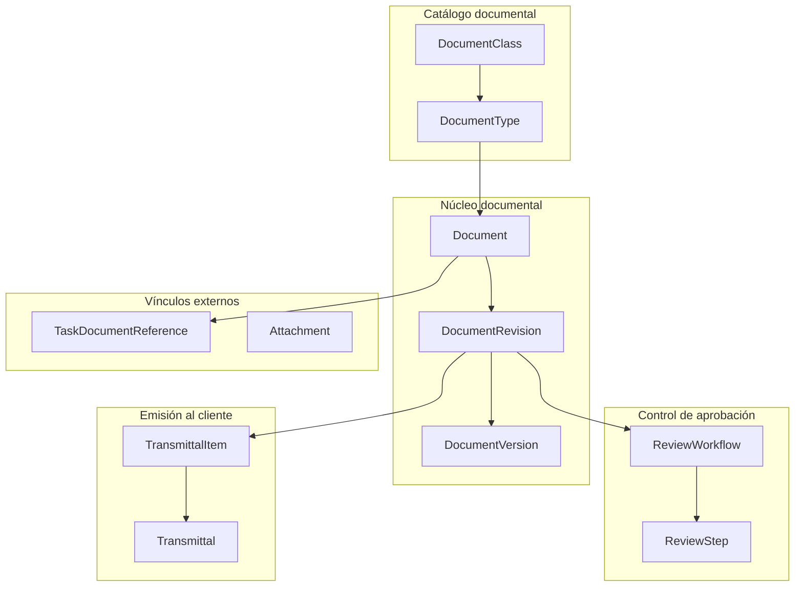

# Plan de evolución funcional — OperMask Documents

**Estado:** Decisiones aprobadas — en ejecución por bloques
**Versión:** 1.3
**Alcance:** subsistema de Gestión Documental (`Document`, `DocumentRevision`, `DocumentVersion`, `ReviewWorkflow`, `ReviewStep`, `Transmittal`, `TransmittalItem`, catálogos, adjuntos y vínculo con tareas de proyecto).

## Objetivo

Relevar el comportamiento implementado del subsistema de Gestión Documental, exponer sus brechas y dejar planteadas las decisiones funcionales que deben confirmarse **antes** de documentar cualquier regla en la SFS.

Este documento no aprueba comportamiento. Las enumeraciones que siguen son observaciones verificadas contra el código; ninguna constituye todavía una regla de negocio.

## Estado de partida verificado

Relevado sobre `prisma/schema.prisma`, `schema.graphql` y `src/resolvers/` a la fecha de este documento.

- El subsistema está completo en el backend: 8 modelos, 10 enumeraciones y las operaciones GraphQL correspondientes.
- El circuito implementado es: `createDocument` crea documento, primera revisión y primera versión en una sola operación; `createRevision` abre revisiones sucesivas; `registerVersion` agrega versiones dentro de una revisión en `DRAFT`; `initiateReview` abre el circuito de aprobación; `approveStep` / `rejectStep` lo resuelven; los transmittals se crean, emiten, responden y cierran.
- La única vía por la que una revisión llega a `APPROVED` es la aprobación del último paso no `ACKNOWLEDGE` de un `ReviewWorkflow`.
- Al aprobarse una revisión, las revisiones anteriores en `APPROVED` del mismo documento pasan a `SUPERSEDED`.
- Toda la trazabilidad se escribe hoy en `DocumentSysLog`, mezclada con los errores técnicos del servicio.
- **No existe ninguna pantalla que consuma este subsistema.** Los directorios `documents/` y `transmittals/` bajo `201-mi-webapp/app/(withSidebar)/projects/documents/[projectId]/` están vacíos y el hub ya los enlaza.
- **No existen pruebas automatizadas** en el módulo.

## Línea base de uso productivo

Confirmado funcionalmente:

- **Ningún cliente utiliza hoy el subsistema de Gestión Documental.** No hay documentos, revisiones, versiones, workflows ni transmittals en uso productivo.
- **Un único cliente utiliza `ScannedFile` y `Area`**, con la funcionalidad implementada en la webapp.

Esta línea base tiene una consecuencia central sobre la estrategia: el subsistema de Gestión Documental **no arrastra datos productivos**. Sus cambios de modelo no requieren compatibilidad hacia atrás, backfill, ni migración por etapas. La estructura puede corregirse de forma directa antes de que exista el primer uso real.

Por el contrario, la salida de `ScannedFile` y `Area` hacia `212-mi-digitalization` **sí opera sobre datos y sobre una interfaz en producción**, y exige preservar la continuidad operativa de ese cliente.

Antes de aplicar las migraciones se verificará el supuesto contra las bases de cada cliente, para confirmar que las tablas del subsistema documental están efectivamente vacías.

## Organización funcional propuesta

Hipótesis inicial para ordenar el relevamiento. No es todavía una arquitectura conceptual aprobada.

## Hallazgos de implementación

Los siguientes puntos requieren revisión antes de convertirse en reglas aprobadas.

### Ciclo de revisión

| # | Tema | Situación actual observada | Estado |
| - | ---- | -------------------------- | ------ |
| H-01 | Revisión bloqueada tras un rechazo | `rejectStep` devuelve la revisión a `DRAFT` y marca el workflow como `REJECTED`. Como `ReviewWorkflow.revisionId` es único, esa revisión ya no admite un segundo workflow; y como `createRevision` rechaza abrir una nueva mientras exista una en `DRAFT` o `IN_REVIEW`, el documento queda sin salida funcional. Resuelto por D-10: el rechazo interno produce una nueva versión dentro de la misma revisión, y la restricción de unicidad del workflow debe caer. Cerrado en `BLOCK_03`. | `PROMOVIDO_A_SFS` |
| H-02 | Sin circuito para documentos que no requieren aprobación | `DocumentType.requiresWorkflow` se persiste pero no se consulta en ninguna validación. No existe operación que apruebe una revisión sin workflow, de modo que un documento de tipo informativo permanece en `DRAFT` indefinidamente. Resuelto por D-03 y cerrado en `BLOCK_03`, donde el circuito mínimo pasó a ser un resultado del armado. | `PROMOVIDO_A_SFS` |
| H-03 | Ausencia de control sobre el firmante | `approveStep` y `rejectStep` no verifican que el usuario autenticado sea el `assignedToId` del paso. Cualquier usuario con `DOCUMENTS_WORKFLOW_UPDATE` puede resolver el paso asignado a otro, y no queda registro de quién lo resolvió realmente. Resuelto por D-04 y cerrado en `BLOCK_03`, con la delegación registrada, su motivo y su permiso propio. | `PROMOVIDO_A_SFS` |
| H-04 | Pasos de toma de conocimiento sin cierre | `approveStep` excluye los pasos `ACKNOWLEDGE` del cálculo de completitud. Al completarse el workflow, esos pasos quedan `PENDING` de forma permanente. Deja de ser un defecto menor: según D-19, el paso de toma de conocimiento **es** el mecanismo con que se comunica un documento interno aprobado, dado que no existe emisión que lo haga. `BLOCK_03` los cerró con un estado terminal de cumplimiento y una operación de acuse posterior a la aprobación. | `PROMOVIDO_A_SFS` |
| H-05 | Cancelación sin identidad propia | `cancelWorkflow` deja el workflow en `REJECTED`; el motivo de la cancelación solo se escribe en el registro técnico y no queda en el modelo. Una cancelación es indistinguible de un rechazo. Resuelto por D-17 y cerrado en `BLOCK_03`, con `WorkflowStatus.CANCELLED` y el motivo en el modelo. | `PROMOVIDO_A_SFS` |
| H-06 | Alcance de la firma | `signatureHash` se calcula como SHA-256 de `stepId`, `userId`, marca temporal y acción. No incorpora la versión ni el `checksum` del archivo, por lo que no acredita **qué** se aprobó. Tampoco se persisten los datos firmados, de modo que el hash no es verificable a posteriori. Resuelto por D-05 y cerrado en `BLOCK_03`, con el payload persistido; `BLOCK_03B` lo llevó a `payloadVersion` 2. | `PROMOVIDO_A_SFS` |
| H-07 | Consulta de pendientes ajenos | `pendingReviewSteps` recibe el `userId` como argumento y no lo contrasta con el usuario autenticado. Alineado con D-04 y cerrado en `BLOCK_03`: devuelve los del usuario autenticado, y consultar los ajenos exige el permiso del trabajo ajeno. | `PROMOVIDO_A_SFS` |
| H-08 | Estados inalcanzables | `WorkflowStatus.PENDING` nunca se asigna: `initiateReview` crea el workflow directamente en `IN_PROGRESS`. `RevisionStatus.OBSOLETE` no lo asigna ninguna operación. Cerrado: `BLOCK_03` retiró `WorkflowStatus.PENDING` y `BLOCK_03B` eliminó `RevisionStatus.OBSOLETE`. | `PROMOVIDO_A_SFS` |
| H-09 | Códigos de revisión arbitrarios | `createRevision` acepta un `revisionCode` explícito sin validar formato ni progresión, lo que permite salir de la secuencia del esquema. Resuelto por D-13 y cerrado en `BLOCK_03`: se admite solo bajo `FREE_TEXT`. | `PROMOVIDO_A_SFS` |
| H-10 | Orden de revisiones por código | `switchRevisionScheme` sobre un documento con revisiones `A`, `B`, `C` que pasa a `NUMERIC` genera `0` como siguiente código. El comportamiento es el buscado (D-13), pero deja secuencias como `A, B, C, 0, 1`: ordenar o comparar revisiones por su código pierde sentido y el orden debe darse por secuencia de creación. Cerrado en `BLOCK_03`: `lastRevision` se resuelve por secuencia de creación y no por código. | `PROMOVIDO_A_SFS` |
| H-34 | Versiones bloqueadas durante la revisión | `registerVersion` exige que la revisión esté en `DRAFT` y rechaza cualquier versión mientras está en `IN_REVIEW`. Contradice el ciclo de D-10: el revisor que marca el plano genera una versión **durante** el circuito. Cerrado en `BLOCK_03`: la versión la registra quien tiene el paso vigente, en cualquier punto del circuito. | `PROMOVIDO_A_SFS` |
| H-35 | Versión sin origen ni naturaleza | `DocumentVersion` no registra qué representa cada versión: original del autor, comentada por el revisor o corregida tras un rechazo. Se resuelve no incorporando esa clasificación: rige la secuencia y la última versión es la vigente (D-10). El hallazgo se cierra sin cambio de modelo. | `DESCARTADO` |

### Emisión al cliente

| # | Tema | Situación actual observada | Estado |
| - | ---- | -------------------------- | ------ |
| H-11 | Emisión de revisiones no aprobadas | `createTransmittal` no valida el estado de las revisiones incluidas. Es posible emitir al cliente una revisión en `DRAFT` o en `IN_REVIEW`. Resuelto por D-18: puerta dura, sin excepción por código de propósito. Cerrado en `BLOCK_04` (B3), y aplicada además al incorporar el ítem. | `PROMOVIDO_A_SFS` |
| H-12 | Acuse de recibo sin operación | `TransmittalStatus.ACKNOWLEDGED` se acepta como estado de origen para responder, pero ninguna operación lo asigna. Cerrado en `BLOCK_04` (B8): el acuse tiene operación propia, y solo en modo Emisor. | `PROMOVIDO_A_SFS` |
| H-13 | Items inmutables tras la creación | No existe operación para agregar ni quitar `TransmittalItem` después de crear el transmittal, ni siquiera en estado `DRAFT`. Cerrado en `BLOCK_04` (B9): se agregan y se quitan en borrador, y quitar libera la revisión. | `PROMOVIDO_A_SFS` |
| H-14 | Respuesta sin verificación de pertenencia | `respondTransmittal` actualiza cada item por su identificador sin comprobar que pertenezca al transmittal indicado. Cerrado en `BLOCK_04` (B5) **por construcción**: la respuesta se crea contra el ítem y aquella operación en lote ya no existe. | `PROMOVIDO_A_SFS` |
| H-15 | Cierre sin respuesta completa | `closeTransmittal` no exige que todos los items tengan `clientStatus` registrado. Deja de ser una brecha: las respuestas parciales son la práctica normal y el cierre no condiciona el avance de ningún documento (D-18). Resta definir si el cierre se deriva de los ítems o admite cierre explícito con motivo.Cerrado en `BLOCK_04` (B10): el cierre es explícito, con motivo, y no exige respuestas completas. | `PROMOVIDO_A_SFS` |
| H-16 | Numeración global y no transaccional | `generateTransmittalCode` deriva `TR-NNN` del último registro por identificador, sin secuencia ni transacción, y la numeración es global en lugar de por proyecto. Cerrado en `BLOCK_04` (B2): unicidad por proyecto y cálculo dentro de la transacción. | `PROMOVIDO_A_SFS` |
| H-29 | Transmittal sin sentido de circulación | El modelo asume una única dirección: se emite y el cliente responde sobre el mismo registro. No existe el concepto de transmittal **entrante** ni el vínculo entre uno de respuesta y el que responde. Según D-18: en modo Emisor el transmittal es saliente y la respuesta llega como transmittal de retorno o documento a documento; en modo Receptor es entrante y **no hay transmittal de salida**. Cerrado en `BLOCK_04` (B1): la naturaleza se declara y el sentido se deriva. | `PROMOVIDO_A_SFS` |
| H-30 | Sin archivos de respuesta del cliente | La respuesta solo admite `clientStatus` y comentarios de texto. No hay forma de incorporar los archivos marcados que devuelve la contraparte, que son la evidencia de la observación. Cerrado en `BLOCK_04` (B5 y B6): los archivos devueltos cuelgan de la respuesta, porque llegan de afuera del circuito. | `PROMOVIDO_A_SFS` |
| H-31 | Sin listado de documentos esperados | En modo Receptor la planta debe definir los documentos obligatorios por contrato, sobre los que el proveedor emite, pudiendo agregar adicionales. No existe ningún concepto equivalente en el modelo. `BLOCK_04` lo cierra sin incorporarlo: todo documento del proyecto es esperado, y pendiente es el que no salió, derivado y no declarado (B13). | `PROMOVIDO_A_SFS` |
| H-32 | Sin alcance para usuarios externos | Ambos modos pueden incorporar usuarios ajenos a la organización que hospeda el sistema: el contratista en modo Receptor, y el cliente que responde directamente en modo Emisor (D-12). Cada uno debe ver únicamente lo que le corresponde. No existe hoy ningún mecanismo de alcance: la autorización es puramente global por permiso. Resuelto por D-15 y promovido con `BLOCK_02`, como autorización en dos capas. | `PROMOVIDO_A_SFS` |
| H-36 | Sin matriz de responsabilidad | En modo Receptor los documentos recibidos se distribuyen entre revisores según disciplina, tipo o área. Salió del alcance de `BLOCK_04` con dos de sus tres ejes ya construidos: la plantilla de `BLOCK_03` resuelve por proyecto, clase y tipo con actores preasignados, y en proyectos la clase es la disciplina. **Descartado al abrir `BLOCK_02B` (B9)**, que retira el eje de área —el único pendiente— por desproporcionado: los revisores de un proyecto son los mismos sin importar el sector, y si cambiaran serían proyectos distintos, porque cada proyecto es un contrato (D-15). Sin ese eje la matriz queda sin contenido. Lo que quede fuera de la propuesta lo resuelve la reasignación de D-04. | `DESCARTADO` |
| H-33 | Respuesta sin autoría diferenciada | El modelo no distingue quién respondió de quién registró la respuesta. En el caso habitual del modo Emisor la ingresa el control documental de la ingeniería, y esa diferencia debe quedar explícita (D-12). Tampoco se conserva la fecha real de la respuesta frente a la de registro. Cerrado en `BLOCK_04` (B5): autoría diferenciada, con la divergencia derivada. | `PROMOVIDO_A_SFS` |

### Modelo y alcance

| # | Tema | Situación actual observada | Estado |
| - | ---- | -------------------------- | ------ |
| H-17 | Documento sin proyecto | `Document` no tiene `projectId`. Su contexto se expresa con `module` más `entityType`/`entityId` genéricos, mientras que `Transmittal`, `Area` y `ScannedFile` sí tienen `projectId`. No hay forma directa de listar los documentos de un proyecto. Resuelto por D-06 y promovido con `BLOCK_02`. | `PROMOVIDO_A_SFS` |
| H-18 | Doble vínculo documento–tarea | Coexisten `Document.projectTaskId` (entregable principal) y `TaskDocumentReference` con rol `OUTPUT`. Ambos expresan producción documental de una tarea y pueden contradecirse. Diferido por D-07. | `PROPUESTO` |
| H-28 | Módulos sin uso real | `Document.module` admite seis módulos, pero no existe ningún consumidor fuera de proyectos: `mi-quality` solo invoca `checkDocumentDependencies` para proteger borrados y nunca crea documentos; la webapp solo consume los catálogos. `entityType`/`entityId` no tienen usos productivos. `BLOCK_02` los retiró y conservó `module` como discriminador. | `PROMOVIDO_A_SFS` |
| H-19 | Unicidad con columnas anulables | `Document`, `DocumentClass` y `DocumentType` declaran unicidad sobre tuplas que incluyen columnas anulables. Cuando `module`, `entityType`, `entityId` o `classId` son nulos, la restricción no impide duplicados. `BLOCK_02` lo cerró para `Document` con dos índices únicos parciales (B2). `BLOCK_03` lo cierra para los dos catálogos con `NULLS NOT DISTINCT`, disponible desde PostgreSQL 15 y verificado en los tres ambientes. A diferencia del resto del subsistema, **estos catálogos tienen datos productivos**: exige verificar duplicados preexistentes por cliente antes de migrar. Cerrado en `BLOCK_03` (B15), con las dos partes del hallazgo resueltas. | `PROMOVIDO_A_SFS` |
| H-20 | Documento sin archivo imposible | `createDocument` exige `fileKey`, `fileName`, `fileSize` y `mimeType`. No es posible registrar un documento previsto antes de contar con su archivo. Deja de ser una mejora independiente: al abarcar el circuito la elaboración (D-03), el archivo es el **producto** de un paso y no puede exigirse al crear el documento. `BLOCK_03` lo incorporó: la primera versión dejó de crearse en el alta. | `PROMOVIDO_A_SFS` |
| H-21 | Adjuntos sin ciclo de vida ni consumidores | `Attachment` carece de `terminatedAt` y `updatedAt`, y no se relaciona con `Document`. Sus operaciones están expuestas en GraphQL, pero no las consume ni la webapp ni `mi-quality`. Diferido por D-08. | `PROPUESTO` |
| H-22 | Permisos poco específicos | `createRevision` y `registerVersion` exigen `DOCUMENTS_DOCUMENT_CREATE` en lugar de un permiso propio de revisión; `cancelWorkflow` exige `DOCUMENTS_WORKFLOW_CREATE`. | `PROPUESTO` |
| H-27 | Integridad del archivo opcional | `DocumentVersion.checksum` es anulable y ninguna operación lo exige. Si la firma debe acreditar el contenido aprobado (D-05), una versión sometida a aprobación sin checksum no es verificable. Cerrado en `BLOCK_03`: se exige en toda versión, sin regla condicional. | `PROMOVIDO_A_SFS` |

### Trazabilidad

| # | Tema | Situación actual observada | Estado |
| - | ---- | -------------------------- | ------ |
| H-23 | Auditoría funcional mezclada con log técnico | Toda la traza se escribía en `DocumentSysLog`, junto con los errores del servicio, en registros de texto sin tipo de objeto ni estado. Resuelto por D-01 e implementado en `BLOCK_01`: las 25 escrituras funcionales del subsistema documental se sustituyeron por `DocWorkflowEvent` y `DocAuditEvent`. `DocumentSysLog` conserva la operación del servicio y el subsistema legado. | `PROMOVIDO_A_SFS` |
| H-24 | Módulo del registro inconsistente | Los transmittals registraban siempre `SysLogModule.PROJECTS`, mientras que el resto derivaba el módulo del documento afectado. La inconsistencia vivía en `DocumentSysLog.module` y desapareció con `BLOCK_01`, al sustituirse las 25 escrituras que la producían. El hallazgo no reclamaba suprimir el módulo sino derivarlo: `BLOCK_02` lo incorpora a ambos eventos junto con `projectId`, derivado del objeto afectado y nunca informado por quien emite (B9). | `PROMOVIDO_A_SFS` |

### Cobertura y validación

| # | Tema | Situación actual observada | Estado |
| - | ---- | -------------------------- | ------ |
| H-25 | Subsistema sin interfaz | Ninguna pantalla consume documentos, revisiones, versiones, workflows ni transmittals. El hub de documentos de proyecto enlaza a rutas cuyos directorios están vacíos. D-28 fija dónde se construye cada pantalla, y con ello que `BLOCK_05` nazca en la ubicación definitiva y no en la ruta actual. | `IMPLEMENTADO_CON_BRECHA` |
| H-26 | Sin pruebas automatizadas | El módulo no tenía marco de pruebas ni script `test`. `BLOCK_01` incorporó la base con `node:test`, sin dependencias nuevas: 28 pruebas en tres suites, incluida la verificación de la garantía transaccional contra la base. Resta la cobertura de integración de los resolvers, diferida al end-to-end con la webapp (`BLOCK_05`). | `IMPLEMENTADO_CON_BRECHA` |

## Decisiones del plan

### D-01 — Trazabilidad funcional como objeto del dominio

**Estado:** Aprobada.

La trazabilidad del subsistema de Gestión Documental se modela con eventos funcionales de dominio, siguiendo el tratamiento de `DigiWorkflowEvent` y `DigiAuditEvent` en OperMask Digitalization:

- un evento de **workflow** registra transiciones de estado: qué objeto cambió, desde qué estado, hacia cuál y cuándo;
- un evento de **auditoría** registra acciones ejecutadas: quién hizo qué, sobre qué objeto, cuándo y con qué datos de contexto;
- ambos son inmutables: no se modifican ni se eliminan.

`DocumentSysLog` conserva su función actual de registro técnico del servicio y de trazabilidad del subsistema legado de `ScannedFile`. Deja de ser la fuente de trazabilidad funcional del subsistema documental.

Alternativa descartada: enriquecer `DocumentSysLog` con tipo de objeto y estados. Se descarta porque mantiene la auditoría funcional mezclada con los errores técnicos y no permite consultarla como parte del dominio.

Resuelto en `BLOCK_01`: nomenclatura de los objetos y de las acciones (B1 y B5), emisión dentro de la transacción del cambio (B3) y relación de una acción con varias transiciones (B4). `BLOCK_02` incorpora a ambos eventos el contexto del objeto afectado —`projectId`, que aquel bloque había diferido, y `module`, que resuelve H-24— derivado y no informado por quien emite (B9).

**Los campos de fecha de las entidades complementan al evento y no lo reemplazan.** Era el último pendiente de esta decisión —`approvedAt`, `issuedAt`, `completedAt`—, que `BLOCK_01` conservó sin definir y que `BLOCK_03` y `BLOCK_04` alteraron sin resolver.

Se conservan con la fórmula que `BLOCK_02B` fijó para el snapshot de la ruta: **son denormalización de conveniencia y no evidencia**. El evento es la fuente de verdad, y estos campos existen para no pagar un recorrido de eventos cada vez que hay que mostrar u ordenar por una fecha.

Tres hechos lo sostienen:

- **no pueden separarse del evento**, porque `BLOCK_01` ya exige emitirlo dentro de la transacción del cambio (`B3`). La fecha y su evento se escriben juntos o no se escribe ninguno;
- **son campos del contrato que la interfaz va a mostrar en cada fila de cada listado.** Derivarlos del evento es un recorrido por fila para pintar una fecha;
- **`issuedAt` además ordena** hoy, y ordenar por un dato derivado obliga a materializarlo igual.

De ahí la regla que vuelve legítima la redundancia: **si alguna vez divergen, gana el evento.** Un campo de fecha se corrige contra la traza; la traza no se corrige contra el campo.

Lo que se descarta es el estado intermedio, que es el que había: conservarlos sin declarar qué son. Es lo que mantuvo este pendiente abierto tres bloques, y es la misma clase de ambigüedad que `BLOCK_02B` retiró al declarar que el snapshot no era evidencia.

### D-02 — El rechazo es terminal para la revisión

**Estado:** Reemplazada por D-10.

Se había acordado que una revisión rechazada quedaba en `REJECTED` de forma definitiva y que la corrección exigía crear una revisión sucesora.

Esa decisión partía de una lectura equivocada del modelo: trataba el rechazo del circuito **interno** como si cerrara la unidad **externa**. Al precisarse el ciclo real de emisión (D-09), quedó claro que el rechazo interno no debe consumir un código de revisión. Se reemplaza por D-10.

### D-03 — Toda revisión se aprueba por workflow

**Estado:** Aprobada.

Se elimina la distinción entre documentos con y sin circuito de aprobación. Toda revisión atraviesa un `ReviewWorkflow`; el camino a `APPROVED` es siempre la resolución de sus pasos.

Los documentos que no requieren revisión formal utilizan un **workflow mínimo**: un único paso de tipo `APPROVE`. El comportamiento resultante es el ciclo `DRAFT` → `APPROVED`: mientras la revisión está en borrador solo la ve quien la trabaja; una vez aprobada, queda disponible para el resto.

Alternativa descartada: una operación de aprobación directa que omita el workflow cuando `requiresWorkflow` es falso. Se descarta porque abriría un segundo camino a `APPROVED` sin firma ni trazabilidad, y duplicaría las reglas de transición.

Definido al abrir `BLOCK_03`, y amplía el alcance de esta decisión:

- **el circuito se instancia con la revisión y abarca el ciclo completo.** No empieza cuando el documento está hecho: su primer paso es el **armado** (`ASSIGN`), donde se designan el elaborador y los revisores, y el segundo es la **elaboración** (`PREPARE`), asignado al elaborador. Completar la elaboración es someter a revisión. La secuencia queda `ASSIGN` ▸ `PREPARE` ▸ `REVIEW` ▸ `APPROVE` ▸ `ACKNOWLEDGE`, y los dos nombres nuevos los aporta el propio dominio: el rótulo de un plano declara *Prepared by / Reviewed by / Approved by*;
- en consecuencia, **`initiateReview` deja de existir como operación**: se reparte en definir el circuito —completa el armado y crea los pasos siguientes— y someter —completa la elaboración—;
- **el workflow mínimo deja de ser un objeto aparte** y pasa a ser un resultado del armado: un circuito cuya designación se limita a un único paso de aprobación. No necesita regla propia, y con ello se resuelve a quién se asigna su paso único: a quien el armado designe;
- **el circuito se reinstancia en lugares distintos según la salida**. El rechazo abre uno nuevo desde `PREPARE`, **copiando** el elenco del anterior; una revisión nueva abre uno desde `ASSIGN`, donde el elenco puede cambiar; la cancelación devuelve al armado (D-17). El elenco se copia y no se referencia, para que reasignar un paso del circuito nuevo no altere la historia del anterior;
- `DocumentType.requiresWorkflow` **cambia de significado**: ya no indica si hay circuito —siempre lo hay— sino si corresponde el formal o el mínimo. Su nombre se revisa en el bloque, y se trata como sugerencia del armado y no como invariante.

La revisión conserva sus estados: permanece en `DRAFT` mientras el circuito está en armado o en elaboración, y pasa a `IN_REVIEW` al someterse. El detalle de dónde está el trabajo lo da el paso vigente, de modo que no hace falta un estado por paso.

**El circuito se propone con una plantilla y se confirma en el armado.** La plantilla declara los pasos de revisión y aprobación, con actores preasignados o sin ellos, y tiene alcance por proyecto con refinamiento por clase y por tipo de documento, resolviéndose la más específica. No incluye el armado ni la elaboración, que el sistema pone siempre. Sus valores **se copian** al materializarse los pasos: cambiar la plantilla no altera circuitos en curso.

**El elaborador nunca se preasigna**, porque designarlo es distribuir carga de trabajo y se decide documento por documento. Por eso el paso de armado tiene contenido incluso con la plantilla más completa.

**El único actor que debe conocerse al crear el documento es el armador**, que se designa de forma obligatoria, con un valor por defecto configurado en el proyecto —habitualmente el jefe de proyecto—. Puede serlo cualquiera con permiso y membresía vigente: no se crea un padrón de armadores habilitados. Que el alta se lo asigne al jefe de proyecto y este lo derive al jefe de especialidad es la reasignación de D-04 aplicada a ese paso, y no requiere ningún concepto adicional.

En consecuencia, **no existe documento sin circuito**: lo que en la práctica se describe como dar de alta el documento y asignarle el workflow después es un circuito con su paso de armado pendiente. Los pasos siguientes se materializan al completarse el armado, y no antes, porque hasta entonces no tienen actor.

Esto tiene un efecto sobre H-20 que el plan no había previsto: **el archivo pasa a ser el producto del paso de elaboración**, de modo que no puede exigirse al crear el documento. La primera versión deja de crearse en el alta, y la precondición se traslada: someter exige al menos una versión con su `checksum`.

### D-04 — La aprobación admite delegación, pero queda registrada

**Estado:** Aprobada.

No se restringe la resolución de un paso al usuario asignado. Un administrador puede aprobar o rechazar el paso asignado a otra persona, situación legítima ante ausencias o urgencias.

A cambio, el modelo registra **quién resolvió efectivamente** el paso, además de quién estaba asignado. Cuando ambos no coinciden, la divergencia queda marcada de forma explícita y visible en la traza y en la interfaz: el paso muestra que fue resuelto por delegación.

Alternativa descartada: exigir coincidencia entre asignado y actor. Se descarta porque bloquea la operación real ante ausencias sin aportar garantía adicional, dado que la trazabilidad se obtiene registrando la diferencia.

Ampliada al abrir `BLOCK_03`: **el paso también se reasigna.** La firma delegada resuelve el momento —alguien firma por otro— y la reasignación resuelve la conducción: el revisor que no está, o la redistribución de carga de trabajo, incluida la elaboración de un documento ya asignado. Las dos capacidades conviven y no se reemplazan.

La reasignación alcanza a los pasos pendientes, incluido el vigente, y **no a los ya resueltos**, cuya firma acredita quién los resolvió. No altera el circuito: cambia el actor, nunca el tipo del paso, su orden ni cuántos son. Que la estructura del circuito sea inmutable una vez armada es lo que le conserva su uso propio a la cancelación de D-17, que es la vía para rearmarlo.

Definido al abrir `BLOCK_03`:

- **la resolución delegada exige un permiso especial**, siguiendo el precedente de `DOCUMENTS_SCANNED_FILE_ADMIN_UPDATE`. Es además **el mismo permiso que gobierna todo acto sobre el trabajo ajeno**: firmar por otro, reasignar un paso, registrar una versión sobre un paso ajeno y consultar pendientes ajenos. Uno solo, no cuatro;
- **la delegación exige motivo**, conservado en el paso y dentro del payload firmado. Es lo que la vuelve trazable y no solo permitida;
- **quién resolvió efectivamente el paso se registra siempre**, y la divergencia con el asignado se deriva de ambos campos en lugar de almacenarse como indicador;
- **`pendingReviewSteps` devuelve los del usuario autenticado** (H-07). Su argumento pasa a opcional: informado y distinto del autenticado, exige el permiso especial. Sigue acotado por membresía, de modo que el permiso habilita ver pendientes ajenos, no proyectos ajenos.

### D-05 — La firma acredita quién aprobó y qué aprobó

**Estado:** Aprobada.

La firma de un paso debe permitir demostrar, a posteriori, **qué contenido exacto** se aprobó y **quién** lo aprobó. Para ello incorpora:

- el paso, el workflow y la revisión;
- la `DocumentVersion` vigente al momento de la firma, con su número, `fileKey` y `checksum`;
- el usuario asignado y el usuario que resolvió efectivamente el paso (D-04);
- la acción y el momento en que se produjo.

Los datos firmados se **persisten junto al hash**. Un hash cuyos insumos no se conservan no es verificable y no constituye evidencia.

Ampliada al abrir `BLOCK_03`: la firma incorpora además **la metadata del documento vigente al firmar** —código, título, clase y tipo—. El motivo es material: esa metadata está impresa dentro del archivo, en el rótulo del plano, y a menudo el código mismo se compone de la clase y el tipo. La clasificación no es descripción sino **identidad**, de modo que acreditar "qué se aprobó" exige acreditar también cómo estaba identificado.

De ahí se desprende una regla que no es del versionado sino de la identidad: **con una revisión aprobada, la metadata del documento se congela**, y corregirla exige abrir una revisión nueva. Es lo que el control documental hace igual, porque un rótulo distinto es un documento distinto. Mientras la revisión vigente no esté aprobada, la metadata se edita libremente; abrir la revisión siguiente vuelve a habilitarla.

Su contracara es la definición de versión, que el mismo bloque fija: **una versión es un archivo**. Un cambio de metadata nunca produce una versión —es una actualización auditada del documento— y una versión, una vez creada, no se modifica ni se elimina.

Consecuencia sobre el modelo (H-27): el `checksum` de la versión deja de ser opcional. Definido al abrir `BLOCK_03`: **se exige en toda versión**, sin regla condicional. No hay versiones existentes que tratar, y cualquier alternativa obligaría a decidir qué pasa con la que entró sin checksum y después resulta ser la firmada.

Queda declarada una dependencia: **hoy nadie lo calcula.** `mi-fileserver` no lo produce, y el precedente portable es el de digitalización, donde el navegador lo computa antes de pedir la URL presignada. Es la única regla de ese bloque cuyo cumplimiento depende de un componente que no construye.

La firma se modela como **objeto propio**, uno por firma, con su payload persistido: separarla del paso permite declararla inmutable sin excepciones, mientras que el paso sigue actualizándose.

### D-06 — El documento pertenece a un proyecto

**Estado:** Aprobada.

`Document` incorpora `projectId`, del mismo modo que ya lo tiene `Transmittal`. El proyecto pasa a ser la unidad de agrupación y de alcance de la gestión documental, y habilita listar, filtrar y numerar documentos por proyecto sin recurrir a la combinación genérica `entityType`/`entityId`.

`module` se conserva. El módulo de documentos está concebido para dar servicio documental a varios módulos del ecosistema, y ese discriminador es lo que lo hace posible. `Transmittal` no lo tiene porque nació como capacidad exclusiva de proyectos; si en el futuro se extiende a otros módulos, deberá incorporarlo.

**El foco funcional actual es la gestión documental de proyectos.** La extensión a calidad u otros módulos se evaluará después, una vez consolidado el circuito sobre proyectos.

El relevamiento respalda esa concentración: no existe hoy ningún consumidor de documentos fuera de proyectos (H-28). `mi-quality` únicamente invoca `checkDocumentDependencies` como protección de borrado entre servicios y nunca crea documentos; la webapp solo consume `DocumentClass` y `DocumentType`.

Alternativa descartada: derivar el proyecto de `entityType = "project"` más `entityId`. Se descarta porque deja el vínculo sin integridad referencial ni índice propio, y obliga a cada consumidor a conocer una convención implícita.

Definido al abrir `BLOCK_02`:

- **`projectId` admite nulo y el invariante lo exige** cuando `module = PROJECTS`. Un `projectId` nulo no es una ausencia: identifica el régimen de publicación descrito más abajo. Se descartó crear un proyecto reservado del sistema que permitiera declararlo obligatorio, porque el módulo no es dueño de `Project` y el invariante quedaría sostenido por convención entre servicios (`BLOCK_02`, B1);
- **`entityType` y `entityId` se retiran.** `module` se conserva como discriminador. La consecuencia sobre `checkDocumentDependencies` se declara por rama en `BLOCK_02`, B3;
- **la unicidad se resuelve con dos índices únicos parciales**: por proyecto para los documentos en circulación, por módulo para los publicados. Cierra H-19 para `Document` (`BLOCK_02`, B2).

Al no existir documentos productivos, estos cambios se aplican de forma directa sobre el modelo, sin etapas de compatibilidad.

### D-07 — La interfaz entre tareas y documentos se posterga

**Estado:** Aprobada — diferida.

El vínculo entre documentos y tareas de proyecto queda fuera del alcance inmediato. El trabajo se concentra primero en el núcleo de la gestión documental de proyectos; la interfaz con tareas se retoma después, con su propio análisis.

Se preserva la intención original que motivó el vínculo, para no perderla: registrar el **avance de una tarea a partir de la revisión aprobada** de su documento entregable, de modo que la aprobación documental alimente el progreso del proyecto. Es una capacidad deseada, no descartada.

En consecuencia, `Document.projectTaskId` y `TaskDocumentReference` se mantienen como están, sin ampliarse ni consolidarse, hasta abrir el bloque correspondiente. La unificación de ambos niveles (H-18) se decide entonces, junto con el mecanismo de avance por aprobación.

### D-09 — El proyecto declara el rol documental del sistema

**Estado:** Aprobada. Ampliada por D-19, que incorpora un tercer rol sin contraparte.

El módulo opera en dos modos según quién hospeda el sistema y hay contraparte. El modo es un atributo **del proyecto**, no del despliegue: un mismo cliente puede tener proyectos en uno u otro rol.

**Modo Emisor** — el sistema lo usa la empresa de ingeniería; el cliente es la planta.

1. El documento se elabora y atraviesa el circuito de revisión **interno** de la ingeniería.
2. Aprobado internamente, se emite al cliente mediante un `Transmittal` saliente.
3. El cliente responde: aprueba, aprueba con comentarios o rechaza, con sus archivos marcados.
4. La respuesta cierra la revisión emitida y habilita el ciclo siguiente.

**Modo Receptor** — el sistema lo hospeda la planta; sus proveedores de ingeniería emiten dentro de él.

1. El proveedor da de alta o toma un documento esperado, y crea un `Transmittal` con sus archivos.
2. **El proveedor no realiza circuito interno dentro del sistema**: sube documentación ya aprobada por sus propios medios.
3. El personal de la planta califica la emisión recibida: aprueba, aprueba con comentarios o rechaza.
4. La calificación habilita al proveedor a emitir una nueva revisión en un nuevo transmittal.

La diferencia estructural entre ambos es el **orden**: en modo Emisor el circuito de revisión precede al transmittal; en modo Receptor el transmittal precede a la revisión, porque lo que se califica es la emisión ya recibida.

Lo que **no** cambia entre modos: la revisión sigue siendo la unidad externa y la versión la iteración interna (D-10); toda aprobación pasa por un workflow con firma (D-03, D-05); la respuesta de la contraparte cierra la revisión.

Esto reconcilia D-03: la regla "toda revisión se aprueba por workflow" se mantiene en ambos modos. Lo que cambia es quién ejecuta ese workflow y en qué momento — la ingeniería antes de emitir, o la planta después de recibir.

Definido al abrir `BLOCK_02`:

- **el rol se declara en `DocProjectSettings`**, un registro por proyecto, con la enumeración `DocumentRole { ISSUER, RECEIVER }`. Esa misma entidad alojará después el esquema de revisión de D-13 y la configuración de ubicación de D-14 (`BLOCK_02`, B4);
- **el rol es inmutable desde el primer documento o transmittal.** Antes de eso se modifica libremente (`BLOCK_02`, B5);
- **el alcance de acceso del usuario externo lo resuelve la membresía de D-15**, aplicada como autorización en dos capas y como filtrado en los listados (`BLOCK_02`, B7).

Pendiente de definición al abrir el bloque correspondiente:

- en modo Receptor, el listado de documentos esperados: la planta define los obligatorios por contrato y el proveedor puede agregar adicionales.

**Resuelto al abrir `BLOCK_04`, y sin el concepto nuevo que este pendiente anticipaba.** Todo documento dado de alta en el proyecto es un documento esperado, y el que aparece después del alcance inicial también lo es: nació más tarde, no es de otra clase. Esperado y adicional describen **cuándo apareció** y no **qué es**, de modo que no hay dos tipos de documento ni un objeto de expectativa. Lo que el negocio pide ver —qué falta— es el documento que todavía no salió, y se deriva de la ausencia de un ítem de transmittal (`B13`).

### D-10 — La revisión es externa; la versión es interna

**Estado:** Aprobada. Reemplaza a D-02.

El modelo distingue dos niveles de iteración, y esa distinción gobierna todo el ciclo:

- la **revisión** es la unidad **externa**: lo que se emite a la contraparte y lo que la contraparte responde;
- la **versión** es la iteración **interna**: cada estado sucesivo del archivo dentro del circuito de revisión.

Las versiones se generan **a lo largo de todo el circuito**, no solo ante un rechazo. Cada intervención que altera el archivo produce una versión:

- el proyectista somete el documento a revisión — versión original, sin comentarios;
- el jefe de especialidad revisa y marca el plano — versión comentada, generada por el revisor;
- si hay rechazo, el proyectista corrige — versión corregida;
- el ciclo continúa hasta la aprobación, con tantas versiones como haya requerido.

El mismo mecanismo aplica en modo Receptor: cuando el personal de la planta incorpora marcas sobre el documento recibido, esa intervención genera una versión.

Definido al abrir `BLOCK_03`: **la versión la registra quien tiene asignado el paso vigente**, más quien cuente con el permiso superior que gobierna la firma delegada y la reasignación. No es una restricción de identidad sino de momento: cada versión es el producto del paso que se está ejecutando. De ahí que **una revisión aprobada no admita versiones nuevas**, porque no tiene paso vigente — y es lo que impide que la firma quede acreditando una versión que dejó de ser la última.

Se admiten dos recorridos de inicio: el documento nuevo, cuya primera versión la aporta el elaborador, y el documento preexistente, cuyo archivo se adjunta al darlo de alta. En ambos, comentar no genera versión: la genera **intervenir sobre el archivo**.

**Las versiones son secuenciales dentro de la revisión y la última es la vigente.** Esa es toda la regla: no se clasifica el origen ni la naturaleza de cada versión. La disciplina del propio ciclo lo resuelve — las versiones con marcas son las que acompañan un rechazo y devuelven el documento a borrador; la versión que se aprueba es una versión limpia. Lo único que el modelo debe garantizar es que la secuencia sea inequívoca, cosa que la unicidad de `[revisionId, versionNumber]` ya sostiene.

En consecuencia:

- **el rechazo interno no cambia la revisión.** Devuelve el trabajo a borrador dentro de la misma revisión, y la corrección se registra como una **nueva versión**. La revisión emitida conserva su código;
- **lo que hace avanzar la revisión es la respuesta de la contraparte.** Toda respuesta cierra la revisión emitida; la emisión siguiente lleva revisión nueva, aunque no se haya objetado nada;
- la revisión emitida queda cerrada por la respuesta recibida. El vocabulario de esa respuesta lo aporta D-22, que reemplaza la enumeración `ClientStatus` por un catálogo con efecto interpretado.

Alternativa descartada: hacer que el rechazo interno consuma un código de revisión (D-02). Se descarta porque expone la iteración interna al cliente, agota la secuencia de códigos con trabajo que nunca salió, y contradice la práctica de control documental de ingeniería.

Consecuencia estructural: `ReviewWorkflow.revisionId` es único, de modo que hoy una revisión admite un solo circuito. Esa restricción debe caer, según lo definido en D-11.

Esta decisión dejaba pendientes los estados de `DocumentRevision` que expresarían el cierre por respuesta de la contraparte. **Quedaron resueltos antes de abrir `BLOCK_04`, y en sentido contrario al que se anticipaba: no hay estados nuevos de la revisión.** D-26 eliminó `RevisionStatus.OBSOLETE` al confirmar que la respuesta de la contraparte no es un estado de la revisión sino la calificación de D-22, y `BLOCK_04` la registra en el ítem del transmittal por el que el documento salió. Que la revisión emitida esté cerrada **se lee de que tiene respuesta**, y no de un estado que lo declare: dos máquinas de estados sobre el mismo hecho es el defecto contra el que advierte el §1 de los principios.

El tratamiento del esquema de revisión se resuelve en D-13.

### D-11 — La revisión admite varios circuitos sucesivos

**Estado:** Aprobada.

El `ReviewWorkflow` permanece asociado a la **revisión**, no a la versión.

Ante un rechazo interno, el documento vuelve a borrador y se instancia un **nuevo workflow** sobre la misma revisión. Una revisión admite varios circuitos sucesivos, y su acumulación conserva la **historia completa de los rechazos** que la revisión atravesó antes de ser emitida.

En consecuencia:

- `ReviewWorkflow.revisionId` deja de ser único;
- `initiateReview` deja de rechazar la existencia de un workflow previo: solo impide abrir uno nuevo mientras haya otro sin resolver;
- la revisión distingue su circuito vigente de los ya cerrados.

Alternativa descartada: asociar el workflow a la versión. Se descarta porque fragmenta la historia del circuito entre versiones y dificulta leer cuántas vueltas necesitó una revisión antes de emitirse, que es justamente lo que interesa conservar.

Esto no altera D-05: la firma sigue referenciando la `DocumentVersion` vigente al momento de firmar. El workflow pertenece a la revisión; cada firma acredita la versión concreta que se aprobó.

El workflow **no registra explícitamente la versión con la que cerró**. Rige la misma regla de D-10: dentro de la revisión las versiones son secuenciales y la última es la vigente, de modo que el circuito cierra sobre ella. La correlación entre un workflow cerrado y la versión de ese momento queda igualmente recuperable por cronología, dado que tanto las versiones como el cierre del workflow están fechados.

Un circuito cierra aprobando una versión limpia. Las versiones con marcas son las que acompañan un rechazo, y ese rechazo devuelve el documento a borrador. En modo Receptor la calificación de la planta cierra la revisión del mismo modo, con o sin comentarios.

Precisado al abrir `BLOCK_03`: **varios circuitos por revisión es el caso de los roles Emisor e Interno, no del Receptor.** La regla uniforme es que **el rechazo devuelve el trabajo a quien elabora**; lo que cambia es dónde vive esa persona. En Emisor e Interno está dentro del sistema, el trabajo vuelve a la elaboración y se abre un circuito nuevo. En Receptor está afuera —el contratista sube documentación ya aprobada por sus propios medios (D-18)— de modo que no hay a quién devolverle nada: **la revisión admite un solo circuito y su calificación la cierra, se apruebe o se rechace**, y la emisión siguiente lleva revisión nueva.

No es una excepción a D-10 sino su aplicación: en modo Receptor el circuito no es el ciclo interno, es el mecanismo con que la contraparte produce su respuesta, y toda respuesta cierra la revisión emitida.

Dos consecuencias estructurales para `BLOCK_04`, que `BLOCK_03` deja habilitadas: que un circuito pueda armarse **sin paso de elaboración**, porque el documento llega elaborado desde afuera; y que la conclusión de un circuito pueda ser **terminal para la revisión** en lugar de devolverla a borrador.

### D-15 — El acceso se acota por membresía de proyecto

**Estado:** Aprobada.

Ambos modos de D-09 incorporan usuarios ajenos a la organización que hospeda el sistema, y en ambos la relación es por proyecto: la planta contrata proveedores de ingeniería distintos según el proyecto, y la empresa de ingeniería trabaja con clientes distintos según el proyecto. El alcance de acceso, por lo tanto, se define **por proyecto**.

Se adopta el patrón de `ProjectMember` (DOM-020) de OperMask Digitalization:

- la membresía vincula un usuario con un proyecto y **habilita su acceso a ese proyecto**;
- la membresía **no define rol ni permisos**: provienen del servicio de administración global. La autorización efectiva resulta de combinar el permiso global **y** la membresía vigente;
- registra alta, baja y actor, preservando la trazabilidad;
- es única por par usuario–proyecto.

El precedente cubre exactamente este caso: en digitalización el `Cliente` que realiza revisiones por muestreo también se modela como miembro del proyecto, de modo que su acceso queda acotado.

Definido al abrir `BLOCK_02`:

**La membresía documental reside en `mi-document`.** La membresía de `mi-project` es interna: registra qué personal propio está asignado al proyecto, tanto para la empresa de ingeniería como para la planta, y no contempla personal externo. La membresía documental es otra población —incorpora cliente o proveedor según el modo— y otra finalidad. Son dos listas distintas, no dos versiones de la misma.

**La membresía no distingue participación de solo lectura.** Queda enteramente en los permisos globales. Incorporar un indicador de solo lectura crearía una segunda fuente de verdad sobre lo permitido y obligaría a resolver cuál prevalece ante una contradicción con el permiso global (`BLOCK_02`, B6).

**La membresía determina qué puede alcanzar el usuario, no qué puede hacer.** Habilita los proyectos y las páginas a las que llega. Lo que puede ejecutar sobre lo que alcanza se resuelve en otras dos capas, que conviene mantener separadas:

- **la membresía**: a qué proyectos accede el usuario y de qué lado está;
- **el permiso global**, provisto por `mi-admin`: si puede ver, editar o eliminar;
- **la asignación del workflow**: qué documento concreto le toca revisar o aprobar.

Incorporar además un rol funcional a la membresía duplicaría las otras dos definiciones y obligaría a resolver cuál prevalece ante una contradicción.

**El lado se denomina según el rol documental del proyecto.** El modelo mantiene dos lados, pero la terminología genérica de anfitrión y contraparte no se expone: cada modo de D-09 aporta el nombre específico.

| Rol del proyecto | Organización que hospeda | Contraparte |
| ---------------- | ------------------------ | ----------- |
| Emisor — el sistema es de la empresa de ingeniería | Ingeniería | **Cliente** |
| Receptor — el sistema es de la planta | Planta | **Contratista** |
| Interno — no hay contraparte (D-19) | La propia organización | **Ninguna** |

La estructura sigue siendo binaria donde hay dos partes; el rótulo se deriva del rol declarado por el proyecto. En el rol Interno todos los miembros están del lado anfitrión, incluidas las personas ajenas a la organización que participen del desarrollo.

#### Cuántas contrapartes admite un proyecto — confirmado

**Una sola.** Confirmado al abrir `BLOCK_02`, donde el proyecto la declara por nombre en `DocProjectSettings` (B4).

La práctica relevada es que cada proyecto **es** un contrato con un proveedor. La ingeniería civil constituye un proyecto; la mecánica y de piping, otro; la construcción, otro más. Cuando cambia el proveedor, se da de alta un proyecto nuevo. Eso no es un rodeo para sortear una limitación: es la unidad contractual del negocio. Admitir varias contrapartes por proyecto permitiría representar situaciones que la propia operación considera inválidas.

Forma adoptada:

- **el proyecto declara su contraparte**, por nombre: el proveedor en modo Receptor, el cliente en modo Emisor;
- **la membresía declara de qué lado está el usuario**: anfitrión o contraparte.

Aun con una sola contraparte, todo proyecto tiene **dos partes**, y no ven lo mismo: las observaciones internas del anfitrión, antes de devolverse formalmente, no deben ser visibles para la contraparte. Esa distinción es necesaria siempre y es binaria, por lo que resulta mucho más barata que una lógica multi-parte, que se filtra a cada regla de visibilidad y a cada pantalla.

Sobre la etapa de construcción, donde el escenario multi-proveedor es más plausible por la aparición de subcontratistas: la práctica documental habitual es que el contratista principal consolide y emita, y que los documentos del subcontratista ingresen a través suyo.

Señal que obligaría a revisar esta recomendación: que dos proveedores emitan **en paralelo** sobre un mismo proyecto y requieran no verse entre sí. En ese caso, trasladar la contraparte del proyecto a la membresía es una migración contenida, y para entonces existiría evidencia concreta en lugar de una hipótesis.

### D-18 — La circulación es asimétrica entre modos

**Estado:** `PROMOVIDO_A_SFS`.

Origen de la práctica: el transmittal nació como el remito en papel que acompañaba una carpeta de documentos, con una carátula que declaraba su contenido. El cliente respondía ese remito con otro remito, uno a uno, que consolidaba la calificación de todos los documentos enviados.

Hoy la emisión sigue siendo un transmittal —una carátula que viaja por correo, con los archivos en un repositorio compartido, o cargada en el sistema del cliente—, pero la respuesta cambió: los sistemas de los clientes distribuyen los documentos por una matriz de responsabilidad y **cada revisor califica y devuelve documento a documento**, a medida que trata cada uno.

**Modo Emisor — la empresa de ingeniería hospeda el sistema.**

- La emisión se agrupa en un transmittal saliente.
- **Puerta dura de emisión**: todo documento incluido debe tener su revisión aprobada internamente. El sistema lo impide sin excepción, cualquiera sea el código de propósito. La función del módulo es garantizar la calidad de lo que sale.
- La respuesta ingresa de dos formas, ambas contempladas: **transmittal de respuesta** que contesta al emitido —la práctica histórica— o **documento a documento** —la práctica actual—.
- **Toda respuesta se vincula al ítem del transmittal por el que ese documento salió.** No se admiten respuestas sobre documentos que no fueron emitidos; si falta la emisión, se registra primero.
- **Las respuestas son parciales y no bloquean.** Cada documento respondido reinicia su propio ciclo interno con independencia de los demás: la ingeniería produce la revisión siguiente sin esperar a que se conteste el resto del transmittal.
- Quién ingresa la respuesta se rige por D-12: excepcionalmente el cliente en el propio sistema, habitualmente el control documental que la obtiene del sistema del cliente y la transcribe.

**Modo Receptor — la planta hospeda el sistema.**

- El contratista ingresa transmittals entrantes con sus documentos, ya aprobados internamente por su organización. **La planta no modela el ciclo interno del contratista**: solo espera documentación aprobada por quien la emite.
- La calificación del personal de la planta se responde **documento a documento**, a medida que cada uno se revisa.
- **No existe transmittal de respuesta.** La planta no consolida su calificación en un remito: la única vía de respuesta es por documento.
- La planta sí entrega al contratista la documentación de referencia que constituye el insumo para desarrollar el proyecto, pero **no como transmittal**: circula como paquete de información de entrada (D-20).
- La calificación habilita al contratista a emitir la revisión siguiente en un nuevo transmittal.

**Naturaleza del transmittal.** La clasificación relevante no es la dirección sino el propósito, que determina qué reglas lo gobiernan:

| Naturaleza | Modo Emisor | Modo Receptor | Responde a otro transmittal |
| ---------- | ----------- | ------------- | --------------------------- |
| **Emisión** — entrega de documentación producida | Saliente, con puerta dura de aprobación interna | Entrante, del contratista | No |
| **Respuesta** — calificación consolidada de una emisión | Entrante, práctica histórica | No existe | Sí, al de emisión que contesta |

**La información de partida dejó de ser una naturaleza del transmittal.** D-20 la traslada a un objeto propio, el paquete de información de entrada, porque su contenido son archivos sin catalogar y no revisiones: alojarla acá obligaría a que el ítem del transmittal fuera polimórfico. Las dos naturalezas que quedan operan ambas sobre revisiones, con una sola clase de ítem.

En el rol Interno (D-19) no existe ninguna de las dos: el ciclo termina en la aprobación.

Con la información de partida fuera, la única distinción que el transmittal debe sostener es entre emisión y respuesta, y la marca es inequívoca: la respuesta referencia necesariamente la emisión que califica.

**Asignación de revisores en modo Receptor.** La matriz de responsabilidad —por disciplina, tipo de documento o área— **propone** los revisores de cada documento recibido, y quien recibe el transmittal puede ajustarlos antes de confirmar. Es una sugerencia, no una asignación automática: evita asignar a mano cada emisión sin quitar el control sobre el resultado.

**Resuelto sin la matriz.** La plantilla de `BLOCK_03` cubre los ejes de disciplina y tipo —en proyectos la clase **es** la disciplina— y `BLOCK_04` la usa para armar el circuito del receptor. El eje de área quedó descartado al abrir `BLOCK_02B` (`B9`), de modo que la matriz queda sin contenido propio y H-36 pasa a `DESCARTADO`. Los ajustes sobre lo propuesto los hace la reasignación de D-04.

**Consecuencia sobre el transmittal.** Agrupa la emisión, pero no gobierna el ciclo. Su estado se desprende de sus ítems y su cierre es un acto documental, no una precondición para que un documento avance.

Definido al abrir `BLOCK_04`:

- **la respuesta a un documento emitido es un objeto propio del ítem**, y no una versión de la revisión. El archivo marcado que devuelve el cliente llega de afuera del circuito, sin paso vigente que lo produzca ni firma que lo acredite: la regla es que **un archivo producido dentro del circuito por quien tiene el paso vigente es una versión, y un archivo que llega de afuera es evidencia de una respuesta**. En modo Receptor esa misma regla da el resultado contrario, y por eso las marcas de la planta sí son versiones — el revisor está adentro. Es la forma de `B16` de `BLOCK_03` aplicada a los archivos: una regla, dos resultados, según dónde viva el revisor;
- **el acuse de recibo no es una calificación y no vive en el ítem, sino en el transmittal.** No dice nada sobre el documento: dice que el envío llegó. Forzarlo dentro del catálogo de D-22 lo dejaría en la cuarta combinación de efectos que esa decisión declara inexistente. Resuelve H-12 dándole operación al `TransmittalStatus.ACKNOWLEDGED` que hoy nadie asigna, con la misma autoría diferenciada de D-12. **Solo tiene sentido en modo Emisor**, donde la emisión viaja afuera; en modo Receptor el contratista carga el transmittal dentro del sistema y el acto equivalente es la confirmación de la recepción con sus revisores;
- **el propósito de la emisión declara si se espera calificación.** Es su primera regla de comportamiento: `PurposeCode` existe desde el origen y no lo consulta ninguna validación. Para aprobación y para revisión se espera respuesta; para información, no. Es expectativa y no permiso: una respuesta sobre una emisión informativa se registra igual. Sin esa distinción, la bandeja de lo que falta contestar acumula para siempre emisiones que nadie va a responder — el mismo mecanismo por el que los pasos de toma de conocimiento quedaban `PENDING` de forma permanente. El propósito gana además una segunda regla, que es la que `BLOCK_03B` le había encargado sobre los roles de archivo de la emisión final: **se advierte y no se exige**, porque en el momento de emitir la revisión ya está aprobada y su versión es inmutable, de modo que una puerta dura ahí sería insatisfacible — el sistema exigiría algo que él mismo hace imposible. La advertencia se adelanta al momento en que la revisión todavía está abierta, que es cuando incorporar el archivo no cuesta nada.

Pendiente de definición al abrir el bloque: el traslado de la emisión al sistema del cliente en modo Emisor —hoy manual, eventualmente automático— queda fuera del alcance actual, pero el modelo no debe impedirlo. La forma prevista, con sus condiciones y sus límites, está en la orientación sobre intercambio entre despliegues.

### D-17 — Cancelar un circuito lo aborta, pero no borra historia

**Estado:** Aprobada. Confirmada y **ampliada** al abrir `BLOCK_03`: se conserva que la cancelación no elimina historia y que adopta identidad propia con su motivo en el modelo, cae la restricción de cancelar solo antes de la primera firma, y se distingue cancelar el circuito de **abortar la revisión**.

Cancelar un `ReviewWorkflow` significa abortar el proceso de revisión: la revisión vuelve al estado que tenía antes de iniciarse el circuito. Eso ya ocurre y es correcto.

**Las versiones generadas durante el circuito no se eliminan.** Se evaluó eliminarlas para restituir el estado previo de forma completa, y se descarta por cuatro motivos:

1. **Consistencia con D-11.** Se sostuvieron varios workflows por revisión precisamente para conservar la historia de los rechazos. Una cancelación que borra crea un incentivo contrario: ante un rechazo inconveniente, cancelar en lugar de rechazar. La historia deja de ser confiable porque existe una salida que la depura.
2. **Integridad de la firma.** Si algún paso fue aprobado y firmado (D-05), eliminar la versión que esa firma acredita deja una firma sin objeto verificable.
3. **Las versiones intermedias son trabajo, no descarte.** La versión marcada por el revisor constituye la observación misma; eliminarla suprime el registro de qué se objetó.
4. **Pertenencia.** Las versiones pertenecen a la revisión, no al workflow. Que la cancelación de un circuito elimine historia de otro objeto invierte la relación. Además, la numeración es secuencial y única por revisión: eliminar deja huecos o fuerza renumerar.

**Son tres salidas distintas, y conviene no confundirlas:**

- **cancelar el circuito**: quedó mal armado —falta un paso, sobra otro, o se designó el circuito mínimo donde correspondía el formal— o se sometió lo que no correspondía. La revisión sobrevive: vuelve a borrador con sus versiones y **se rearma desde el paso de armado** (D-03, D-11). Es la salida que la reasignación de D-04 no cubre, porque aquella cambia quién y esta cambia cómo está armado;
- **rechazar**: el circuito se ejecutó y concluyó negativamente. La revisión vuelve a borrador y se corrige con una versión nueva (D-10);
- **abortar la revisión**: la revisión dejó de tener sentido y no va a emitirse. Se abandona entera, con su circuito si lo tiene.

**La cancelación se admite en cualquier punto, aun con pasos ya firmados.** Es el caso real: se abre una revisión, se avanza, y a mitad del circuito se concluye que no corresponde continuarla. Exigir que ninguna firma exista obligaría a completar un circuito que ya se sabe inútil, o a rechazarlo simulando un rechazo que nadie emitió.

Esto no reabre el riesgo que motivaba la restricción, porque **nada se elimina**: la revisión abortada permanece en la historia con su circuito, sus versiones y las firmas que alcanzó a reunir, junto con el motivo del abandono. La evidencia queda intacta por construcción, que era el fin que la restricción perseguía.

**La revisión abortada no consume código de revisión.** Es el mismo principio con que D-10 impide que el rechazo interno agote la secuencia: lo que la contraparte ve son las revisiones que salieron. Sobre un documento en revisión `A` puede abrirse `B`, abortarse, y abrirse más adelante otra vez `B`, que se completa. La `B` abortada queda en la historia sin ocupar el código.

**Una revisión se aborta mientras no esté aprobada.** Aprobada, la revisión es el documento vigente y lo que corresponde es abrir la siguiente. Como la emisión exige aprobación interna (D-18), una revisión abortada nunca fue emitida.

Al no aprobarse nunca, tampoco superseda a la anterior: **volver a la revisión anterior no requiere restituir nada**, porque la vigente nunca dejó de serlo.

El caso del circuito trabado —un revisor ausente con pasos previos ya aprobados— no requiere ninguna de las dos cancelaciones: lo resuelve la delegación registrada de D-04.

Si se necesita retomar el archivo previo a la revisión, no hace falta eliminar: siendo la última versión la vigente (D-10), se registra nuevamente ese archivo como versión siguiente. La historia avanza, no retrocede.

Esto resuelve H-05: la cancelación deja de expresarse como `REJECTED`, adopta identidad propia y su motivo pasa a residir en el modelo en lugar del registro técnico.

Forma definida al abrir `BLOCK_03`: **cada una de las dos cancelaciones tiene su estado propio** —en el workflow y en la revisión—, ambos acompañados de fecha, actor y motivo, y ambos con su transición en el catálogo. La traza también las distingue: hoy cancelar emite la transición de rechazo, que es la misma confusión de H-05 trasladada al registro. Los pasos pendientes quedan salteados, como hoy, y **los ya resueltos conservan su estado y su firma**.

El estado de revisión obsoleta no se reutiliza para esto: obsoleto es lo que dejó de aplicar, no lo que se abandonó antes de salir.

### D-16 — Material recibido y documento controlado son cosas distintas

**Estado:** Aprobada. Su punto 1 lo reemplaza D-20: la recepción deja de ser un transmittal y pasa a ser un objeto propio. El resto se mantiene sin cambio.

Al iniciar un proyecto la contraparte entrega documentación de partida. Parte de ella integra el alcance y será modificada para producir nuevas revisiones; el resto es solo referencia y llega en volumen, habitualmente comprimida, sin que se sepa de antemano qué resultará útil.

Exigir que todo eso se dé de alta como documento controlado impone al control documental un trabajo de catalogación desproporcionado. La consecuencia práctica es la que se observa hoy: el material termina en un directorio de red compartido y se pierde toda trazabilidad de qué se recibió, de quién y cuándo.

La distinción a sostener es entre **material recibido** y **documento controlado**. El primero no necesita identidad documental; el segundo sí. Forzar la identidad sobre todo lo que ingresa es lo que vuelve inviable el registro.

Existe precedente estructural en OperMask Digitalization: una masa de archivos sin identidad —la evidencia digital— de la que selectivamente se derivan documentos catalogados, conservando el linaje de qué originó qué. El problema es el mismo con otro disparador.

Forma propuesta:

1. **La recepción es un paquete de información de entrada**, objeto propio y distinto del transmittal, según D-20. Aporta lo que hoy se pierde: quién la envió, cuándo, con qué referencia y qué contenía. Existe en los tres roles de D-09 y D-19: del cliente a la ingeniería en modo Emisor, de la planta al contratista en modo Receptor, y cargada por el propio equipo en modo Interno.
2. **Los archivos recibidos no son documentos.** Cuelgan de la recepción con lo mínimo —nombre, tamaño, tipo, ubicación en el repositorio— sin código, sin revisión, sin workflow y sin catalogación obligatoria. Un paquete comprimido con doscientos archivos ingresa como doscientos archivos recibidos, sin clasificarlos.
3. **Deben ser navegables desde el sistema.** Listado por proyecto y por recepción, búsqueda y previsualización con el visor existente. Es lo que distingue esta solución del directorio compartido.
4. **La promoción es el puente.** Cuando un archivo recibido resulta estar en alcance, se promueve a documento controlado: se crea el documento con su primera revisión y su primera versión a partir de ese archivo, registrando el linaje. La decisión se toma cuando el equipo lo descubre, no por adelantado.

Este mecanismo es simétrico: aplica también en modo Receptor, donde la planta entrega material de referencia al contratista.

No se modela con `Attachment`, cuyo destino está diferido en D-08 y responde a otro propósito.

**La revisión no se hereda del material de origen.** Al darse de alta en el proyecto, el documento se inicia con la revisión que corresponda al esquema vigente —numérica, alfabética o de texto libre (D-13)— con independencia del código que trajera el archivo recibido. No puede suponerse nada sobre cómo cada cliente administra sus propias revisiones, de modo que ese código no es interpretable ni comparable con la secuencia del proyecto.

El dato de origen no se pierde: el linaje conserva la referencia al archivo recibido, que mantiene su nombre y su recepción. No hace falta un atributo adicional en el documento para preservarlo.

Riesgos y pendientes:

- **La búsqueda determina si la solución se adopta.** Buscar solo por nombre de archivo no supera al directorio compartido, dado que los nombres que llegan de la contraparte suelen ser opacos. La búsqueda por contenido exige extracción de texto e indexación. **Queda diferida y se analizará por separado**, evaluando el impacto en el servidor y el costo de operar el servicio. Un punto a considerar en ese análisis: PostgreSQL ofrece búsqueda de texto completo de forma nativa, lo que podría evitar incorporar un servicio adicional; el costo real está en la extracción del texto, y en si los PDF recibidos son digitales o escaneados, caso en el que se requeriría reconocimiento óptico. No debe sostenerse que el sistema reemplaza al directorio de red hasta resolverlo;
- si el archivo recibido conserva algún estado que indique si fue promovido, o si esa condición se deriva del linaje;
- cómo ingresa un paquete comprimido: descompresión en el servidor o carga individual.

### D-14 — El documento se ubica en una jerarquía física

**Estado:** `PROMOVIDO_A_SFS`. Ejecutada en `BLOCK_02B` y desplegada en testing.

Los proyectos de una planta industrial ocurren en un sitio y en una ubicación física concreta —planta, área, unidad de proceso—. Para el operador de la planta esos metadatos son el criterio principal de orden y de búsqueda: la documentación se consulta por dónde está el equipo, no por qué proyecto la produjo. Para la empresa de ingeniería el dato es accesorio.

Se adopta el patrón de `CatalogReference` (DOM-024) de OperMask Digitalization:

- un catálogo **jerárquico y auto-referencial**, con nodo padre y descendientes;
- **profundidad libre**: puede cargarse como lista plana de un nivel o como árbol de varios, según cómo cada organización describa su instalación;
- cada nodo mantiene su **ruta completa**, y renombrar o mover un nodo obliga a recalcular la ruta de todos sus descendientes;
- el documento referencia **un** nodo, habitualmente la hoja, y conserva la ruta como **snapshot**;
- corregir un nodo admite propagación explícita y auditada a los documentos ya emitidos;
- baja lógica, con eliminación definitiva solo si el nodo no está en uso ni tiene descendientes.

**El sitio no es una entidad aparte: es el nivel superior del mismo árbol.** Sitio ▸ Planta ▸ Área ▸ Unidad es una jerarquía única, no dos conceptos. Modelar el sitio por separado duplicaría la estructura sin agregar capacidad.

La obligatoriedad se resuelve por configuración, en `DocProjectSettings` y junto con el esquema de revisión de D-13: habilitado, obligatorio y etiqueta.

**Se ejecuta en `BLOCK_02B`, no en `BLOCK_02`.** La entidad de configuración por proyecto la crea `BLOCK_02`; el catálogo jerárquico y su vínculo con el documento son un cuerpo de trabajo separable que no bloquea al ciclo interno.

Definido al abrir `BLOCK_02B`:

- **el árbol se hereda del despliegue y el proyecto lo amplía**, en dos modos que el proyecto declara: heredar el del despliegue y agregarle nodos, o tener el propio sin verlo. En una planta rige el primero, porque cada proyecto interviene sobre la misma instalación; en una empresa de ingeniería el global queda vacío o mínimo y cada proyecto carga la estructura de su cliente. **Es el mecanismo de alcance de D-21 y lo construye este bloque**, sobre el catálogo que no tiene datos ni interfaz en producción (`B1`);
- **la ubicación pertenece al documento y no a la revisión, y se edita siempre.** No entra en el congelamiento de D-05 ni en el payload de la firma: que un dato aparezca impreso en el rótulo no lo vuelve identificación. Lo que D-23 sostiene es que la identificación pertenece a la emisión, no que todo lo impreso lo haga — el código identifica, el título describe la emisión, y la ubicación clasifica (`B3`);
- **el atributo es opcional en los tres roles.** Se corrige acá la expectativa de que *"una planta lo exigirá"*: la planta lo usa para filtrar, no para exigir. La configuración de habilitación, obligatoriedad y etiqueta se conserva, con el valor por defecto habilitado y no obligatorio (`B4`);
- **el snapshot de la ruta es denormalización y no evidencia.** Sin inmutabilidad que respetar, renombrar o mover un nodo recalcula las rutas de forma automática, y la propagación explícita y auditada que esta decisión anticipaba deja de hacer falta: existía en el precedente porque allá el snapshot formaba parte de una publicación (`B6`);
- **el nodo lleva una referencia externa opcional**, con origen e identificador, para que el puente con el registro de activos sea después una operación y no una migración (`B7`).

**La ubicación no tiene ningún consumidor de comportamiento.** Ninguna regla del módulo la lee: es clasificación y filtrado. Su único consumidor previsto era el eje de área de la matriz de responsabilidad, que `B9` descarta.

**No se reutiliza `Area`.** La entidad existente es plana, está atada al proyecto y pertenece al subsistema de `ScannedFile`, que sale del módulo. La ubicación documental es una jerarquía propia.

Pendientes de definición, que el usuario dejó explícitamente abiertos:

- **si el sitio es además un espacio de trabajo** y no solo un atributo de filtrado. Como el proyecto puede abarcar varios sitios, un espacio de trabajo por sitio **cortaría transversalmente** a los proyectos en lugar de contenerlos. Eso lo vuelve viable como vista, pero no como límite estructural: el alcance de acceso se resuelve por membresía de proyecto (D-15), no por sitio;
- **bandeja de emisiones entre proyectos**: recibir en una sola vista las emisiones de varios proyectos y filtrar después por proyecto. Mientras el documento lleve proyecto y ubicación, es una consulta y no una estructura nueva; lo que ve cada usuario en esa bandeja lo determina D-15. **Contestado por la organización por ámbito de la interfaz**, que confirma la lectura y le da lugar: la bandeja transversal vive en el módulo de proyectos y la acotada, en el workspace de cada uno. `pendingReviewSteps` ya es transversal por construcción —no toma proyecto y devuelve los pasos del usuario autenticado acotados por membresía—, de modo que lo que falta es el filtro por proyecto y no la consulta.

**Cardinalidad entre proyecto y sitio: un proyecto puede abarcar varios sitios.** Aunque lo habitual es un proyecto por sitio, limitarlo traería problemas cuando las locaciones son cercanas y una misma intervención las alcanza a todas.

En consecuencia, se descarta la alternativa de que el proyecto declare su sitio y el documento lo herede: con un proyecto multisitio esa herencia sería ambigua. **El documento lleva su propia ubicación**, y es el único dato autoritativo sobre dónde está lo que describe.

Advertencia de frontera: esta jerarquía de ubicación es la misma que administraría el módulo de biblioteca de planta. Si cada módulo construye su propio árbol de sitios y áreas, se obtienen dos jerarquías divergentes sobre la misma instalación. Es el mismo riesgo de duplicación discutido para el control documental.

**Contestada al abrir `BLOCK_02B`, en lugar de diferida a que el módulo de activos se defina** (`B8`). El planteo era que el dueño natural del árbol es activos, que solo tiene sentido en una planta, mientras que una empresa de ingeniería puede necesitar el atributo sin tener ese módulo y un contratista de digitalización debe entregarlo cuando su cliente lo exige — de modo que la titularidad quedaba dependiendo de qué módulos tenga cada despliegue.

La salida es que **son dos cosas distintas que se parecen**, y por eso no compiten por un dueño. El **registro de activos** afirma que un equipo existe y es propio, con ciclo de vida real —el decomisionamiento de una unidad deja obsoleta su documentación sin que nada la reemplace, causa que este módulo no conoce— y su dueño es activos. El **catálogo de clasificación** afirma cómo nombra el cliente sus sectores, no tiene ciclo de vida sobre nada, y su dueño es el módulo que clasifica: documentos el suyo, digitalización el suyo —que ya tiene, y correctamente—.

Con eso, la divergencia entre un catálogo de clasificación y un registro de activos **no es un defecto**, porque no dicen lo mismo. La divergencia entre dos registros de activos sí lo sería, y no va a ocurrir. El costo aceptado es que un despliegue de planta con ambos módulos mantenga el árbol dos veces hasta que el puente de `B7` exista, y lo vuelve tolerable que el atributo documental sea opcional y solo sirva para filtrar.

Alternativa descartada: un hogar transversal para el árbol —`mi-admin`, único subgraph presente en todo despliegue, o uno propio—. Resolvería la duplicación de raíz y se descarta ahora porque obligaría a diseñar dato maestro compartido para un módulo todavía sin especificar, y arrastraría la migración del `CatalogReference` que digitalización ya tiene modelado. La referencia externa de `B7` mantiene el camino abierto.

### D-13 — El esquema de revisión es configurable por proyecto

**Estado:** Aprobada.

El esquema de revisión deja de ser una propiedad fija por documento. Cada cliente y cada proyecto usa su propia convención, y fijarla en el modelo obliga a acompañar cada variante con código.

Se adopta el patrón ya resuelto en OperMask Digitalization para los atributos de catalogación (`CatalogSettings`, ADR-026 y `DIGITALIZATION_CATALOG_ATTRIBUTES_SPEC.md`):

- **tres esquemas**: `FREE_TEXT` (texto libre), `ALPHA` (A, B, C… Z, AA, AB…) y `NUMERIC` (0, 1, 2…);
- los valores de los esquemas enumerados se **generan por código**, sin tabla de valores ni clave foránea;
- la validación ocurre **solo en escritura**: cambiar la configuración nunca revalida ni invalida revisiones ya existentes.

**Alcance de la configuración: por proyecto, con default global.** Una configuración global del despliegue fija el esquema por defecto y cada proyecto puede sobrescribirlo. Así se cubre la variación entre clientes y entre proyectos sin obligar a configurar cada proyecto.

**Comportamiento según esquema**, que es donde este módulo se aparta de digitalización:

- con `ALPHA` o `NUMERIC` el sistema **calcula** el código de la revisión sucesora y no admite que se ingrese a mano;
- con `FREE_TEXT` el código **lo ingresa el usuario** y solo se valida que no esté repetido dentro del documento. El sistema no infiere el siguiente valor.

Esa diferencia existe porque acá la revisión es una entidad con ciclo de vida que debe avanzar sola, mientras que en digitalización es una etiqueta que solo se valida contra una lista.

Esto resuelve H-09: los códigos arbitrarios dejan de ser una brecha y pasan a ser el comportamiento propio de `FREE_TEXT`, inadmisible bajo los esquemas enumerados.

**El caso letras y luego números se resuelve a mano**, y al abrir `BLOCK_03` se definió cómo: **el esquema no se persiste en el documento.** Se elige al crear cada revisión, y el sistema propone el código.

- **la primera revisión** toma el esquema del proyecto, o el valor por defecto del despliegue;
- **las siguientes** calculan el código a partir de la última revisión no abortada, **infiriendo el esquema de la forma de su código**: dígitos continúan en `NUMERIC`, letras en `ALPHA`. La inferencia solo interpreta valores que el propio sistema generó, porque bajo `FREE_TEXT` el código lo escribe el usuario;
- **cambiar de esquema** es elegir otro en ese momento, y la secuencia se reinicia.

En consecuencia se retiran `Document.revisionScheme` y la operación `switchRevisionScheme`, que deja de existir en lugar de volverse capacidad legítima.

El motivo es que un esquema almacenado **puede contradecir a los hechos**: declararlo `NUMERIC` con la revisión vigente en `A` afirma algo que el documento no muestra, y obliga a inventar una precondición para tapar la incoherencia. Sin atributo, la incoherencia no puede existir. La precedencia de tres niveles se conserva; lo que cambia es que el escalón del documento se **lee** de su última revisión en lugar de guardarse.

Lo que se pierde, declarado: un documento no puede fijar de antemano el esquema que va a seguir. Existe la secuencia de sus revisiones, que es el hecho, y el usuario elige en el momento en que importa, con el código propuesto a la vista.

Alternativa descartada: que el cambio de esquema se dispare solo al aprobarse para construcción. Se descarta porque ata la convención de numeración al estado del documento, y no todas las organizaciones hacen coincidir ambos momentos.

Observación sobre H-10: al cambiar a `NUMERIC` un documento con revisiones `A`, `B`, `C`, la implementación actual genera `0` como siguiente código. Lo que se había registrado como defecto resulta ser exactamente el comportamiento buscado para este caso. El problema residual es otro y subsiste: la secuencia queda `A, B, C, 0, 1`, de modo que **ordenar revisiones por su código pierde sentido** y el orden debe establecerse por secuencia de creación.

Resuelto en `BLOCK_02`: la configuración por proyecto reside en `DocProjectSettings` (B4). La pregunta por el momento en que se admite el cambio de esquema **desapareció** al no persistirse el atributo.

También definido al abrir `BLOCK_03`:

- **existe un valor por defecto del despliegue**, como registro único con el patrón de `CatalogSettings`. Permite fijar la convención del cliente sin desplegar y sin configurar proyecto por proyecto;
- **la generación de códigos se extrae a un util propio**, como en digitalización, incorporando además la inferencia del esquema a partir del último código. Hoy vive dentro de `src/resolvers/revisions.ts`. Se porta la generación del **sucesor** y no la de la lista de valores: acá el sistema calcula el siguiente código, mientras que allá valida contra un conjunto cerrado;
- **la configuración no incorpora etiqueta**, a diferencia de `CatalogSettings`: "revisión" es terminología establecida en el dominio documental.

### D-12 — La respuesta de la contraparte se registra siempre, la ingrese quien la ingrese

**Estado:** `PROMOVIDO_A_SFS`. Queda abierto si la respuesta directa del cliente exige que sea usuario con alcance restringido al proyecto: el modelo no lo prejuzga, porque el autor es texto y no referencia a `User`.

En modo Emisor la respuesta del cliente puede llegar de dos maneras:

- **directa**: el cliente responde dentro del sistema del proveedor. Ocurre, pero es poco frecuente;
- **transcripta**: el cliente responde por fuera —correo, un repositorio compartido, SharePoint— y el **control documental de la ingeniería registra esa respuesta en el sistema**, con los archivos marcados que recibió.

El caso habitual es el segundo. El sistema no depende de que el cliente sea usuario: la respuesta se modela igual, y el control documental cubre el rol de ingresarla cuando el cliente no lo hace.

Lo que el modelo debe distinguir es **quién responde** de **quién registra la respuesta**. Es el mismo criterio de D-04 sobre la firma delegada: no se restringe quién puede ingresar el dato, pero la diferencia entre el autor de la respuesta y quien la transcribió queda explícita y visible.

Alternativa descartada: exigir que el cliente sea usuario del sistema para registrar su respuesta. Se descarta porque dejaría fuera del control documental el caso más frecuente, y porque la evidencia —los archivos marcados— existe con independencia de dónde se haya producido.

Definido al abrir `BLOCK_04`: **la respuesta es un objeto propio, colgado del ítem del transmittal por el que el documento salió**, y conserva como evidencia de origen la calificación, los archivos devueltos si los hay, quién respondió, quién la registró, y la fecha real frente a la de registro. La distinción entre autor y registrante deja de ser un indicador y se deriva de que ambos datos existan, como en D-04.

**La respuesta es corregible, con auditoría.** Nadie la firma —el cliente no participa de nuestro circuito— de modo que la inmutabilidad de la versión no le aplica; y siendo transcripta a mano, el error de transcripción es esperable. Lo que la corrección no puede hacer es borrar que existió.

Pendiente de definición:

- si la respuesta directa del cliente exige que sea usuario con alcance restringido al proyecto, lo que extiende H-32 al modo Emisor.

**Restricción de diseño: el autor de la respuesta no debe declararse como referencia a un usuario propio.** Lo exige el caso transcripto, que es el habitual: el cliente que responde por correo o por un repositorio compartido no es usuario del sistema y no tiene `User` que lo represente. Quien registra sí lo es. Es la condición que `BLOCK_04` no debe comprometer, y no depende de ningún escenario futuro.

### D-08 — Los adjuntos quedan fuera del alcance

**Estado:** Aprobada — diferida.

`Attachment` no pertenece al núcleo de la gestión documental de proyectos. Fue concebido para registrar evidencias y fotografías del módulo de calidad: archivos de soporte sin revisión, versionado ni circuito de aprobación.

Queda fuera del alcance actual y no se modifica. No se le agrega ciclo de vida ni relación con `Document`.

Su destino depende de una cuestión todavía sin resolver: si este módulo presta servicio documental a otros módulos o se especializa en proyectos. Si se especializa, los adjuntos corresponden a `mi-quality`; si mantiene la vocación transversal, pueden permanecer aquí.

El relevamiento no fuerza la decisión en ninguna dirección: hoy `Attachment` no tiene ningún consumidor. Sus operaciones están expuestas en GraphQL, pero no las utiliza la webapp ni `mi-quality`.

### D-19 — Un proyecto puede no tener contraparte

**Estado:** Aprobada. Amplía D-09.

Una planta industrial desarrolla proyectos con su propia ingeniería, sin contraparte externa. La empresa de ingeniería tiene el caso equivalente en su desarrollo propio. El rol documental incorpora por eso un tercer valor, **Interno**, que no es un modo de planta sino la ausencia de contraparte.

**El circuito interno es idéntico al de los otros dos modos.** D-03, D-05, D-10, D-11 y D-13 no distinguen quién hospeda el sistema: se elabora, se revisa, se marca, se rechaza, se corrige y se aprueba de la misma forma. Nada de eso se agrega ni se ramifica.

**Lo que cambia es el significado del estado terminal.** En modo Emisor `APPROVED` es intermedio: significa aprobado internamente y listo para emitir, y el ciclo continúa con la emisión y la respuesta. En modo Receptor la calificación de la planta habilita la revisión siguiente. En modo Interno **`APPROVED` es terminal**: el documento queda vigente y no hay nada después.

Es el mismo nombre de estado con dos semánticas, y no puede inferirse de que todavía no exista un transmittal. Por eso el rol se declara y no se deduce.

En consecuencia, un proyecto Interno:

- **no declara contraparte.** El nombre de la contraparte se exige solo en los roles que la tienen;
- **no admite transmittals**, de ninguna de sus naturalezas;
- **sí admite paquetes de información de entrada**, según D-20;
- **conserva la membresía** de D-15, con miembros de un solo lado. Mantenerla uniforme evita un caso especial en la capa de autorización.

**Las personas ajenas a la organización participan del lado anfitrión.** Un proyectista externo o un consultor contratado trabaja dentro del proyecto como uno más: no recibe emisiones ni califica. Que exista un tercero involucrado no lo convierte en contraparte; lo que define la contraparte es recibir la emisión y responderla.

**La comunicación de lo aprobado se resuelve dentro del circuito.** Cuando hay que dejar constancia de que alguien tomó conocimiento del documento vigente, eso es un paso del workflow —`StepType.ACKNOWLEDGE`— y no una emisión. En el caso de la planta, la comunicación efectiva ocurre más adelante, al promoverse el documento al módulo de activos, que notifica la versión nueva a quienes corresponde. No se incorpora ninguna capacidad de distribución a este módulo.

Esto eleva la importancia de H-04: los pasos de toma de conocimiento que hoy quedan `PENDING` de forma permanente dejan de ser un defecto cosmético y pasan a ser **el mecanismo con que se comunica un documento interno aprobado**.

Definido al abrir `BLOCK_03`: **el acuse no bloquea la aprobación y se resuelve después de ella.** El circuito cierra con los pasos que deciden —`REVIEW` y `APPROVE`—, y los de toma de conocimiento quedan pendientes hasta que cada destinatario los acuse, con una operación propia y sin permiso adicional. Bloquear la aprobación invertiría la función del acuse, que es comunicar lo ya aprobado; cerrarlo de oficio lo convertiría en un registro vacío.

Requiere además corregir la consulta de pendientes, que hoy los oculta apenas el circuito se completa: los acuses viven precisamente en circuitos cerrados, que es el conjunto que esa consulta excluye. Sin esa corrección nadie recibe el aviso ni puede cerrarlos, que es la razón por la que hoy quedan pendientes para siempre.

`StepStatus` incorpora para eso un estado terminal de **cumplimiento**, distinto de la aprobación: los pasos de armado, elaboración y toma de conocimiento se cumplen, no juzgan. Deja explícita una partición que hasta ahora estaba implícita en el código: solo `REVIEW` y `APPROVE` pueden rechazar, y solo ellos cuentan para completar el circuito.

Alternativa descartada: tratar el proyecto interno como modo Emisor sin emisión. Se descarta porque obligaría a declarar una contraparte que no existe, dejaría `APPROVED` con semántica ambigua y mostraría en la interfaz acciones de emisión que nunca se usan.

Alternativa descartada: un transmittal interno. D-18 fija que la clasificación relevante del transmittal es el propósito, y sus propósitos se definen por cruzar una frontera organizacional. Un transmittal interno sería una carátula dirigida a nadie, que nadie responde, arrastrando la puerta dura, el vínculo respuesta-ítem y el ciclo de cierre sin gobernar nada.

B5 de `BLOCK_02` no cambia: el rol es inmutable desde el primer documento. Una planta que desarrolla internamente y luego contrata afuera abre un proyecto nuevo, coherente con D-15, donde cada proyecto es un contrato.

### D-20 — La información de entrada no es un transmittal

**Estado:** Aprobada. Reemplaza el tratamiento previsto en D-16 y retira una de las tres naturalezas de D-18.

La documentación que constituye el insumo de un proyecto se modela como un **paquete de información de entrada**, objeto propio y distinto del transmittal. El transmittal queda exclusivamente para documentación controlada: emisión y respuesta.

Motivo principal: **evita que el ítem del transmittal sea polimórfico.** D-16 ya establece que los archivos recibidos no son documentos —sin código, sin revisión, sin workflow— mientras que la emisión y la respuesta operan sobre revisiones. Alojar ambos en `TransmittalItem` exigiría dos claves anulables con invariante de exclusión mutua, que es la misma familia de defecto que D-06 retira al eliminar `entityType`/`entityId`.

Motivo concurrente: **las reglas son disjuntas.** La emisión tiene puerta dura de aprobación interna, vínculo entre respuesta e ítem, estado del cliente por ítem y cierre documental. La información de entrada no tiene ninguna: se recibe y queda disponible. Compartir el objeto obligaría a excepcionar la naturaleza en cada regla, en cada estado del ciclo y en cada pantalla.

Motivo adicional: **el paquete existe en los tres roles**, incluido el Interno, que no admite transmittals (D-19). Separarlos elimina la excepción.

Qué conserva el paquete, que es lo que D-16 buscaba y hoy se pierde en el directorio de red: quién lo aportó, cuándo, qué contenía y con qué referencia externa. **El número de transmittal de la contraparte se conserva como referencia**, que es lo que realmente es: un dato del remito ajeno, no un remito propio.

Todo lo demás de D-16 se mantiene sin cambio: los archivos no son documentos, deben ser navegables desde el sistema, y la promoción a documento controlado es el puente que conserva el linaje.

En consecuencia, la tabla de naturalezas de D-18 se reduce a dos —emisión y respuesta— y ambas operan sobre revisiones, con una sola clase de ítem.

Pendientes de definición al abrir el bloque:

- cómo se expresa el sentido del paquete en modo Receptor, donde la planta entrega material al contratista, y qué parte del paquete alcanza la contraparte;
- si el paquete admite ser cargado por la propia contraparte o solo por el anfitrión;
- cómo ingresa un paquete comprimido, que D-16 ya dejaba abierto.

### D-21 — El catálogo documental admite alcance por proyecto

**Estado:** `PROMOVIDO_A_SFS`. Su mecanismo lo construyó `BLOCK_02B` sobre el catálogo de ubicación, y `BLOCK_02C` lo aplicó a clase y tipo —los que tienen datos e interfaz en producción—, desplegado en testing y producción.

`DocumentClass` y `DocumentType` son hoy catálogos **globales del despliegue**, con `module` opcional donde nulo significa disponible para todos los módulos. Eso ya resuelve dos de los tres alcances que el negocio necesita:

- **compartido entre módulos** — la entrada sin módulo, que es lo que permite que un mismo catálogo sirva a proyectos y a activos. Es el caso deseado, porque lo que se produce en un proyecto termina en la biblioteca de planta;
- **propio de un módulo** — la entrada con módulo declarado.

Falta el tercero: **el catálogo propio del proyecto.** Una empresa de ingeniería trabaja para plantas distintas, y cómo se clasifican los documentos lo determina el cliente, no el despliegue. Dos proyectos pueden tener catálogos enteramente distintos porque son para dos plantas distintas.

**El eje del módulo no puede cubrirlo**: el módulo agrupa por función —proyectos, calidad, activos— mientras que el proyecto agrupa por contrato. Un catálogo del módulo de proyectos sería necesariamente el mismo para todos los clientes.

**Un catálogo es un conjunto, no un valor**, y esa es la diferencia con las demás configuraciones por proyecto de este plan. En el esquema de revisión (D-13) o en la plantilla del circuito (D-03) la definición más específica **reemplaza** a la general. Acá lo que se resuelve es qué entradas están disponibles, de modo que el proyecto debe poder **heredar** el catálogo del módulo —y ampliarlo— o tener el **suyo propio**, y declarar cuál de las dos cosas hace.

El proyecto solo tiene sentido como alcance cuando `module = PROJECTS`, con la misma forma del invariante que D-06 fija para `Document`.

Consecuencia sobre la unicidad: el alcance por proyecto agrega otra columna anulable a las tuplas de H-19. `BLOCK_03` las cierra con `NULLS NOT DISTINCT`, de modo que el mecanismo ya queda decidido y esta decisión no vuelve a plantearlo.

**Es la primera vez que un cambio de este plan toca algo con interfaz y datos en producción.** La webapp ya tiene pantallas de catálogos, y `ScannedFile` referencia ambas entidades en el único cliente con uso real. La migración es aditiva —todo lo existente queda como global— pero la resolución cambia en cada consulta y en cada selector, y esa parte debe planificarse con el mismo cuidado que la salida de `ScannedFile`.

**El mecanismo de alcance lo construye `BLOCK_02B` y no `BLOCK_02C`.** Es el mismo para tres catálogos —clase, tipo y la ubicación de D-14—, de modo que conviene definirlo una vez, y conviene probarlo donde no hay datos ni interfaz en producción. `BLOCK_02C` lo reutiliza sobre los dos catálogos donde `optimal` tiene 7 clases y 57 tipos productivos: el bloque barato prueba el mecanismo, el caro lo aplica. La jerarquía es además el caso difícil de la copia, porque hay que rearmar vínculos de padre y recalcular rutas: si funciona ahí, clase y tipo son el caso fácil.

Definido al abrir `BLOCK_02B`, y vale para los tres catálogos:

- **dos modos que el proyecto declara**: heredar el catálogo del despliegue y ampliarlo, o tener el propio sin verlo. Heredar es el valor por defecto, que es lo que la migración aditiva necesita. **La declaración es por catálogo y no una sola por proyecto**: un cliente puede dictar los tipos de documento y no tener nomenclatura formal de áreas (`B1`);
- **la siembra por copia es puntual**, y esa es justamente la distinción entre los dos modos: una copia permanente **es** herencia, y llamarla de otro modo daría dos formas de lo mismo;
- **la fuente de la siembra admite el global del despliegue o un proyecto existente.** El global suele ser el estándar de la propia organización, mientras que el catálogo de un proyecto es el estándar de un cliente: el segundo proyecto para el mismo cliente copia del primero. Los proyectos que se ofrecen como fuente son los que el usuario alcanza por membresía (D-15), y sembrar solo agrega lo que falta, se admite más de una vez y no duplica. De dónde salió el catálogo queda en `DocAuditEvent` y no en un atributo de linaje (`B2`);
- **excluir una entrada heredada deja de hacer falta.** Si hay que podar, se declara *propio* y se siembra. Un mecanismo de exclusión sería una tercera forma de decir lo mismo, con la ambigüedad de qué ocurre cuando el global agrega una entrada nueva (`B2`);
- **cambiar de modo con documentos ya clasificados se admite**, con la orientación de D-13: la validación ocurre solo en escritura y nunca revalida lo existente. No se le impone la inmutabilidad que D-09 exige al rol documental, porque acá no hay semántica que cambie de significado (`B1`).

Definido al abrir `BLOCK_02C`, y precisa el mecanismo para el par de la clasificación:

- **clase y tipo declaran su alcance juntos** (`B1`). El tipo cuelga de la clase, de modo que declararlos por separado admite un estado que no describe ninguna práctica: un proyecto con clasificación propia que hereda tipos apuntando a clases que no ve. Los catálogos pasan a ser **dos y no tres** —clasificación y ubicación—, y el caso que `BLOCK_02B` defendía se conserva entero: el cliente que dicta la clasificación y no tiene nomenclatura de áreas declara distinto en cada uno;
- **el cruce de alcance va en un solo sentido** (`B7`): lo del proyecto cuelga de lo del despliegue y nunca al revés, alcanzando también a `DocWorkflowTemplate`;
- **la ausencia de ámbito nombra el despliegue** (`B8`). Es lo que permite que la migración sea aditiva sin cambiar lo que las pantallas existentes muestran.

Pendiente de definición:

- cómo se traduce la clasificación al promover un documento a la biblioteca de planta, donde el catálogo es el del activo y no el del proyecto (nota prospectiva del cierre de proyecto).

### D-22 — La calificación es un catálogo configurable, no una enumeración

**Estado:** `PROMOVIDO_A_SFS`.

Hoy la respuesta de la contraparte se expresa con `ClientStatus`, **enumeración fija de cuatro valores** en `TransmittalItem`. No resiste el uso real: cada cliente tiene su propio juego de calificaciones, con **sus códigos y su cantidad** —tres, cuatro o cinco—, y el rótulo que el usuario ve es el del cliente, no una traducción nuestra.

Se modela como catálogo, con el mismo criterio de alcance de D-21: valor por defecto del despliegue y configuración por proyecto, porque el proyecto **es** el contrato con una contraparte.

Cada entrada declara su **código**, su **rótulo** y su **efecto**. El código y el rótulo son lo que el usuario ve; el efecto es lo único que el sistema interpreta.

**El efecto no es aprobado o rechazado.** Lo que cambia el tratamiento aguas abajo son dos preguntas independientes:

| Calificación habitual | ¿Habilita usar el documento? | ¿Obliga a emitir una revisión nueva? |
| --------------------- | ---------------------------- | ------------------------------------ |
| Aprobado | Sí | No |
| Aprobado con comentarios | Sí | **Sí** |
| Revisado sin objeción | Sí | No |
| Rechazado | **No** | Sí |

Con ese par se explica sin casos especiales por qué "aprobado con comentarios" no es ni una cosa ni la otra —que es justamente lo que un mapeo binario pierde— y por qué cada calificación tiene un tratamiento distinto del lado de la ingeniería. La cuarta combinación no existe: si el documento no sirve, hay que volver a emitirlo.

**No es un campo más al lado de aprobar y rechazar: es el resultado del paso.** El circuito conserva su desenlace interno binario —el paso queda aprobado o rechazado, derivado del efecto—, de modo que su lógica no se ramifica. La calificación es lo que el usuario elige y lo que la interfaz muestra.

**Sirve a los dos modos con el mismo catálogo.** En modo Receptor la planta emite la calificación al cerrar el circuito; en modo Emisor el control documental transcribe la que el cliente devolvió (D-12). Misma lista y mismos efectos: esa es la razón para modelarla una sola vez.

Pertenece a `BLOCK_04`, junto con el circuito del rol Receptor y la respuesta de la contraparte. `BLOCK_03` solo debe no impedirla: conserva el desenlace binario del paso y no incorpora semántica de calificación al circuito.

Definido al abrir `BLOCK_04`: **la calificación se registra en la respuesta del ítem, y es el único lugar donde los dos modos la leen igual.** Lo que cambia entre modos es quién la produce —el desenlace del paso en Receptor, la transcripción del control documental en Emisor— y no dónde queda. Es también lo que la vuelve legible por la contraparte, que la orientación sobre federación pide.

**La calificación es el único dato obligatorio de la respuesta.** El archivo es opcional: un rechazo trae el plano marcado, un sello de aprobado para construcción no trae nada. Una respuesta sin calificación y sin archivo no registra ningún hecho.

**Los tres pendientes que esta decisión dejaba abiertos los cerró `BLOCK_04` en `B11`:**

- **reemplaza a `ClientStatus` sin etapa de convivencia.** No hay datos productivos, de modo que convivir solo obligaría a sostener dos vocabularios y a decidir cuál gana. El despliegue se siembra con las cuatro entradas actuales;
- **el efecto es una enumeración de tres valores y no dos indicadores.** Con dos indicadores, la cuarta combinación que esta decisión declara inexistente **puede escribirse en la base** y hay que impedirla por validación; con la enumeración no puede expresarse. Es el criterio de D-13 aplicado a otro atributo: sin atributo, la incoherencia no puede existir. Las dos preguntas se conservan como lectura derivada, que es lo que explica por qué *aprobado con comentarios* no es ni una cosa ni la otra;
- **orden explícito y baja lógica.** El orden lo declara la entrada, porque es el de la lista del cliente y no el alfabético. Una calificación usada no se elimina, y lo ya calificado no se revalida.

### D-23 — La metadata de identificación pertenece a la revisión

**Estado:** `PROMOVIDO_A_SFS`.

El congelamiento que estableció D-05 y ejecutó `B6` de `BLOCK_03` tiene un fundamento material: parte de la metadata está **impresa dentro del archivo**. El rótulo lleva el código, el título y a menudo la clase y el tipo.

Si el dato está impreso en el archivo, pertenece a la emisión que lo produjo. Ubicarlo en el documento obliga a sostener por regla de comportamiento —editable mientras no esté aprobada— algo que la estructura sostiene sola: una revisión aprobada no se modifica.

**Título, clase y tipo pasan a la revisión.** Descripción, ámbito y vínculos quedan en el documento y se editan siempre: no aparecen en ningún rótulo, y hoy el congelamiento los alcanza sin causa.

El documento conserva la metadata efectiva **como copia de su revisión en curso**, de modo que los índices, los listados y los filtros no cambian. Aparecen las dos lecturas que `B14` ya definió, aplicadas a otro atributo: metadata vigente y metadata en curso.

**La copia se nombra por la lectura que sirve** —`currentTitle`, `currentDocumentClass`, `currentDocumentType`—, en el modelo y en el contrato. Un campo desnudo significaría *"el de la revisión en curso"* sin decirlo, y quien buscara el rótulo aprobado se llevaría otro valor sin enterarse: es lo que el §13 previene al pedir que las dos lecturas se expongan y no se deriven en cada consumidor. En la revisión, en cambio, los nombres quedan desnudos, porque ahí el valor no es copia sino el dato.

Resuelve además una anomalía que DOM-005 hoy admite: abandonar una revisión no revierte la metadata, y el documento queda declarando algo que ninguna revisión aprobada reproduce. Con el dato en la revisión, se abandona con ella. Y habilita comparar qué cambió entre una revisión y la siguiente, que hoy no existe.

### D-24 — El código es el identificador, y no cambia

**Estado:** `PROMOVIDO_A_SFS`.

El código no es metadata: es la referencia. Está en los transmittals emitidos, en el payload de cada firma, en las referencias cruzadas de otros documentos, en el sistema de la contraparte y en el rótulo de cada archivo que salió. Cambiarlo no renombra un registro: rompe la correspondencia con todo lo que ya lo nombra y que el sistema no controla. Es lo que DOM-005 afirma sin extraer la consecuencia — *la identificación no es descripción sino identidad*.

Por eso queda fuera de D-23, aunque también se imprima en el rótulo. El título describe y puede corregirse entre revisiones porque nadie referencia un documento por su título; el código identifica.

**Se corrige mientras el documento no tenga revisión aprobada**, que es la condición material de que nada salió. Es más precisa que "antes de la primera revisión": si la primera se abandona, sigue sin haberse aprobado nada.

**Un cambio posterior es un documento nuevo que reemplaza y supera al anterior.** Conserva lo que la edición destruiría — el documento anterior mantiene su código, su historia y sus transmittals, y el acto declara qué lo reemplazó y por qué.

**Reemplazar es superar, y el reemplazado queda obsoleto.** Es el sentido de la fórmula con que el control documental lo enuncia, y el mismo hecho que un nivel más abajo ocurre al aprobar una revisión, que supersede a la anterior. El documento obsoleto no admite revisiones nuevas, conserva todo lo demás intacto y **no libera su código**, que sigue tomado dentro de su ámbito.

**El reemplazo no es la única causa de obsolescencia.** Un documento también caduca **por salir del alcance del proyecto**, sin que nada lo reemplace. Por eso la obsolescencia se registra en el documento —fecha, actor y motivo—, con el precedente del abandono de la revisión, y no se deriva de la existencia de un reemplazo. Lo que **sí se deriva es la causa**: el obsoleto que figura en un acto de reemplazo lo está por reemplazo, y el que no figura en ninguno, por fuera de alcance.

**Obsoleto no es dado de baja.** `terminatedAt` corrige un alta que no debió existir; la obsolescencia es un hecho del ciclo de vida — el documento existió, sirvió y dejó de servir.

**Se modela N:M desde el principio.** Con la misma relación quedan expresados tres hechos que hoy no tienen forma de registrarse: la recodificación (1:1), la unificación de dos documentos en uno (N:1) y la división de uno en dos (1:N).

**El reemplazo es un acto y no un par de referencias**: declara fecha, actor y motivo, y agrupa los documentos que salen y los que entran. Sin el acto, una reorganización de dos documentos en dos es indistinguible de dos reemplazos separados. Qué clase de reemplazo es **se deriva de su cardinalidad** y no se tipifica, por el criterio de D-04.

**Los documentos de un acto comparten ámbito.** Reemplazar es interno a un proyecto, o interno al régimen de publicación. Lo que cruza de uno a otro no es reemplazo sino promoción, que es otra cosa — ver la nota prospectiva sobre la promoción al cierre del proyecto.

Queda registrado un escenario no cubierto: que la contraparte cambie su esquema de codificación a mitad de proyecto y renumere en masa. Si aparece, es una operación de proyecto explícita y auditada con el código anterior conservado, nunca una edición ordinaria. La decisión no debe impedirlo.

### D-25 — Una versión es un conjunto de archivos, no un archivo

**Estado:** `PROMOVIDO_A_SFS`.

Un documento se entrega habitualmente como más de un archivo. El caso corriente de ingeniería es el **PDF junto con su editable**: se revisa y se marca el PDF, y el DWG viaja como respaldo de la fuente. También existe el documento compuesto por varios entregables, de modo que la restricción es "al menos uno revisable" y no "exactamente uno".

**El principio de D-10 y `B4` no se debilita: se corrige su cardinalidad.** Lo que sostiene es que la versión no existe sin contenido nuevo y que nunca cambia, y ambas cosas se conservan enunciadas sobre el conjunto. Agregar un archivo a una versión existente se descarta: dejaría a una firma acreditando un conjunto distinto del que su autor tuvo delante.

Cada archivo declara su **rol**, modelado como enumeración y no como catálogo, por el criterio de D-22: es catálogo cuando el usuario elige el rótulo, y enumeración cuando el sistema interpreta el efecto.

| Rol | Qué es |
| --- | ------ |
| Entregable | Lo que se revisa y se marca. Al menos uno por versión |
| Fuente | El editable, en custodia junto al entregable |
| Respaldo | La evidencia que formó parte de producir el documento: memoria de cálculo, ensayos, planillas |

El respaldo **no invade a `Attachment`**, y la frontera no es la naturaleza del archivo sino a qué se ata: el archivo de una versión integra la entrega, es inmutable y queda acreditado por la firma; un adjunto cuelga del documento, es mutable y no acredita nada. Que la evidencia que sustenta un cálculo quede firmada junto con el entregable que la usa es lo que hoy no se puede afirmar. Antes que anticipar D-08, lo descarga: le retira el caso de uso que más lo apuraba.

**La firma acredita el conjunto completo**, incluido lo que nadie revisó. Es el punto: la custodia del editable importa porque es la fuente del PDF, y que hayan sido firmados juntos es lo que sostiene su correspondencia.

Que el editable se exija recién en la emisión final —apto para construcción, conforme a obra— es una regla real que **no se implementa acá**: depende del propósito de la emisión, concepto que corresponde a `BLOCK_04`. Este bloque habilita la capacidad y no la obligación.

### D-26 — Cada nivel tiene su palabra para terminar mal

**Estado:** `PROMOVIDO_A_SFS`.

El vocabulario de los estados terminales se superpone. El estado de la revisión abandonada se llama `CANCELLED`, y *cancelación* nombra además el acto que retira el circuito **sin** abandonar la revisión: la misma palabra para dos actos de efecto opuesto. Y `BLOCK_03` alterna tres términos para el mismo hecho — la SFS dice *abandonar*, sus decisiones dicen *abortar*, el modelo dice `cancelled`.

Se fija una palabra por nivel, exclusiva de ese nivel:

| Nivel | Palabra | Qué nombra |
| ----- | ------- | ---------- |
| Circuito | **Cancelado** | Se retiró sin que nadie emitiera juicio. La revisión sobrevive |
| Revisión | **Abandonada** | Dejó de tener sentido antes de aprobarse. No consume código |
| Documento | **Obsoleto** | Fue superado por otro, o salió del alcance |

Retirar un armado, desistir de una emisión y dar por concluida una identidad son hechos que no se confunden en el trabajo real, y no deben confundirse en el nombre.

**`RevisionStatus.OBSOLETE` se elimina.** Está declarado sin uso, reservado a los estados terminales por respuesta de la contraparte que definiría `BLOCK_04`. Una revisión se aprueba o se rechaza; si el trabajo deja de tener sentido antes, se abandona, y si deja de tenerlo después, lo que caduca es el documento y no la emisión que salió. Lo que la contraparte responde ya tiene forma propia en D-22 —la calificación, con sus dos efectos— y no es un estado de la revisión: meterlo ahí sería el defecto contra el que advierte el §1, dos máquinas de estados describiendo lo mismo. `SUPERSEDED` cubre el único caso de caducidad interna.

**Confirmado al cerrar el bloque: `BLOCK_04` no lo necesita**, de modo que la eliminación no le deja deuda. La reserva quería evitar una segunda migración de enumeración que ya no va a hacer falta.

**Esa confirmación resultó equivocada, y se corrige al implementar `BLOCK_04`.** Se dio antes de construir el circuito del rol Receptor, que es el único lugar donde el problema aparece: en Emisor e Interno el rechazo devuelve la revisión a borrador y abre otro circuito, pero allí el elaborador está afuera y no hay a quién devolverle el trabajo. Sin estado terminal la revisión quedaba en `DRAFT` para siempre, y `createRevision` —que no admite abrir otra mientras haya una en curso— bloqueaba la emisión siguiente. Es H-01 reapareciendo en el otro modo.

`RevisionStatus` incorpora entonces **`REJECTED`**, que no es el `OBSOLETE` retirado: obsoleto es lo que dejó de aplicar, y esto es una emisión que la contraparte no aceptó. **Consume código**, a diferencia de `ABANDONED`, porque salió y la contraparte la recibió con él.

Lo que D-26 sostiene sigue en pie: la respuesta de la contraparte **no** es un estado de la revisión. En modo Emisor la revisión emitida no se mueve (`B7`), y la calificación vive en la respuesta del ítem. `REJECTED` no expresa la respuesta sino la conclusión del **circuito**, que en ese rol es interno a la planta.

### D-27 — La versión nace al confirmar, y antes hay una copia de trabajo

**Estado:** `PROMOVIDO_A_SFS`.

D-25 deja abierta una pregunta que con un solo archivo no existía: **cómo se modifica**. Mientras la versión era un archivo, subirlo era producirla. Con un conjunto, corregir el PDF obligaría a rearmar el conjunto entero en un acto, y subir cada archivo por separado produciría una versión por archivo — una secuencia de iteraciones que no son iteraciones.

**La inmutabilidad de la versión y la comodidad de editar no están en conflicto: ocurren en momentos distintos.** La versión debe ser inmutable *una vez que existe*; lo que hay que decidir es **cuándo existe**. Y es al confirmar, no al abrir ni al subir cada archivo.

Antes hay una **copia de trabajo**: el conjunto en preparación, mutable por naturaleza, que todavía no es una versión y no acredita nada. Se abre precargada con los archivos de la versión vigente, admite reemplazar, adjuntar y quitar, y al confirmarse se convierte en la versión siguiente, completa e inmutable. Un archivo que no cambió viaja con su `fileKey` y su `checksum` sin volver a subirse.

Es la práctica de *check-out / check-in* de la gestión documental, con dos diferencias que conviene enunciar: acá **no descarga** —leer un archivo nunca fue un acto del ciclo— y **no bloquea**, porque la exclusividad ya la da el circuito, donde la versión la produce quien tiene el paso vigente. Los nombres del oficio sirven para la interfaz; el modelo los nombra por lo que hacen.

**A lo sumo una copia de trabajo abierta por revisión**, que es el mismo invariante que el módulo ya aplica a la revisión en curso y al circuito abierto, en un tercer nivel. **Confirmar exige al menos un cambio**, porque la versión solo existe con contenido nuevo. **Resolver un paso exige no tener copia abierta**, porque declarar que se terminó con una iteración en curso es una contradicción.

Se descartó que abrir cree la versión y confirmar la sobrescriba: volvería mutable a la entidad cuya razón de ser es no serlo, y una apertura abandonada dejaría una versión consumiendo un número en la secuencia — lo mismo que el módulo evitó un nivel más arriba al decidir que la revisión abandonada no consume código.

### D-28 — El ámbito determina dónde vive la pantalla

**Estado:** Aprobada.

La expansión transversal confirmada más abajo tiene una consecuencia sobre la interfaz que conviene fijar antes de construirla: los mismos objetos —catálogos, documentos, bandejas de trabajo— existen en tres ámbitos, y el usuario tiene que saber en cuál está parado sin deducirlo.

**El ámbito se expresa en la ruta**, con una regla y no con un criterio caso por caso:

| Ámbito | Ruta | Qué vive ahí |
| ------ | ---- | ------------ |
| Despliegue | `documents/` | Catálogo global, configuración por defecto, auditoría |
| Módulo | `<modulo>/documents/` | Catálogo y documentos de calidad, comercial y activos |
| Proyecto | `projects/[projectId]/documents/` | Catálogo propio del proyecto y sus documentos |

**No es una preferencia de navegación.** El ámbito es lo que gobierna la resolución de los catálogos (D-21), el alcance de acceso (D-15) y la precedencia de la configuración. Una pantalla ubicada fuera de su ámbito obliga a pasarlo por parámetro y a que cada consumidor decida cuál rige, que es exactamente lo que `BLOCK_02C` evita en el contrato al declarar que la ausencia de ámbito nombra el despliegue (`B8`).

**Es la contracara de los dos regímenes** descritos en la cuestión de fondo: lo que circula vive en el proyecto y se acota por membresía; lo publicado vive en su módulo y se gobierna por permiso global y clasificación.

**La bandeja de trabajo es transversal, y su filtro por proyecto es una vista.** Lo que una persona tiene para elaborar, revisar o aprobar lo ve en el módulo de proyectos, con todos sus proyectos juntos, y acotado dentro de cada workspace cuando quiere mirar uno solo. No requiere estructura nueva: `pendingReviewSteps` **ya es transversal por construcción** —no toma proyecto y devuelve los pasos del usuario autenticado acotados por membresía—, de modo que lo que falta es el filtro y no la consulta. Es la misma lectura que D-14 anticipó para la bandeja de emisiones entre proyectos.

**`BLOCK_05` nace en la ubicación definitiva.** Hoy la ruta implementada es `projects/documents/[projectId]/` —módulo primero, identificador después— y la de esta decisión la invierte. Construir la interfaz documental en la ruta vieja para mudarla después es levantar dos veces las mismas pantallas y sus enlaces.

**Dependencia externa declarada:** la reorganización del módulo de proyectos por workspace, que tiene su propio plan en curso y no pertenece a este módulo. El precedente construido es OperMask Digitalization, donde el workspace es `digitalization/[projectId]/` por fase y los catálogos del despliegue viven en `digitalization/settings/`.

Alternativa descartada: construir `BLOCK_05` sobre la ruta actual y mudarla al reorganizarse el módulo de proyectos. Se descarta porque la interfaz documental es el bloque más grande que queda, y sería el que más superficie tendría que mudar.

Alternativa descartada: administrar el catálogo de cada proyecto desde la pantalla global, con un selector de proyecto. Se descarta porque vuelve al ámbito un filtro dentro de una pantalla en lugar de un lugar donde se está parado, y obliga a que la misma pantalla resuelva permisos de despliegue y membresías de proyecto a la vez.

## Cuestión de fondo pendiente

Una definición atraviesa varias decisiones de este plan y conviene enunciarla por separado, porque no se resuelve dentro de ningún bloque:

**¿Es OperMask Documents un servicio documental transversal a todo el ecosistema, o el módulo documental de proyectos?**

De esa respuesta dependen:

- el sentido de `Document.module` (D-06, H-28);
- la permanencia de `Attachment` en este módulo o su traslado a `mi-quality` (D-08);
- el destino de las páginas `/quality/documents` y `/tags/documents`.

La orientación era **concentrarse en proyectos sin cerrar la puerta transversal**: conservar `module` como discriminador y no retirar nada que la habilitara, hasta que existiera una necesidad concreta de otro módulo con el circuito de proyectos ya consolidado.

**Esa condición se cumplió, y la cuestión quedó resuelta**: ver más abajo. Activos, calidad y comercial van a usar el ciclo, los tres con el comportamiento del rol Interno.

`BLOCK_02` sostuvo esa orientación de forma deliberada. `projectId` admite nulo justamente para no obligar a un documento no perteneciente a un proyecto a colgar de uno artificial, y el nulo quedó nombrado como el régimen de publicación descrito más abajo. Lo que sí se retiró fue `entityType`/`entityId`: no expresaban pertenencia con integridad referencial, y el criterio de D-06 es que cualquier módulo que se incorpore la exprese con una referencia propia, como se hizo con el proyecto.

### Análisis — pendiente de confirmación

Recomendación sobre la cuestión de fondo: **mantener el módulo transversal**.

El control documental ISO 9001 —revisión, circuito de aprobación con firma, vigencia y supersesión— es el mismo mecanismo para un procedimiento del sistema de calidad y para un plano de ingeniería. Difieren en qué documentan, no en cómo se controlan. Duplicar ese circuito en dos subgraphs implicaría dos esquemas de firma y dos interpretaciones de "aprobado" sobre un proceso que debe ser auditable, además de duplicar migraciones y multiplicar mecanismos como `checkDocumentDependencies`.

El riesgo real no es el acoplamiento entre módulos, sino la **modelización débil del contexto**: expresar la pertenencia con `entityType` como texto libre y `entityId` como entero suelto, sin integridad referencial. D-06 corrige eso para proyectos; el mismo criterio debe aplicarse a cualquier módulo que se incorpore.

Riesgo secundario: que lo específico de un módulo se filtre al núcleo compartido. `Transmittal` es emisión al cliente propia de ingeniería, no control documental. Conviene sostener la frontera entre un núcleo de control documental agnóstico y las capacidades específicas de cada módulo, aunque convivan en el mismo subgraph.

Señal de que correspondería dividir, si aparece: que calidad requiera semántica de workflow sustancialmente distinta —revisión periódica, listas de distribución controlada, acuse de lectura por persona—. `StepType.ACKNOWLEDGE` sugiere que esa necesidad ya se anticipó, y D-03 la deja expresable.

### Análisis — circulación y publicación como dos regímenes

Pendiente de confirmación. Responde a la pregunta de qué ocurre con la membresía (D-15) si el módulo pasa a atender también calidad y activos.

La membresía existe por una causa concreta: la **participación externa**. Y la participación externa ocurre en proyectos. El manual de calidad y los procedimientos son documentación interna, sin contraparte que los revise ni proveedor que los emita. La biblioteca de planta se consume internamente, y lo externo que la alimenta ingresa **a través de proyectos**, que ya tienen membresía.

Calidad y activos no tienen contraparte. Sin contraparte no hay nada que acotar más allá del permiso global.

De ahí se desprende una distinción que ordena el módulo completo:

- **documentos en circulación**: viven en un proyecto, tienen partes, y el acceso se acota por membresía;
- **documentos publicados**: el manual de calidad, el conforme a obra de la biblioteca. Ya no circulan, y el acceso se gobierna por permiso global y por su clasificación o ubicación.

Un documento de proyecto puede pasar del primer régimen al segundo al cerrarse el proyecto. Ese es el traspaso a la biblioteca de planta.

Bajo esta lectura, la membresía por proyecto no es una restricción que haya que generalizar más adelante: es la forma correcta, porque solo la circulación necesita acotarse.

### La cuestión de fondo queda resuelta: el módulo es transversal

**Confirmado.** Cuatro subsistemas van a usar el ciclo de revisión, y tres de ellos con el mismo comportamiento:

| Origen del documento | Circuito |
| -------------------- | -------- |
| Proyecto con contraparte | Emisor o Receptor, según D-09 |
| Proyecto sin contraparte | Interno |
| **Activo de planta**, dado de alta directamente en el módulo | Como el interno |
| **Calidad** | Como el interno |
| **Comercial** | Como el interno |

Con eso, la orientación que el plan mantenía —concentrarse en proyectos sin cerrar la puerta transversal— deja de ser una apuesta y pasa a ser el hecho. **El circuito interno es el caso general, y Emisor y Receptor son la especialización**: lo que los distingue es tener contraparte, no ser de proyecto.

Y confirma la lectura de la membresía: existe por la **participación externa**, que solo ocurre en proyectos. Calidad, comercial y activos no tienen contraparte, de modo que su acceso se gobierna por permiso global y clasificación. **La expansión transversal no obliga a generalizar la membresía**, que era el riesgo que esa decisión cargaba.

**El activo se alimenta por dos vías, y no solo por promoción.** Puede dar de alta un documento directamente, con su propio circuito. La promoción sigue siendo lo que D-24 describe —linaje entre revisiones—, pero no es el único modo en que un documento del activo adquiere revisiones.

### Orientación — falta un escalón de módulo en la precedencia

Planteada al confirmarse lo anterior, sin decidir.

La precedencia de la configuración tiene hoy tres escalones —documento, proyecto, despliegue— y **un documento de calidad no tiene proyecto**: cae directo al despliegue. Verificado en el modelo:

- `DocProjectSettings.projectId` es **obligatorio y único**, de modo que no hay dónde declarar el armador por defecto ni el esquema de revisión de calidad o de comercial;
- `DocWorkflowTemplate` resuelve su alcance por **proyecto, clase y tipo**, sin módulo. Un procedimiento de calidad y un documento comercial con la misma clase y tipo resolverían **la misma plantilla**, que es la del despliegue.

Con un solo subsistema sin proyecto el hueco no se nota; con tres, cada uno necesita sus propios valores por defecto y su propio circuito propuesto.

Lo que se anticipa es **un escalón de módulo entre el proyecto y el despliegue**, con el mecanismo que el alcance ya tiene: documento → proyecto **o módulo** → despliegue. No hace falta decidirlo ahora, pero conviene no construir nada que lo impida — en particular, no tratar la ausencia de proyecto como equivalente al despliegue.

**El hueco es más acotado de lo que parece a primera vista.** El eje de módulo **ya existe para los catálogos**: `DocumentClass` y `DocumentType` llevan `module` anulable, y D-21 lo describe como uno de los tres alcances que el negocio necesita. Lo que no lo tiene es la **configuración y la plantilla**.

**Y se acotó otra vez al abrir `BLOCK_02C`**, que deja preparado el eje en la **declaración de alcance del catálogo** (`B6`): `DocCatalogScope` pasa a llevar los mismos dos ejes que la entrada —`module` obligatorio, `projectId` anulable—, de modo que un módulo puede declarar su modo sin migrar estructura. Es la aplicación literal de lo que esta orientación pedía: no tratar la ausencia de proyecto como equivalente al despliegue.

De ahí se desprende algo que conviene enunciar antes de que ocurra: cuando un módulo declare **propio**, el `module` nulo de una entrada dejará de significar *disponible para todos* de forma incondicional, y pasará a significar *disponible para los módulos que heredan*. Es la misma generalización que el proyecto recibe, un escalón más arriba.

Lo que sigue diferido es la **configuración y la plantilla** con alcance de módulo, que es donde el argumento de esperar a después de `BLOCK_04` conserva toda su fuerza.

**No bloquea a `BLOCK_04`**, que es enteramente sobre documentos con contraparte y por lo tanto de proyecto. Registrado entre los bloques diferidos, con el argumento de por qué conviene abrirlo **después**: `BLOCK_04` va a cargar `DocProjectSettings` de configuración específica de contraparte —el catálogo de calificaciones, la matriz de responsabilidad, los documentos esperados—, y después de eso será evidente que el escalón de módulo no puede ser esa misma tabla con `projectId` anulable, porque la mitad de sus columnas no aplicarían. Decidirlo ahora, con la tabla todavía chica, arriesga elegir esa forma.

Un punto para verificar al abrir `BLOCK_04`, y no ahora: D-22 construye una precedencia nueva de dos escalones para el catálogo de calificaciones. Como la calificación es de la contraparte, no debería necesitar escalón de módulo — conviene confirmarlo ahí en lugar de descubrirlo después.

**El rol documental probablemente no necesite declararse en esos casos.** Sin proyecto no hay contraparte, y sin contraparte el rol es Interno necesariamente: es derivable en lugar de configurable, con el mismo criterio que el módulo aplica en otros lados. Queda por confirmar al abrirlo.

**La unicidad del código no se toca**: `(code, module)` para los documentos sin proyecto es exactamente lo que calidad, comercial y activos necesitan.

**Riesgo de vocabulario.** «Régimen de publicación» nombra hoy todo lo que no tiene proyecto, y va a agrupar cuatro cosas distintas —el manual de calidad, la documentación comercial, la biblioteca de planta y lo promovido desde proyectos—. El modelo las distingue por módulo y no hace falta cambiarlo, pero el nombre va a describir cada vez menos lo que nombra. Es la misma clase de deriva que el bloque `BLOCK_03B` corrigió con una palabra por nivel.

### Orientación — el repositorio documental puede ser externo

Planteada, sin decidir.

Los módulos de calidad y de biblioteca de planta deben poder apuntar **tanto al repositorio documental de OperMask como a un sistema documental externo**. La gestión documental propia es una implementación posible detrás de una referencia, no la única.

Esto no contradice el carácter transversal del módulo: lo acota. El módulo presta el servicio a quien lo elija, y quien ya tiene un repositorio externo lo referencia.

Consecuencia de diseño a resolver cuando se aborde: la referencia documental debe admitir origen interno o externo desde su definición. El precedente actual es insuficiente — `ScannedFile.externalReference` resuelve el caso con una cadena y una URL construida por variable de entorno, sin modelar el concepto.

Ninguna de estas condiciones deberá decidirse de forma implícita durante la implementación.

### Orientación — el sistema del proveedor puede operar como usuario del sistema del cliente

Planteada, sin decidir. No se implementa en ningún bloque previsto. Se registra para que las decisiones que se tomen ahora no la impidan.

**El escenario.** La planta hospeda el sistema y exige a su contratista de ingeniería que emita dentro de él: es el modo Receptor de D-09, y la relación de fuerzas es esa. Si además el contratista es cliente del sistema, hoy carga dos veces — su circuito interno en su propio despliegue, y la emisión a mano en el de la planta— y después transcribe de vuelta la calificación que la planta registró.

**El beneficio es enteramente del contratista.** La planta ya tiene su sistema y su información completa; no gana nada. Esa asimetría gobierna el diseño: **todo el trabajo debe recaer sobre el lado que se beneficia.**

**Forma prevista: el sistema del contratista actúa como un usuario del sistema de la planta.** No hay canal nuevo, ni bandeja de entrada, ni contrato de intercambio, ni mensajería. El contratista ya es miembro del proyecto del lado contraparte (D-15), y hoy una persona suya entra y crea el transmittal entrante. Mañana entra su sistema, con credenciales propias, y ejecuta **la misma operación**, con la misma autorización en dos capas, la misma puerta, los mismos invariantes y los mismos eventos de dominio.

**Consecuencia central: la federación es una capacidad del emisor, no del receptor.** El despliegue de la planta no requiere ningún cambio — ni configuración, ni endpoint, ni concepto nuevo. Se construye íntegramente de un lado, y por eso no condiciona lo que se está desarrollando ahora.

**Las dos direcciones las inicia el contratista: empuja la emisión y lee la calificación.** La alternativa —que el sistema de la planta escriba la respuesta en el del contratista— se descarta porque exigiría que la planta configure destino y credenciales para un beneficio ajeno, y no se configuraría nunca. Siendo el sistema del contratista un usuario con acceso al proyecto, puede consultar la calificación de sus propios documentos y registrarla de su lado. La planta permanece pasiva en ambas direcciones.

**Transparencia de comportamiento, no de identidad.** Para el sistema receptor no debe existir ninguna diferencia en el **comportamiento**: misma operación, mismas validaciones, mismos estados, mismos eventos. No se admite ninguna vía de ingreso paralela ni ningún atajo. La **identidad** del actor, en cambio, sí queda registrada: el evento de auditoría de `BLOCK_01` ya conserva quién ejecutó cada acción, y un actor de sistema es distinguible de una persona. Es el criterio de D-04 sobre la firma delegada — la regla no cambia y la diferencia se registra.

`mi-admin` ya admite representar ese actor: `User` tiene `isSys` y credenciales propias, de modo que un usuario que representa un sistema es un usuario con permisos y membresía como cualquier otro. No hace falta un concepto nuevo de identidad.

**Qué condiciona del trabajo actual.** Menos de lo que parecía, justamente porque el receptor no cambia:

1. **Ninguna operación de ingreso paralela.** Toda escritura atraviesa la operación ordinaria con su autorización ordinaria. Es lo que B7 de `BLOCK_02` ya establece, y esta orientación lo confirma como criterio y no solo como implementación.
2. **La calificación debe ser legible por la contraparte.** `BLOCK_04` debe exponer la calificación de un documento a quien lo emitió, que es lo que permite leerla en lugar de esperar que se la escriban. No es un requisito nuevo: es lo que cualquier contratista necesita ver en pantalla.
3. **La correspondencia entre objetos de ambos despliegues vive del lado del contratista.** Su documento con el documento de la planta, su proyecto con el proyecto de la planta. Al no requerir nada del receptor, es un dato privado del emisor y no impone estructura al modelo compartido.

Queda para el análisis correspondiente evitar que un reintento del emisor duplique la emisión.

**Alineación a favor.** El `checksum` que D-05 vuelve obligatorio adquiere un segundo uso: verificar la integridad de lo que se transfirió entre despliegues.

**Límites.** Solo opera cuando ambas partes son clientes del sistema, que será el caso minoritario por mucho tiempo, de modo que es una comodidad y no un camino principal. Debe ser **opcional por proyecto**, y las dos vías que D-12 contempla —la contraparte operando como usuario, y la transcripción por el control documental— siguen siendo de primera clase de forma permanente.

## Nota prospectiva — promoción de documentos al cierre del proyecto

**No forma parte del alcance y no se desarrolla ahora.** Se deja asentada la forma que se anticipa, para no perderla y para no tomar decisiones que la obstruyan.

Al cerrarse un proyecto, parte de su documentación se promueve al módulo de activos, incorporándose a la biblioteca de planta. Es el paso del régimen de circulación al de publicación descrito en la cuestión de fondo.

**La promoción no es uno a uno.** Un documento de proyecto puede:

- generar una **nueva revisión** de un documento ya existente en el activo;
- generar un **documento nuevo** en el activo;
- dejar **obsoletos varios** documentos del activo y ser reemplazados por otros nuevos, sin correspondencia individual entre unos y otros.

Es decir, la relación entre origen y resultado es **N:M**, y no una revisión que pisa un documento.

Existe precedente resuelto en OperMask Digitalization, que enfrentó el mismo problema al publicar: el linaje `CatalogedFileSource` es una tabla de unión N:M entre el archivo publicado y las evidencias que lo originaron, con dos rasgos que conviene retener — el linaje es **informativo y no bloquea**, y solo se valida su integridad referencial; y existe una operación que **reemplaza** el conjunto de orígenes para corregirlo sin rehacer la publicación. La misma fase tiene pendiente una capacidad de *supersede* N:M, que corresponde exactamente al tercer caso de la lista anterior.

Consecuencia a tener presente mientras tanto: **no asumir correspondencia uno a uno entre el documento de proyecto y el documento del activo**, ni modelar la promoción como un cambio de estado del propio documento.

**La promoción no es un reemplazo, y la distinción se precisó al abrir `BLOCK_03B`.** El acto de reemplazo que D-24 incorpora resuelve otra cosa, y confundirlos habría mezclado dos mecanismos con efectos opuestos:

| | Reemplazo (D-24) | Promoción |
| --- | --- | --- |
| Nivel | Entre documentos | Entre **revisiones** |
| Efecto | El anterior queda obsoleto | El de proyecto **no queda obsoleto**: quedó terminado |
| Qué produce | Un documento nuevo | Una **revisión** en el activo |
| Ámbito | El mismo | Cruza del proyecto al régimen de publicación |

**Lo que se promueve es la revisión aprobada**, y no el documento. Del lado del activo produce una revisión nueva del documento que ya existe, o su primera revisión con el documento creado en el acto: **un proyecto aporta al activo una revisión nueva o un documento nuevo**. La unidad de origen es la misma en ambos casos, y el vínculo siempre une revisión con revisión, como linaje informativo. El precedente de `CatalogedFileSource` sigue siendo el correcto, y por la misma razón: es linaje a nivel de lo publicado, y no identidad.

Cuando el documento del activo se crea, su código es propio del régimen de publicación y no hereda el del proyecto: son dos identidades en dos ámbitos con índices de unicidad separados, de modo que pueden coincidir sin conflicto y sin contradecir D-24.

Y no alcanza a todo: **hay documentación que vive solo en el proyecto** y no representa nada de la planta. La promoción es selectiva por naturaleza, otra razón por la que no puede ser un efecto automático del cierre.

**La obsolescencia del activo tiene una causa propia** que este módulo no conoce: el decomisionamiento de una parte de la planta deja obsoleto su documento sin que nada lo reemplace. Es por lo que la derivación de obsolescencia que D-24 establece vale dentro de este módulo y no puede exportarse al de activos, que necesitará un acto propio.

Lo que `BLOCK_03B` sí le deja resuelto es el terreno: con la identificación en la revisión (D-23), promover es **copiar una revisión** en lugar de reconstruirla; y con la versión como conjunto (D-25), el entregable viaja con su fuente y su respaldo, que es lo que la biblioteca de planta necesita conservar.

## Bloques previstos

Orden propuesto. Cada bloque se abre con su propio documento, con línea base confirmada, alcance incluido, fuera de alcance, decisiones y criterios de aceptación.

| Bloque | Contenido | Depende de |
| ------ | --------- | ---------- |
| `BLOCK_01` ✔ | Trazabilidad funcional: eventos de workflow y auditoría (D-01) | — |
| `BLOCK_02` ✔ | Contexto de proyecto y rol documental: `projectId`, modo Emisor / Receptor, membresía y alcance de acceso, unicidad del código, retiro de `entityType`/`entityId`, contexto de los eventos (D-06, D-09, D-15; H-17, H-24, H-28, H-32; cierra H-19 para `Document`) | `BLOCK_01` |
| `BLOCK_03` ✔ | Ciclo interno: revisión externa y versión interna, versiones durante el circuito, circuito instanciado con la revisión —con armado y elaboración—, circuitos sucesivos por revisión, esquema de revisión configurable, delegación y reasignación, abandono de la revisión y cancelación con identidad propia, y firma verificable (D-03, D-04, D-05, D-10, D-11, D-13, D-17; H-01 a H-10, H-27, H-34) | `BLOCK_02` |
| `BLOCK_03B` ✔ | Titularidad por nivel: metadata de identificación en la revisión, código inmutable con acto de reemplazo N:M entre documentos, la versión como conjunto de archivos con rol producido por copia de trabajo, y una palabra por nivel para los estados terminales (D-23 a D-27). Revisa `B4` y `B6` de `BLOCK_03` | `BLOCK_03` |
| `BLOCK_04` ✔ | Emisión y respuesta: circulación asimétrica por modo, **circuito del rol Receptor y catálogo de calificaciones**, puerta de emisión, respuesta como objeto propio del ítem con archivos y autoría diferenciada, acuse de recibo, propósito de la emisión y documento pendiente derivado (D-12, D-18, D-22; H-11 a H-16, H-29 a H-31, H-33) | `BLOCK_03B` |
| `BLOCK_04B` | Paquete de información de entrada y promoción a documento controlado (D-16, D-20) | `BLOCK_02` |
| `BLOCK_02B` ✔ | Ubicación física jerárquica del documento, y **el mecanismo de alcance por proyecto** que los tres catálogos comparten (D-14; construye D-21; descarta H-36). **Promovido a la SFS y desplegado en testing** | `BLOCK_02` |
| `BLOCK_02C` ✔ | Alcance por proyecto de clase y tipo, aplicando el mecanismo que construye `BLOCK_02B`: clase y tipo declaran juntos, siembra conjunta, cruce en un solo sentido, y el eje de módulo preparado en la declaración de alcance (D-21). **Promovido a la SFS y desplegado en testing y producción** | `BLOCK_02`, `BLOCK_03` por la unicidad, `BLOCK_02B` por el mecanismo |
| `BLOCK_05` | Interfaz de usuario del subsistema, en la organización por ámbito de D-28 (H-25) | `BLOCK_03`, `BLOCK_04`, `BLOCK_02B`, `BLOCK_02C` |

El rol documental (D-09) gobierna el ciclo completo, por lo que el contexto de proyecto pasa a ser el primer bloque funcional: ya no puede quedar detrás del ciclo de revisión.

`BLOCK_03B` se abrió al cerrarse `BLOCK_03`, y **se interpone antes de `BLOCK_04`**. Revisa decisiones de bloques ya promovidos, que no se reabren: lo relevado e implementado no se confunde con lo que se decide después. Y no puede ir detrás de la emisión, porque `BLOCK_04` da por sentados qué acredita una firma y qué compone un entregable — si esas dos cosas se mueven durante la emisión, la puerta se especifica sobre un piso inestable. Conserva el sufijo por el mismo criterio que `BLOCK_02B` y `BLOCK_02C`: no renumerar bloques ya referenciados.

El paquete de información de entrada se separó al abrir `BLOCK_04`, con el identificador `BLOCK_04B`. **Es el mismo argumento con que D-20 lo separó del transmittal**, aplicado un nivel más arriba: sus reglas son disjuntas de las de la emisión —no tiene puerta de aprobación, ni vínculo entre respuesta e ítem, ni calificación, ni cierre—, opera sobre archivos sin catalogar en lugar de revisiones, y **existe en los tres roles**, incluido el Interno que no admite transmittals. Depende de `BLOCK_02` y no de la circulación, de modo que puede ejecutarse en paralelo. Arrastra además dos preguntas que D-16 ya había diferido a un análisis propio —la búsqueda por contenido y el ingreso de un comprimido—, que no deben condicionar el calendario de la emisión.

El alcance por proyecto de los catálogos (D-21) se registró al abrir `BLOCK_03` y también se separó, con el identificador `BLOCK_02C`. No pertenece al ciclo interno y **es el primer bloque que altera un objeto con interfaz y datos en producción**, de modo que su ejecución tiene condiciones propias. `BLOCK_03` le deja resuelto el mecanismo de unicidad con nulos, y `BLOCK_02B` el mecanismo de alcance.

La ubicación física (D-14) se separó del contexto de proyecto al abrir `BLOCK_02`. Es un catálogo auto-referencial completo —con recálculo de rutas y snapshot en el documento— y no bloquea al ciclo interno, de modo que pudo diferirse detrás de `BLOCK_03` y `BLOCK_04`. Conserva el identificador `BLOCK_02B` para no renumerar los bloques ya referenciados. Su configuración de habilitación y obligatoriedad reside en `DocProjectSettings`, que `BLOCK_02` deja creado.

**Se abre después de `BLOCK_04` y antes de `BLOCK_05`, y cargó dos responsabilidades que no tenía.** Es la última dependencia de la interfaz, y es el terreno más barato del módulo: la ubicación no tiene ningún consumidor de comportamiento, no hay datos productivos y no hay pantallas que cambiar. Por eso se le asignó **construir el mecanismo de alcance de D-21**, que es común a los tres catálogos, en lugar de que lo estrenara `BLOCK_02C` sobre clase y tipo, donde `optimal` tiene datos e interfaz en producción. Y **descarta el eje de área de la matriz de responsabilidad** (`B9`), que era lo único que dependía de D-14 y lo único que le faltaba a ese bloque diferido.

Diferidos, con su propio análisis y sin fecha asignada:

| Bloque | Contenido | Motivo |
| ------ | --------- | ------ |
| Interfaz tareas–documentos | Unificación del doble vínculo y avance de tarea por revisión aprobada (D-07; H-18) | Requiere definición funcional adicional. Se retoma tras consolidar el núcleo documental. |
| Adjuntos | Destino de `Attachment` (D-08; H-21) | Depende de la cuestión de fondo sobre el alcance del módulo. |
| Escalón de módulo en la configuración | Valores por defecto y plantilla de circuito con alcance de módulo, para los documentos sin proyecto. **`BLOCK_02B` le agrega un caso concreto**: exigir la ubicación en documentos sin proyecto, que es justamente la biblioteca de planta, donde ese atributo es el eje principal de orden | **No bloquea a `BLOCK_04`** ni a `BLOCK_02B`, que funcionan sin él. Su plazo lo fija el roadmap de calidad, comercial y activos: antes de que el primero use el ciclo. Conviene abrirlo **después** de `BLOCK_04`, que al cargar `DocProjectSettings` de configuración de contraparte deja en evidencia que el escalón no puede ser esa misma tabla con proyecto anulable. |
| Salida de `ScannedFile` y `Area` | Migración hacia `212-mi-digitalization` | Único subsistema con datos e interfaz en producción. Exige preservar la continuidad operativa del cliente que lo usa. |

La cobertura de pruebas (H-26) no se trata como bloque propio: cada bloque incorpora sus propias pruebas como parte de sus criterios de aceptación.

Dado que el subsistema documental no tiene uso productivo, el orden de los bloques responde a dependencias conceptuales y no a restricciones de migración.

## Definición pendiente por caso de uso

Al especificar cada caso de uso se definirá explícitamente, antes de implementarlo:

- el permiso exigido y su alcance;
- las precondiciones de estado de los objetos involucrados;
- los eventos funcionales emitidos;
- el comportamiento ante conflicto o violación de invariante.

## Referencias

- `README.md`
- `../SFS/README.md`
- `../SFS/00_Convenciones.md`
- `../../prisma/schema.prisma`
- `../../schema.graphql`
- `../../DOCUMENT_MANAGEMENT_STRATEGY.md`
- `212-mi-digitalization/docs/SFS/domain/00_transversal/`
