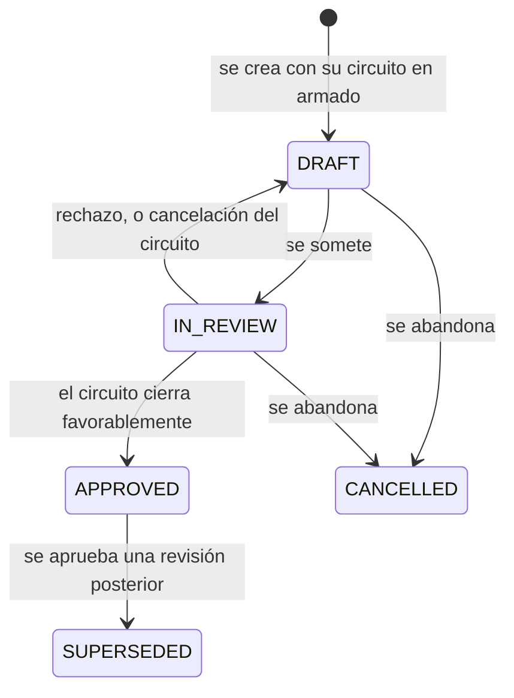

# DOM-006 — DocumentRevision

**Ámbito:** Ciclo interno
**Categoría:** Entity
**Estado:** Approved
**Versión:** 1.0

---

# Propósito

Representar **una emisión del documento**: la unidad que el mundo exterior reconoce y numera.

---

# Descripción

Una `DocumentRevision` es lo que se somete, se aprueba y eventualmente se emite. Es la **unidad externa** del ciclo: lo que ocurre dentro de ella —cuántas versiones se produjeron, cuántas veces se rechazó— es historia interna que no consume numeración.

La revisión **nace con su circuito**, con el armado pendiente y el armador ya designado. Puede nacer sin archivo, o con el archivo de un documento preexistente adjunto en el alta.

Su ciclo de vida:

Está en borrador mientras el trabajo se arma o se elabora, y en revisión desde que se somete. **No hay un estado por cada paso**: dónde está el trabajo lo dice el paso vigente del circuito.

---

# Responsabilidades

`DocumentRevision` es responsable de:

- ser la unidad de emisión y de numeración externa;
- designar al armador de su circuito;
- agrupar sus versiones y sus circuitos sucesivos;
- registrar su abandono con motivo, cuando ocurre.

No es responsable de:

- describir el avance interno del trabajo, que expresa el paso vigente;
- guardar el esquema con que se numeró, que es una decisión del momento de crearla.

---

# Atributos Conceptuales

Entre los atributos propios de la `DocumentRevision` podrán encontrarse:

- código de revisión;
- estado;
- armador designado;
- fecha y actor de aprobación;
- fecha, actor y motivo del abandono;
- fechas y actores de alta y modificación.

La definición detallada de estos atributos corresponde al Modelo de Datos.

---

# Invariantes

**El armador es obligatorio.** Es el único actor que debe conocerse en el alta: todo lo demás lo trae la plantilla o lo decide el armado. Cuando no se informa, lo aporta la configuración del proyecto.

**Un documento tiene a lo sumo una revisión en curso.** Abrir otra exige completar o abandonar la anterior.

**El código es único entre las revisiones no abandonadas del documento.** Las abandonadas **no consumen código**, y un documento puede tener varias con el mismo, distinguidas por su fecha y su motivo.

**Toda revisión viva tiene exactamente un circuito abierto.**

**A lo sumo hay una revisión aprobada por documento**, porque aprobar supersede a las anteriores.

**Solo se abandona una revisión no aprobada.** Aprobada, es el documento vigente y lo que corresponde es abrir la siguiente. Como la emisión exige aprobación, **una revisión abandonada nunca fue emitida**.

---

# Relaciones Conceptuales

**Pertenece a**

- `Document`

**Agrupa a**

- `DocumentVersion`, en secuencia continua propia de la revisión
- `ReviewWorkflow`, como circuitos sucesivos ordenados por creación

**Designa a**

- el armador, por referencia externa al usuario

---

# Observaciones

**El código lo propone el sistema.** Bajo los esquemas calculados se deriva de la última revisión no abandonada, infiriendo el esquema de la forma de su código, y el valor informado se rechaza; bajo texto libre lo ingresa el usuario y solo se valida que no se repita.

**Las revisiones se ordenan por creación y nunca por código.** Con el cambio de esquema la secuencia puede quedar `A, B, C, 0, 1`.

**Registrar una versión no cambia su estado**: durante el circuito permanece en revisión. Solo el rechazo y la cancelación la devuelven a borrador.

**No hace falta restituir la revisión anterior al abandonar una.** La supersesión ocurre al aprobarse la sucesora, y una abandonada nunca se aprueba: la anterior nunca dejó de estar vigente.

El estado `OBSOLETE` existe en el modelo **sin uso**: queda reservado para los estados terminales por respuesta de la contraparte, que pertenecen al bloque de circulación.

---

# Referencias

- `10_DOM-005_Document.md`, `30_DOM-007_DocumentVersion.md`, `40_DOM-008_ReviewWorkflow.md`
- `80_Principios_del_Modelo.md`
- `../../00_Convenciones.md`
