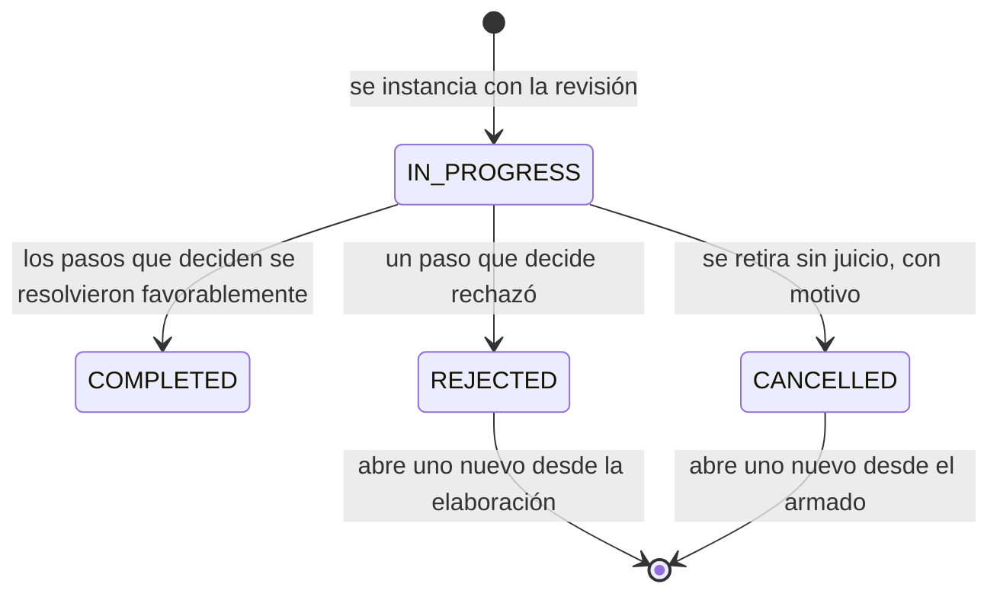

# DOM-008 — ReviewWorkflow

**Ámbito:** Ciclo interno
**Categoría:** Entity
**Estado:** Approved
**Versión:** 1.1

---

# Propósito

Instanciar **el ciclo completo** de una revisión: quién la arma, quién la elabora, quiénes la revisan y quiénes toman conocimiento.

---

# Descripción

Un `ReviewWorkflow` es el circuito de una revisión. **No es el trámite de aprobación de un documento terminado**: se crea junto con la revisión y arranca en el armado, cuando todavía no hay ni elaborador designado ni archivo.

Nace **iniciado** y con un solo paso, el armado. Los pasos siguientes **se materializan al completarse ese armado**, y no antes: hasta entonces no tienen actor.

Una revisión admite **varios circuitos sucesivos**, y a lo sumo uno abierto:

**En el rol Receptor el rechazo no abre nada**: ahí el circuito es el mecanismo con que la planta produce su respuesta, el elaborador está afuera y la conclusión es terminal para la revisión. Ver `../15_circulation/80_Principios_del_Modelo.md`.

El circuito vigente **se deriva** de los circuitos de la revisión; no se almacena una referencia al vigente, que sería un dato derivado con riesgo de desincronizarse.

---

# Responsabilidades

`ReviewWorkflow` es responsable de:

- sostener la estructura de pasos de una revisión;
- registrar quién lo inició y cuándo concluyó;
- registrar su cancelación con motivo, cuando ocurre;
- conservar de qué plantilla salió su propuesta.

No es responsable de:

- decidir el estado de la revisión, que resulta de lo que sus pasos resuelven;
- guardar los actores fuera de sus pasos.

---

# Atributos Conceptuales

Entre los atributos propios del `ReviewWorkflow` podrán encontrarse:

- estado;
- fecha y actor de inicio;
- fecha de conclusión;
- fecha, actor y motivo de la cancelación;
- plantilla de la que salió la propuesta;
- fecha de alta.

La definición detallada de estos atributos corresponde al Modelo de Datos.

---

# Invariantes

**Una revisión viva tiene exactamente un circuito abierto**, desde que nace hasta que se aprueba o se abandona.

**El circuito exige al menos un paso que decida.** Sin revisión ni aprobación no tendría con qué completarse y la revisión quedaría trabada. El circuito mínimo es precisamente el caso límite: un único paso de aprobación.

**La estructura es inmutable una vez armada.** No se agregan, quitan ni reordenan pasos. La excepción aparente no lo es: el armado **crea** los pasos siguientes, y la inmutabilidad rige desde que se completa.

**«Cancelado» es la palabra de este nivel, y no se usa en ningún otro.** El circuito se cancela, la revisión se abandona y el documento queda obsoleto. Retirar un armado, desistir de una emisión y dar por concluida una identidad son hechos que no se confunden en el trabajo real, y no deben confundirse en el nombre.

**Se cancela en cualquier punto, aun con pasos ya firmados.** Los pendientes quedan salteados y **los resueltos conservan su estado y su firma**: nada se elimina.

**Al completarse, la revisión queda aprobada**, y las revisiones aprobadas anteriores del mismo documento quedan superadas.

---

# Relaciones Conceptuales

**Pertenece a**

- `DocumentRevision`

**Se compone de**

- `ReviewStep`, en el orden en que se recorren

**Se propone desde**

- `DocWorkflowTemplate`, cuyos valores se copian al materializarse

---

# Observaciones

**La reinstanciación depende de la salida.** El rechazo abre un circuito desde la elaboración con el **mismo elenco copiado**, porque el trabajo vuelve al elaborador sin rearmar nada. La cancelación abre uno desde el armado, porque lo que se corrige es precisamente cómo estaba armado.

**Salvo donde no hay elaborador.** La regla uniforme es que el rechazo devuelve el trabajo a quien elabora; lo que cambia es dónde vive esa persona. En el rol Receptor vive afuera, de modo que no hay circuito sucesor y la emisión siguiente llega con revisión nueva. Por lo mismo, ahí el armado no tiene contenido y lo resuelve el sistema desde la plantilla del contrato.

**El elenco se copia y no se referencia**: reasignar un paso del circuito nuevo no altera la historia del anterior.

**El circuito mínimo dejó de ser un objeto aparte.** Es un circuito cuyo armado designa un único paso de aprobación, y no necesita regla propia.

**El atributo del tipo de documento que distingue el circuito formal del mínimo es una sugerencia y no un invariante**: propone el armado, no lo impone.

---

# Referencias

- `20_DOM-006_DocumentRevision.md`, `50_DOM-009_ReviewStep.md`, `70_DOM-011_DocWorkflowTemplate.md`
- `80_Principios_del_Modelo.md`
- `../../00_Convenciones.md`
