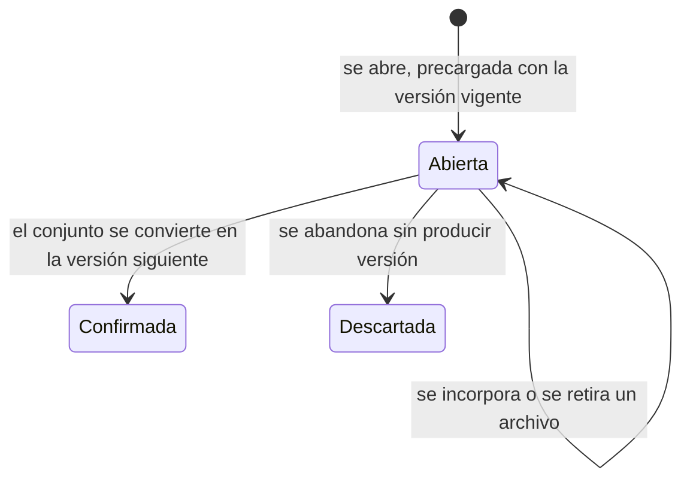

# DOM-014 — DocWorkingCopy

**Ámbito:** Ciclo interno
**Categoría:** Entity
**Estado:** Approved
**Versión:** 1.0

---

# Propósito

Sostener el conjunto de archivos **en preparación**, hasta que se confirme y se convierta en una versión.

---

# Descripción

Una `DocWorkingCopy` es el conjunto que se está armando. **Todavía no es una versión**, y por eso no acredita nada: es mutable por naturaleza, mientras que la versión debe ser inmutable una vez que existe.

Lo que esta entidad resuelve es **cuándo la versión existe**. La respuesta es: al confirmar. No al abrir, y no al subir cada archivo.

Sin ella, un conjunto de tres archivos obligaría a rearmarlo entero en un solo acto para corregir uno, o produciría una versión por archivo — una secuencia de iteraciones que no son iteraciones.

**Se abre precargada con los archivos de la versión vigente.** Precargar es lo que vuelve barata la edición: quien corrige el entregable abre, lo reemplaza y confirma, y la fuente y el respaldo viajan solos conservando su referencia y su hash, sin volver a subirse. Lo que se crea al confirmar es el registro del conjunto, no el objeto almacenado.

Su ciclo de vida:

---

# Responsabilidades

`DocWorkingCopy` es responsable de:

- sostener el conjunto mientras se prepara;
- registrar quién la abrió, y quién la confirmó o la descartó;
- vincularse con la versión que produjo.

No es responsable de:

- acreditar contenido, que corresponde a la versión;
- bloquear el trabajo de otro, que ya lo resuelve el circuito;
- entregar el archivo a quien lo edita: leerlo nunca fue un acto del ciclo.

---

# Atributos Conceptuales

Entre los atributos propios de la `DocWorkingCopy` podrán encontrarse:

- fecha y actor de apertura;
- fecha y actor de confirmación, con la versión que produjo;
- fecha, actor y motivo del descarte;
- los archivos del conjunto, con la misma forma que los de la versión.

La definición detallada de estos atributos corresponde al Modelo de Datos.

---

# Invariantes

**A lo sumo una copia abierta por revisión.** Es el mismo invariante que el documento aplica a su revisión en curso y la revisión a su circuito, apareciendo en un tercer nivel.

**Confirmar exige al menos un cambio.** Sin archivo agregado, reemplazado o quitado no hay nada que confirmar, porque la versión solo existe con contenido nuevo. El principio se hace cumplir solo.

**Confirmar exige un conjunto completo**: al menos un archivo, y al menos uno con rol de entregable.

**La opera quien tiene el paso vigente**, o quien cuente con el permiso de administración del circuito. No es una restricción de identidad sino de momento, y se comprueba en cada operación y no solo al abrir.

**Descartar exige motivo**, y no produce versión: la numeración interna no salta.

**Resolver un paso exige no tener copia abierta**, y someter también.

---

# Relaciones Conceptuales

**Pertenece a**

- `DocumentRevision`

**Produce**

- `DocumentVersion`, al confirmarse

---

# Observaciones

**Es lo que la gestión documental opera con check-out y check-in**, con dos diferencias que conviene enunciar porque cambian el modelo:

- **No descarga.** El archivo se lee cuando se quiere, y leerlo nunca fue un acto del ciclo. Abrir la copia declara que hay una iteración en curso, no que alguien obtuvo el archivo.
- **No bloquea, porque el bloqueo ya existe.** La versión la produce quien tiene el paso vigente: la exclusividad la da el circuito, no un candado. Agregar uno duplicaría la regla.

Los nombres del oficio sirven para la interfaz; el modelo los nombra por lo que hacen.

**Incorporar un archivo cubre adjuntar y reemplazar**, porque es el mismo hecho: el conjunto pasa a tener este archivo con este contenido. Distinguirlos obligaría a quien opera a saber qué había antes, que es justamente lo que la precarga le evita.

**Se descartó que abrir cree la versión y confirmar la sobrescriba.** Volvería mutable a la entidad cuya razón de ser es no serlo, y una apertura abandonada dejaría una versión consumiendo un número en la secuencia — lo mismo que el ciclo evita un nivel más arriba al decidir que la revisión abandonada no consume código.

**Confirmar admite recibir el conjunto completo de una vez**, creando y cerrando la copia en un solo acto. No son dos modelos sino la misma transición sin acumulación previa, y es lo que necesita un cliente automático para no depender de una secuencia de llamadas.

**La palabra del nivel es «descartada».** El circuito se cancela, la revisión se abandona, el documento queda obsoleto y la copia se descarta.

**Su traza cuelga de la revisión y no de sí misma.** No es un objeto que alguien consulte por separado: lo que se pregunta es qué le pasó a la revisión, y separar la copia partiría en dos una línea de tiempo que se lee entera.

---

# Referencias

- `20_DOM-006_DocumentRevision.md`, `30_DOM-007_DocumentVersion.md`
- `80_Principios_del_Modelo.md`
- `../../00_Convenciones.md`
