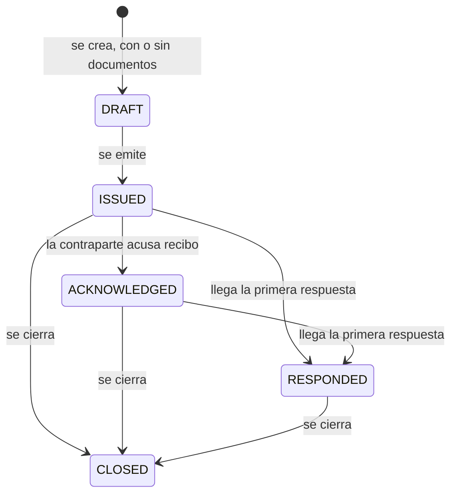

# DOM-015 — Transmittal

**Ámbito:** Circulación
**Categoría:** Aggregate Root
**Estado:** Approved
**Versión:** 1.0

---

# Propósito

Agrupar la documentación que **cruza la frontera con la contraparte**, en un acto con fecha, contenido declarado y responsable.

---

# Descripción

Un `Transmittal` es el remito. Nació en papel, como la carátula que acompañaba una carpeta de documentos y declaraba qué llevaba adentro, y conserva esa función: **agrupa la entrega, pero no gobierna el ciclo de cada documento**.

Lo que lo clasifica no es su dirección sino su **propósito**, porque es el propósito el que determina qué reglas lo gobiernan:

| Naturaleza | Qué es |
| ---------- | ------ |
| `EMISSION` | Entrega de documentación producida |
| `RESPONSE` | Calificación consolidada de una emisión. Referencia necesariamente la emisión que contesta |

**El sentido no se declara: se deriva** del rol documental del contrato y de la naturaleza. Guardarlo sería un dato capaz de contradecir a los hechos.

| Rol del contrato | `EMISSION` | `RESPONSE` |
| ---------------- | ---------- | ---------- |
| `ISSUER` | Saliente | Entrante |
| `RECEIVER` | Entrante, del contratista | No existe |
| `INTERNAL` | No existe | No existe |

Que la respuesta consolidada exista solo en modo Emisor no es una asimetría arbitraria: la planta no consolida su calificación en un remito, responde documento a documento. Y un contrato sin contraparte no tiene a quién entregarle nada.

El destinatario tampoco se declara por transmittal: es la contraparte del contrato, que es única.

---

# Responsabilidades

`Transmittal` es responsable de:

- declarar qué documentación se entregó, a quién corresponde y cuándo;
- conservar cómo la contraparte nombra ese envío en su propio sistema;
- registrar el acuse de recibo y el cierre, con quién y cuándo;
- vincular una respuesta consolidada con la emisión que contesta.

No es responsable de:

- condicionar el avance de los documentos que agrupa: cada uno sigue su ciclo con independencia de los demás;
- alojar la calificación de la contraparte, que pertenece a cada documento;
- existir en contratos sin contraparte.

---

# Atributos Conceptuales

Entre los atributos propios del `Transmittal` podrán encontrarse:

- código propio, único dentro del contrato;
- naturaleza y estado;
- contrato al que pertenece;
- referencia externa: cómo la contraparte lo nombra;
- emisión que contesta, cuando es una respuesta;
- emisión, acuse y cierre, cada uno con su actor y su fecha;
- motivo del cierre.

La definición detallada de estos atributos corresponde al Modelo de Datos.

---

# Ciclo de Vida

**El estado acompaña, no condiciona.** Pasa a respondido con la **primera** respuesta y no espera al resto, porque las respuestas son parciales por naturaleza.

---

# Invariantes

**El contrato declara su rol documental desde que nace.** Sin él no hay circulación posible: es el rol el que dice si el transmittal sale, si entra o si no existe.

**Un contrato interno no admite transmittals**, de ninguna naturaleza.

**En modo Receptor no existe el transmittal de respuesta.**

**Una respuesta referencia siempre una emisión del mismo contrato**, y nunca otra respuesta. Una emisión, en cambio, no contesta nada.

**El código es único dentro del contrato** y lo genera el sistema. La numeración corre por contrato porque el contrato **es** la unidad de la relación.

**Solo la emisión lleva ítems.** La respuesta es el sobre en que viajaron las respuestas de los documentos, y no crea registros propios sobre las mismas revisiones.

**El contenido se edita solo en borrador.** Emitido, queda fijo: la carátula que la contraparte recibió declara un contenido, y corregir una emisión ya salida no es editarla sino emitir otra.

**Se acusa recibo una sola vez, y solo de una emisión saliente.** No es precondición de la respuesta.

**El cierre no exige respuestas completas** y no impide una respuesta posterior.

---

# Relaciones Conceptuales

**Pertenece a**

- un contrato, con su rol documental declarado

**Agrupa**

- `TransmittalItem`, cuando es una emisión

**Contesta a**

- otro `Transmittal` de naturaleza emisión, cuando es una respuesta

**Transporta**

- `DocTransmittalResponse`, cuando es una respuesta consolidada

---

# Observaciones

**El acuse de recibo no es una calificación.** No dice nada sobre el documento: dice que el envío llegó. Por eso vive en el transmittal y no en cada ítem, y por eso no forma parte del catálogo de calificaciones, cuyos efectos no admiten un valor que no habilite nada ni obligue a nada.

**Solo tiene sentido donde la emisión viaja afuera.** En modo Receptor el contratista carga el transmittal dentro del sistema: no hay nada que acusar, y el acto equivalente es la confirmación de la recepción, que reparte el trabajo entre los revisores.

**Cerrar declara que se dejó de esperar, no que se dejó de escuchar.** Una calificación tardía se registra igual sobre un transmittal cerrado, y no lo reabre. Un cierre que exigiera respuestas completas no ocurriría nunca, porque las parciales son la práctica normal.

**El avance de las respuestas se deriva y no se almacena**, contando solo los ítems cuyo propósito espera calificación. Es lo que el cierre muestra —*faltan tres de las cinco que esperaban respuesta*— y no lo que lo condiciona.

**Los dos casos entrantes tienen naturaleza distinta**, y por eso conviene no confundir sentido con propósito: lo que entra en modo Emisor es una respuesta que contesta algo nuestro, y lo que entra en modo Receptor es una emisión que no contesta nada. Comparten dirección y no comparten una sola regla.

**La referencia externa es un dato del remito ajeno, no un remito propio.** Conserva cómo la contraparte nombra ese envío, que es por lo que va a preguntar.

---

# Referencias

- `20_DOM-016_TransmittalItem.md`, `30_DOM-017_DocTransmittalResponse.md`
- `../05_project/10_DOM-003_DocProject.md`
- `80_Principios_del_Modelo.md`
- `../../00_Convenciones.md`
